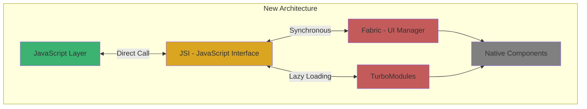
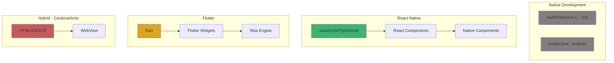
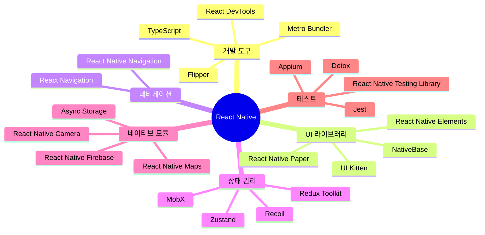

# 1장. React Native 소개

## 1-1. React Native란 무엇인가

### 개요

React Native는 Facebook(현 Meta)에서 개발한 **크로스 플랫폼 모바일 애플리케이션 개발 프레임워크**입니다. JavaScript와 React를 사용하여 iOS와 Android 네이티브 앱을 동시에 개발할 수 있으며, 하나의 코드베이스로 양쪽 플랫폼에서 실행되는 진정한 네이티브 애플리케이션을 만들 수 있습니다.

이 섹션에서는 React Native의 정의, 동작 원리, 그리고 다른 크로스 플랫폼 솔루션과의 차이점을 살펴봅니다.

### React Native의 탄생 배경

Facebook은 2012년 모바일 우선 전략으로 전환하면서 초기에 HTML5 기반의 하이브리드 앱을 개발했습니다. 그러나 성능 문제와 네이티브 경험의 부족으로 인해 결국 네이티브 앱으로 재개발해야 했습니다. 이 과정에서 다음과 같은 문제점들이 드러났습니다:

- iOS와 Android 각각 별도의 개발 팀과 코드베이스 필요
- 동일한 기능을 두 번 구현해야 하는 비효율성
- 플랫폼 간 일관성 유지의 어려움
- 빠른 반복 개발의 제약

2015년, Facebook은 이러한 문제를 해결하기 위해 React Native를 오픈소스로 공개했습니다. React의 선언적 프로그래밍 모델을 모바일 플랫폼으로 확장하여, 개발자가 JavaScript로 작성한 코드가 실제 네이티브 컴포넌트로 렌더링되도록 설계했습니다.

### React Native의 핵심 개념

#### 1. Learn Once, Write Anywhere

React Native는 "Write Once, Run Anywhere"가 아닌 **"Learn Once, Write Anywhere"** 철학을 따릅니다. 이는 각 플랫폼의 특성을 존중하면서도 동일한 개발 패러다임을 사용할 수 있다는 의미입니다.

```typescript
// 플랫폼별 코드 분기 예시
import { Platform, StyleSheet } from 'react-native';

const styles = StyleSheet.create({
  container: {
    padding: Platform.OS === 'ios' ? 20 : 16,
    ...Platform.select({
      ios: {
        shadowColor: '#000',
        shadowOffset: { width: 0, height: 2 },
        shadowOpacity: 0.1,
      },
      android: {
        elevation: 3,
      },
    }),
  },
});
```

#### 2. Bridge 아키텍처 (레거시)

초기 React Native는 JavaScript와 네이티브 코드 간의 통신을 위해 **Bridge**라는 비동기 메시징 시스템을 사용했습니다.


Bridge의 특징:
- **비동기 통신**: JavaScript와 네이티브 간 모든 통신이 비동기로 처리됨
- **JSON 직렬화**: 데이터는 JSON으로 직렬화되어 전송됨
- **성능 병목**: 대량의 데이터나 빈번한 통신 시 성능 저하 발생 가능

#### 3. 새로운 아키텍처 (Fabric & TurboModules)

React Native 0.68 버전부터 도입된 **새로운 아키텍처**는 Bridge의 한계를 극복합니다.



**새로운 아키텍처의 장점**:

1. **JSI (JavaScript Interface)**
   - JavaScript와 네이티브 간 직접 호출 가능
   - 동기 메서드 호출 지원
   - JSON 직렬화 오버헤드 제거

2. **Fabric (새로운 렌더링 엔진)**
   - React의 동시성 렌더링 지원
   - 우선순위 기반 렌더링
   - 더 나은 타입 안정성

3. **TurboModules**
   - 네이티브 모듈의 지연 로딩
   - 더 빠른 시작 시간
   - 타입 안정성 향상

```typescript
// TurboModule 예시
import type { TurboModule } from 'react-native';
import { TurboModuleRegistry } from 'react-native';

export interface Spec extends TurboModule {
  getConstants(): {
    VERSION: string;
  };
  getString(id: string): Promise<string>;
  getNumber(value: number): number;
}

export default TurboModuleRegistry.getEnforcing<Spec>('SampleTurboModule');
```

### React Native vs 다른 솔루션

#### 비교 다이어그램



#### 주요 차이점

| 특징 | React Native | Flutter | 하이브리드 (Cordova) | 네이티브 |
|------|--------------|---------|---------------------|---------|
| **언어** | JavaScript/TypeScript | Dart | HTML/CSS/JS | Swift/Kotlin |
| **렌더링** | 네이티브 컴포넌트 | 자체 렌더링 엔진 | WebView | 네이티브 |
| **성능** | 우수 | 매우 우수 | 보통 | 최고 |
| **개발 속도** | 빠름 | 빠름 | 매우 빠름 | 느림 |
| **커뮤니티** | 매우 큼 | 큼 | 중간 | 플랫폼별 |
| **코드 재사용** | 70-90% | 90-95% | 95%+ | 0% |
| **네이티브 접근** | 우수 | 우수 | 제한적 | 완전 |

### React Native의 핵심 특징

#### 1. Hot Reloading & Fast Refresh

**Fast Refresh**는 개발 중 코드 변경 사항을 앱을 재시작하지 않고 즉시 반영합니다.

```mermaid
sequenceDiagram
    participant Dev as Developer
    participant Metro as Metro Bundler
    participant App as React Native App
    
    Dev->>Metro: 코드 수정 저장
    Metro->>Metro: 변경 감지 &#38; 번들링
    Metro->>App: HMR 업데이트 전송
    App->>App: 상태 유지하며 컴포넌트 재렌더링
    App-->>Dev: 화면 즉시 업데이트
    
    Note over Dev,App: 앱 재시작 없이 1-2초 내 반영
```



#### 2. 선언적 UI

React의 선언적 프로그래밍 모델을 그대로 사용합니다.

```typescript
import React, { useState } from 'react';
import { View, Text, Button, StyleSheet } from 'react-native';

const Counter: React.FC = () => {
  const [count, setCount] = useState(0);

  return (
    <View style={styles.container}>
      <Text style={styles.countText}>Count: {count}</Text>
      <Button 
        title="Increment" 
        onPress={() => setCount(count + 1)} 
      />
    </View>
  );
};

const styles = StyleSheet.create({
  container: {
    flex: 1,
    justifyContent: 'center',
    alignItems: 'center',
  },
  countText: {
    fontSize: 24,
    marginBottom: 20,
  },
});
```

#### 3. 네이티브 컴포넌트 활용

React Native의 컴포넌트는 실제 네이티브 UI 컴포넌트로 렌더링됩니다.

```mermaid
graph LR
    subgraph "React Native"
        A[&#60;View&#62;]
        B[&#60;Text&#62;]
        C[&#60;Image&#62;]
        D[&#60;ScrollView&#62;]
    end
    
    subgraph "iOS"
        E[UIView]
        F[UILabel]
        G[UIImageView]
        H[UIScrollView]
    end
    
    subgraph "Android"
        I[ViewGroup]
        J[TextView]
        K[ImageView]
        L[ScrollView]
    end
    
    A --> E
    A --> I
    B --> F
    B --> J
    C --> G
    C --> K
    D --> H
    D --> L
    
    style A fill:#3cb371
    style B fill:#3cb371
    style C fill:#3cb371
    style D fill:#3cb371
```



### React Native 생태계



### 실제 사용 사례

React Native를 사용하는 주요 기업들:

- **Meta**: Facebook, Instagram, Messenger
- **Microsoft**: Skype, Office Mobile
- **Shopify**: Shopify Mobile App
- **Discord**: 모바일 앱
- **Tesla**: Tesla Mobile App
- **Coinbase**: 암호화폐 지갑 앱
- **Walmart**: Walmart Mobile App

### 언제 React Native를 선택해야 하나?

#### React Native가 적합한 경우

✅ 빠른 MVP 개발이 필요할 때
✅ iOS와 Android를 동시에 출시해야 할 때
✅ 기존 React 웹 개발 팀이 있을 때
✅ 제한된 개발 리소스로 두 플랫폼을 커버해야 할 때
✅ 자주 업데이트되는 콘텐츠 중심 앱
✅ 소셜, 전자상거래, 미디어 앱

#### React Native가 부적합한 경우

❌ 고성능 3D 게임이나 복잡한 애니메이션
❌ AR/VR 같은 고급 그래픽 기능
❌ 배터리 효율이 극도로 중요한 백그라운드 앱
❌ 플랫폼 고유의 최신 기능을 즉시 활용해야 하는 경우
❌ 극도로 복잡한 네이티브 UI 커스터마이징

### 요약

React Native는 JavaScript와 React를 사용하여 진정한 네이티브 앱을 개발할 수 있는 강력한 프레임워크입니다. 

**핵심 포인트**:
- JavaScript로 작성하지만 네이티브 컴포넌트로 렌더링
- 새로운 아키텍처(JSI, Fabric, TurboModules)로 성능 대폭 개선
- 70-90%의 코드 재사용으로 개발 효율성 극대화
- Fast Refresh로 빠른 개발 사이클
- 방대한 생태계와 커뮤니티 지원

다음 섹션에서는 React Native의 구체적인 장단점을 살펴보겠습니다.
