# 1장. React Native 소개

## 1-2. React Native의 장단점

### 개요

React Native를 프로젝트에 도입하기 전에 장점과 단점을 명확히 이해하는 것이 중요합니다. 특히 **Redux Toolkit을 사용한 전역 상태 관리**와 **Java API 서버 연동**을 계획하는 경우, React Native의 특성이 프로젝트에 어떤 영향을 미치는지 파악해야 합니다.

이 섹션에서는 실무 관점에서 React Native의 장점과 단점을 상세히 분석하고, 각 요소가 개발 프로세스에 미치는 영향을 다이어그램으로 시각화합니다.

### React Native의 주요 장점

#### 1. 코드 재사용과 개발 생산성

React Native의 가장 큰 장점은 **단일 코드베이스**로 iOS와 Android 앱을 동시에 개발할 수 있다는 점입니다.

```mermaid
graph TB
    subgraph "Traditional Native Development"
        A1[iOS Team<br/>Swift/Objective-C] --> B1[iOS App]
        A2[Android Team<br/>Kotlin/Java] --> B2[Android App]
    end
    
    subgraph "React Native Development"
        C[Single Team<br/>TypeScript/JavaScript] --> D[Shared Codebase<br/>70-90&#37;]
        D --> E1[iOS App]
        D --> E2[Android App]
        D --> F[Platform-Specific<br/>10-30&#37;]
        F --> E1
        F --> E2
    end
    
    style C fill:#3cb371
    style D fill:#3cb371
    style F fill:#daa520
    style A1 fill:#808080
    style A2 fill:#808080
```

**실무적 이점**:
- 개발 인력 50% 절감 가능
- 기능 출시 시간 30-50% 단축
- 양 플랫폼 동시 배포로 일관된 사용자 경험 제공
- 버그 수정 시 한 곳만 수정하면 양쪽 플랫폼에 반영

```typescript
// 플랫폼 공통 비즈니스 로직 (90%)
import { createSlice, createAsyncThunk } from '@reduxjs/toolkit';
import { userApi } from '../api/userApi';

export const fetchUserProfile = createAsyncThunk(
  'user/fetchProfile',
  async (userId: string) => {
    const response = await userApi.getProfile(userId);
    return response.data;
  }
);

const userSlice = createSlice({
  name: 'user',
  initialState: { profile: null, loading: false },
  reducers: {},
  extraReducers: (builder) => {
    builder
      .addCase(fetchUserProfile.pending, (state) => {
        state.loading = true;
      })
      .addCase(fetchUserProfile.fulfilled, (state, action) => {
        state.profile = action.payload;
        state.loading = false;
      });
  },
});
```

#### 2. React 생태계 활용

기존 React 웹 개발 경험을 그대로 활용할 수 있으며, 방대한 npm 생태계에 접근 가능합니다.

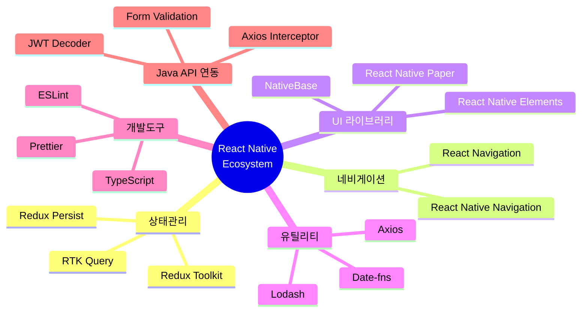

**Redux Toolkit과의 시너지**:
- RTK Query로 Java API 서버 통신 자동화
- Redux DevTools로 상태 디버깅
- Redux Persist로 오프라인 데이터 저장
- 웹과 모바일 간 상태 관리 로직 공유 가능

#### 3. Hot Reloading과 빠른 개발 사이클

Fast Refresh 기능으로 코드 변경 시 1-2초 내에 결과를 확인할 수 있습니다.

```mermaid
sequenceDiagram
    participant Dev as 개발자
    participant Editor as VS Code
    participant Metro as Metro Bundler
    participant App as RN App
    
    Dev->>Editor: 코드 수정 &#40;Ctrl+S&#41;
    Editor->>Metro: 파일 변경 감지
    Metro->>Metro: 변경 모듈만 번들링
    Metro->>App: HMR 패치 전송
    App->>App: 상태 유지하며<br/>컴포넌트 재렌더링
    App-->>Dev: 화면 업데이트 &#40;1-2초&#41;
    
    Note over Dev,App: 전체 앱 재시작 불필요
```

**개발 효율성**:
- 네이티브 개발 대비 10배 빠른 피드백 루프
- Redux 상태를 유지한 채 UI 수정 가능
- 디버깅 시간 대폭 단축

#### 4. 네이티브 성능

React Native는 WebView를 사용하지 않고 **실제 네이티브 컴포넌트**로 렌더링됩니다.

```mermaid
graph LR
    subgraph "React Native Rendering"
        A[React Component] -->|Bridge/JSI| B[Native UI Thread]
        B --> C1[UIKit &#40;iOS&#41;]
        B --> C2[Android Views]
    end
    
    subgraph "Hybrid App &#40;Cordova&#41;"
        D[HTML/CSS] --> E[WebView]
        E --> F[Rendered UI]
    end
    
    C1 --> G[60 FPS Native UI]
    C2 --> G
    F --> H[30-40 FPS Web UI]
    
    style A fill:#3cb371
    style B fill:#3cb371
    style C1 fill:#3cb371
    style C2 fill:#3cb371
    style D fill:#c35b5b
    style E fill:#c35b5b
```

**성능 지표**:
- UI 렌더링: 네이티브와 동일한 60 FPS
- 리스트 스크롤: FlatList로 수천 개 항목 부드럽게 처리
- 애니메이션: Animated API로 네이티브 수준 애니메이션
- API 통신: Axios + RTK Query로 효율적인 데이터 페칭

#### 5. Over-The-Air 업데이트

CodePush를 사용하면 앱스토어 심사 없이 JavaScript 번들을 즉시 업데이트할 수 있습니다.

```mermaid
graph TB
    A[Bug Fix/Feature Update] --> B{변경 내용?}
    B -->|JavaScript Only| C[CodePush 배포]
    B -->|Native Code 변경| D[앱스토어 제출]
    
    C --> E[사용자에게 즉시 배포<br/>&#40;1-2시간&#41;]
    D --> F[앱스토어 심사<br/>&#40;1-7일&#41;]
    
    style C fill:#3cb371
    style E fill:#3cb371
    style D fill:#daa520
    style F fill:#daa520
```

**실무적 활용**:
- 긴급 버그 수정 즉시 배포
- A/B 테스트 빠른 적용
- Redux 로직 변경사항 즉시 반영
- Java API 엔드포인트 변경 대응

#### 6. 강력한 커뮤니티와 기업 지원

```typescript
// 주요 기업 사용 사례
const companies = {
  meta: ['Facebook', 'Instagram', 'Messenger'],
  microsoft: ['Skype', 'Office Mobile'],
  ecommerce: ['Shopify', 'Walmart'],
  finance: ['Coinbase', 'Bloomberg'],
  other: ['Discord', 'Tesla', 'Uber Eats']
};
```

**커뮤니티 지원**:
- GitHub 110k+ 스타
- Stack Overflow 150k+ 질문
- 주간 npm 다운로드 100만+
- 정기적인 버전 업데이트 (분기별)

### React Native의 주요 단점

#### 1. 네이티브 모듈 의존성

복잡한 네이티브 기능은 여전히 Swift/Kotlin 코드가 필요합니다.

```mermaid
graph TB
    subgraph "JavaScript Layer &#40;70-90&#37;&#41;"
        A[비즈니스 로직]
        B[UI 컴포넌트]
        C[Redux Store]
        D[API 통신]
    end
    
    subgraph "Native Bridge &#40;10-30&#37;&#41;"
        E[카메라 고급 기능]
        F[Bluetooth Low Energy]
        G[백그라운드 작업]
        H[생체 인증]
    end
    
    A --> I{기능 구현 가능?}
    I -->|Yes| B
    I -->|No| E
    
    style E fill:#c35b5b
    style F fill:#c35b5b
    style G fill:#c35b5b
    style H fill:#c35b5b
```

**제약사항**:
- 최신 iOS/Android 기능은 네이티브 모듈 대기 필요
- 복잡한 AR/VR 기능은 구현 어려움
- 네이티브 개발 지식이 일부 필요

#### 2. 앱 크기 증가

React Native 런타임과 JavaScript 번들로 인해 기본 앱 크기가 큽니다.

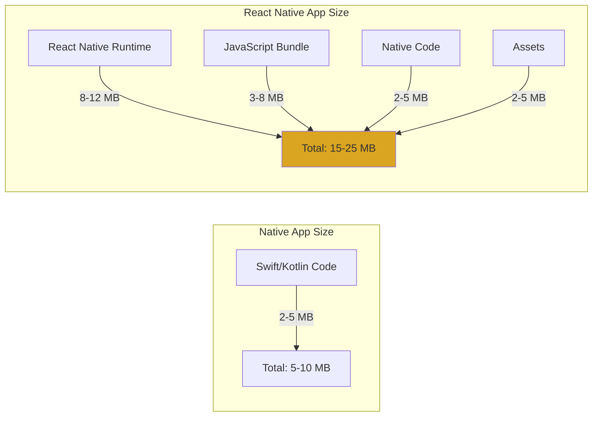

**최적화 방안**:
- Hermes 엔진 사용으로 번들 크기 30% 감소
- 코드 스플리팅과 동적 임포트
- ProGuard/R8 (Android) 적용
- 이미지 최적화 및 압축

```typescript
// 동적 임포트로 번들 크기 최적화
const HeavyComponent = lazy(() => import('./HeavyComponent'));

function App() {
  return (
    <Suspense fallback={<LoadingSpinner />}>
      <HeavyComponent />
    </Suspense>
  );
}
```

#### 3. 초기 로딩 시간

JavaScript 번들 로드로 인한 초기 실행 시간이 네이티브 대비 느립니다.

```mermaid
gantt
    title 앱 시작 시간 비교
    dateFormat X
    axisFormat %L ms
    
    section Native App
    앱 실행        :0, 500
    
    section React Native
    앱 실행        :0, 300
    JS 번들 로드   :300, 700
    Bridge 초기화  :700, 400
```

**개선 방법**:
- Hermes 엔진으로 시작 시간 50% 단축
- 인라인 Requires로 지연 로딩
- RAM Bundle 사용
- Splash Screen으로 체감 시간 개선

#### 4. 디버깅의 복잡성

JavaScript, 네이티브 코드, Bridge를 넘나드는 디버깅이 필요합니다.

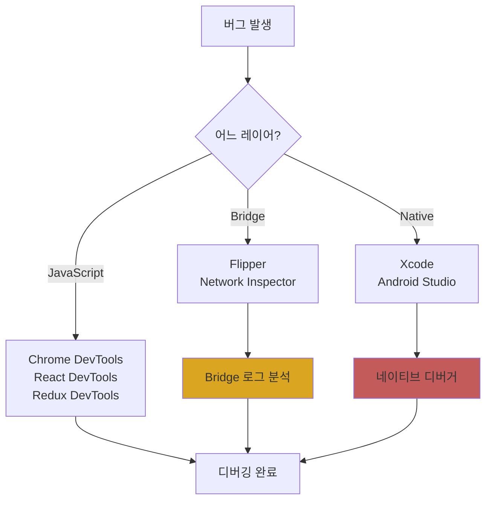

**디버깅 도구**:
- **Flipper**: 통합 디버깅 플랫폼
- **Redux DevTools**: 상태 변화 추적
- **React DevTools**: 컴포넌트 계층 분석
- **Network Inspector**: Java API 통신 모니터링

#### 5. 플랫폼별 차이 처리

동일한 코드라도 플랫폼별로 다르게 동작할 수 있습니다.

```typescript
// 플랫폼별 분기 처리 예시
import { Platform, StyleSheet } from 'react-native';

const styles = StyleSheet.create({
  container: {
    // iOS와 Android에서 그림자 처리 방식이 다름
    ...Platform.select({
      ios: {
        shadowColor: '#000',
        shadowOffset: { width: 0, height: 2 },
        shadowOpacity: 0.25,
        shadowRadius: 3.84,
      },
      android: {
        elevation: 5,
      },
    }),
  },
  // 상태바 높이도 플랫폼별로 다름
  header: {
    paddingTop: Platform.OS === 'ios' ? 44 : 0,
  },
});

// 날짜 포맷도 플랫폼별로 다를 수 있음
const formatDate = (date: Date) => {
  if (Platform.OS === 'ios') {
    return date.toLocaleDateString('ko-KR');
  }
  return date.toLocaleDateString('en-US');
};
```

#### 6. 업그레이드와 의존성 관리

React Native 버전 업그레이드 시 breaking change가 자주 발생합니다.

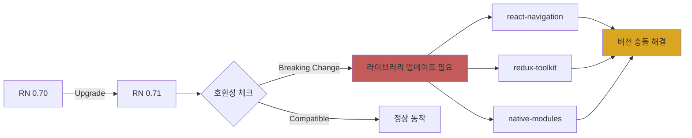

**대응 전략**:
- 메이저 버전 업그레이드는 분기별 계획
- 의존성 버전 고정 (`package-lock.json`)
- 업그레이드 전 staging 환경 테스트
- React Native Upgrade Helper 활용

### 장단점 종합 비교

```mermaid
graph TB
    subgraph "장점 &#40;Strengths&#41;"
        S1[코드 재사용 70-90&#37;]
        S2[빠른 개발 사이클]
        S3[React 생태계 활용]
        S4[네이티브 수준 성능]
        S5[OTA 업데이트]
        S6[강력한 커뮤니티]
    end
    
    subgraph "단점 &#40;Weaknesses&#41;"
        W1[네이티브 모듈 의존]
        W2[앱 크기 증가]
        W3[초기 로딩 시간]
        W4[복잡한 디버깅]
        W5[플랫폼별 차이]
        W6[업그레이드 부담]
    end
    
    subgraph "완화 전략"
        M1[Hermes 엔진]
        M2[코드 스플리팅]
        M3[Flipper 디버깅]
        M4[Platform API]
        M5[점진적 업그레이드]
    end
    
    W2 --> M1
    W3 --> M1
    W2 --> M2
    W4 --> M3
    W5 --> M4
    W6 --> M5
    
    style S1 fill:#3cb371
    style S2 fill:#3cb371
    style S3 fill:#3cb371
    style S4 fill:#3cb371
    style S5 fill:#3cb371
    style S6 fill:#3cb371
    
    style W1 fill:#c35b5b
    style W2 fill:#c35b5b
    style W3 fill:#c35b5b
    style W4 fill:#c35b5b
    style W5 fill:#c35b5b
    style W6 fill:#c35b5b
    
    style M1 fill:#daa520
    style M2 fill:#daa520
    style M3 fill:#daa520
    style M4 fill:#daa520
    style M5 fill:#daa520
```

### Redux Toolkit + Java API 환경에서의 고려사항

#### 장점 극대화 전략

```typescript
// RTK Query로 Java API 서버 통신 최적화
import { createApi, fetchBaseQuery } from '@reduxjs/toolkit/query/react';

export const javaApi = createApi({
  reducerPath: 'javaApi',
  baseQuery: fetchBaseQuery({
    baseUrl: 'https://api.example.com/v1',
    prepareHeaders: (headers, { getState }) => {
      const token = (getState() as RootState).auth.token;
      if (token) {
        headers.set('authorization', `Bearer ${token}`);
      }
      return headers;
    },
  }),
  endpoints: (builder) => ({
    getUserProfile: builder.query({
      query: (userId) => `/users/${userId}`,
      // 자동 캐싱과 재검증
      keepUnusedDataFor: 60,
    }),
  }),
});
```

**이점**:
- 자동 캐싱으로 API 호출 최소화
- Redux DevTools로 모든 API 통신 추적
- TypeScript로 API 타입 안정성 확보
- 양 플랫폼에서 동일한 API 레이어 사용

#### 단점 완화 방법

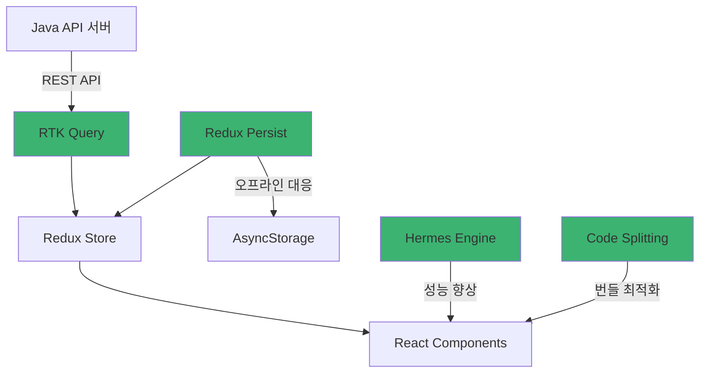

### 의사결정 가이드

#### React Native를 선택해야 하는 경우

✅ **프로젝트 특성**
- Redux Toolkit 기반 상태 관리 필요
- Java API 서버와 RESTful 통신
- iOS/Android 동시 출시 필요
- 빠른 MVP 개발 및 반복

✅ **팀 구성**
- React 개발 경험 보유
- TypeScript 숙련도 높음
- 제한된 네이티브 개발 리소스

#### React Native를 재고해야 하는 경우

❌ **프로젝트 요구사항**
- 고성능 3D 게임
- 복잡한 AR/VR 기능
- 블루투스 저수준 제어
- 플랫폼별 완전히 다른 UX

❌ **팀 역량**
- React 경험 전무
- JavaScript 생태계 낯섦
- 네이티브 개발 인력 충분

### 요약

React Native는 **Redux Toolkit을 사용한 전역 상태 관리**와 **Java API 서버 연동**에 매우 적합한 선택입니다.

**핵심 장점**:
- 70-90% 코드 재사용으로 개발 생산성 극대화
- RTK Query로 API 통신 자동화 및 최적화
- Hot Reloading으로 빠른 개발 사이클
- Redux DevTools로 강력한 디버깅

**주의할 단점**:
- 앱 크기와 초기 로딩 시간 (Hermes로 완화)
- 플랫폼별 차이 처리 필요
- 버전 업그레이드 관리

다음 섹션에서는 React Native 개발 환경을 구축하는 방법을 다룹니다.
