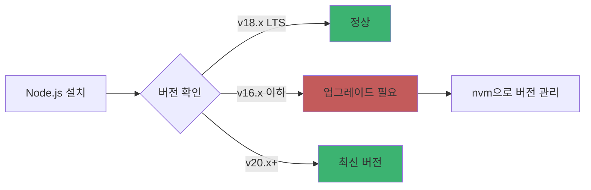
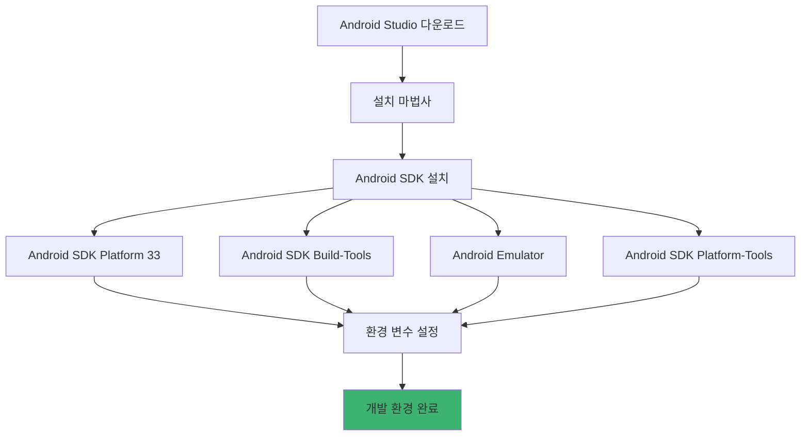
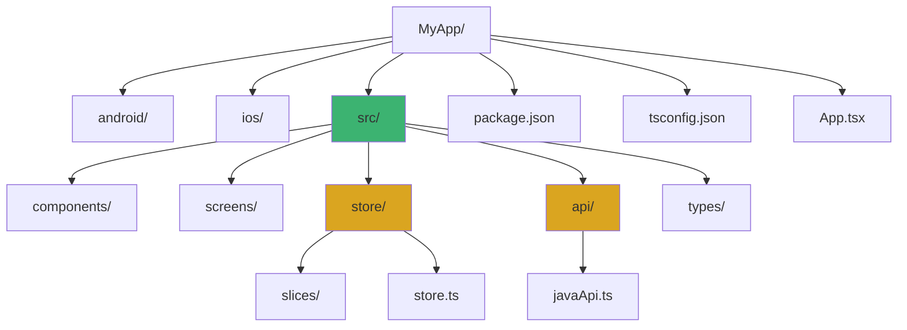
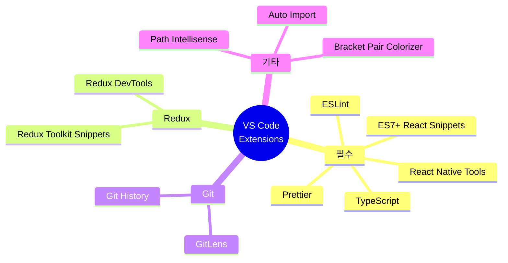
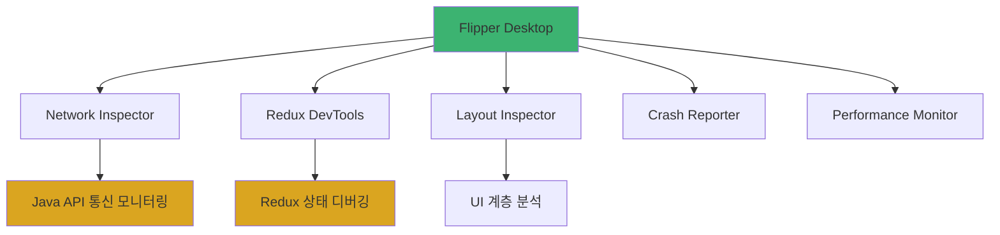
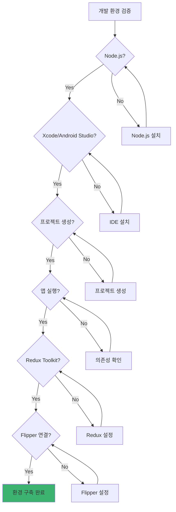

# 1장. React Native 소개

## 1-3. 개발 환경 구축

### 개요

React Native 개발 환경 구축은 iOS와 Android 플랫폼별로 다른 도구와 SDK가 필요합니다. 이 섹션에서는 **TypeScript 기반의 React Native 프로젝트**를 시작하고, **Redux Toolkit**과 **Java API 서버 연동**을 위한 최적의 개발 환경을 구축하는 방법을 단계별로 안내합니다.

macOS, Windows, Linux 환경에서의 설치 방법과 필수 도구, 그리고 생산성을 높이는 개발 도구 설정까지 다룹니다.

### 개발 환경 구성 요소

```mermaid
graph TB
    subgraph "공통 개발 도구"
        A[Node.js &#40;LTS&#41;]
        B[Watchman]
        C[VS Code]
        D[Git]
    end
    
    subgraph "iOS 개발 &#40;macOS Only&#41;"
        E[Xcode]
        F[CocoaPods]
        G[iOS Simulator]
    end
    
    subgraph "Android 개발"
        H[Android Studio]
        I[Android SDK]
        J[Android Emulator]
        K[JDK 11+]
    end
    
    subgraph "프로젝트 도구"
        L[React Native CLI]
        M[TypeScript]
        N[Redux Toolkit]
        O[ESLint/Prettier]
    end
    
    A --> L
    B --> L
    E --> G
    H --> I
    I --> J
    
    style A fill:#3cb371
    style E fill:#daa520
    style H fill:#808080
    style L fill:#3cb371
```



### 시스템 요구사항

#### macOS (iOS + Android 개발 가능)
- macOS 12.0 (Monterey) 이상
- Xcode 14.0 이상
- 최소 8GB RAM (16GB 권장)
- 50GB 이상 여유 공간

#### Windows (Android 개발만 가능)
- Windows 10 이상 (64-bit)
- 최소 8GB RAM (16GB 권장)
- 40GB 이상 여유 공간
- Hyper-V 또는 HAXM 지원

#### Linux (Android 개발만 가능)
- Ubuntu 18.04 LTS 이상
- 최소 8GB RAM
- 30GB 이상 여유 공간

### Node.js 및 패키지 매니저 설치

#### Node.js LTS 설치



**macOS/Linux 설치**:
```bash
# Homebrew 사용 (macOS)
brew install node@18
brew install watchman

# nvm 사용 (macOS/Linux)
curl -o- https://raw.githubusercontent.com/nvm-sh/nvm/v0.39.0/install.sh | bash
nvm install 18
nvm use 18
nvm alias default 18
```

**Windows 설치**:
```powershell
# Chocolatey 사용
choco install nodejs-lts
choco install watchman

# 또는 공식 인스톨러
# https://nodejs.org 에서 LTS 버전 다운로드
```

**설치 확인**:
```bash
node --version  # v18.x.x
npm --version   # 9.x.x
watchman --version  # 2023.x.x
```

#### Yarn 설치 (선택사항)

```bash
# npm 대신 yarn 사용 시
npm install -g yarn
yarn --version  # 1.22.x
```

### iOS 개발 환경 (macOS Only)

#### Xcode 설치

```mermaid
sequenceDiagram
    participant Dev as 개발자
    participant AS as App Store
    participant Xcode as Xcode
    participant CLI as Command Line Tools
    
    Dev->>AS: Xcode 다운로드 &#40;~15GB&#41;
    AS->>Xcode: 설치 완료
    Dev->>CLI: xcode-select --install
    CLI->>Xcode: CLI Tools 연동
    Dev->>Xcode: sudo xcodebuild -license accept
    
    Note over Dev,Xcode: 총 소요 시간: 30-60분
```



**설치 단계**:
```bash
# 1. App Store에서 Xcode 설치

# 2. Command Line Tools 설치
xcode-select --install

# 3. 라이선스 동의
sudo xcodebuild -license accept

# 4. Xcode 버전 확인
xcodebuild -version
# Xcode 14.3
# Build version 14E222b
```

#### CocoaPods 설치

```bash
# Ruby gem으로 설치
sudo gem install cocoapods

# 버전 확인
pod --version  # 1.12.x

# CocoaPods 리포지토리 초기화
pod setup
```

#### iOS Simulator 확인

```bash
# 설치된 시뮬레이터 목록
xcrun simctl list devices

# 시뮬레이터 실행 테스트
open -a Simulator
```

### Android 개발 환경

#### JDK 설치

```bash
# macOS
brew install openjdk@11
sudo ln -sfn /usr/local/opt/openjdk@11/libexec/openjdk.jdk \
  /Library/Java/JavaVirtualMachines/openjdk-11.jdk

# Windows (Chocolatey)
choco install openjdk11

# Linux (Ubuntu)
sudo apt-get install openjdk-11-jdk

# 설치 확인
java -version
# openjdk version "11.0.x"
```

#### Android Studio 설치



**설치 단계**:

1. **Android Studio 다운로드 및 설치**
   - https://developer.android.com/studio
   - 설치 시 "Android Virtual Device" 포함 선택

2. **SDK Manager에서 필수 컴포넌트 설치**
   ```
   Android Studio > Settings > Appearance & Behavior > System Settings > Android SDK
   
   SDK Platforms:
   ✅ Android 13.0 (Tiramisu) - API Level 33
   ✅ Android 12.0 (S) - API Level 31
   
   SDK Tools:
   ✅ Android SDK Build-Tools 33.0.0
   ✅ Android Emulator
   ✅ Android SDK Platform-Tools
   ✅ Android SDK Tools
   ✅ Intel x86 Emulator Accelerator (HAXM installer)
   ```

3. **환경 변수 설정**

   **macOS/Linux** (`~/.zshrc` 또는 `~/.bashrc`):
   ```bash
   export ANDROID_HOME=$HOME/Library/Android/sdk
   export PATH=$PATH:$ANDROID_HOME/emulator
   export PATH=$PATH:$ANDROID_HOME/platform-tools
   export PATH=$PATH:$ANDROID_HOME/tools
   export PATH=$PATH:$ANDROID_HOME/tools/bin
   ```

   **Windows** (시스템 환경 변수):
   ```
   ANDROID_HOME=C:\Users\YOUR_USERNAME\AppData\Local\Android\Sdk
   
   Path에 추가:
   %ANDROID_HOME%\platform-tools
   %ANDROID_HOME%\emulator
   %ANDROID_HOME%\tools
   %ANDROID_HOME%\tools\bin
   ```

4. **설치 확인**:
   ```bash
   # 터미널 재시작 후
   echo $ANDROID_HOME
   # /Users/username/Library/Android/sdk (macOS)
   # C:\Users\username\AppData\Local\Android\Sdk (Windows)
   
   adb --version
   # Android Debug Bridge version 1.0.41
   ```

#### Android Emulator 생성

```bash
# AVD Manager 실행
# Android Studio > Tools > Device Manager

# 또는 CLI로 생성
sdkmanager "system-images;android-33;google_apis;x86_64"
avdmanager create avd -n Pixel_6_API_33 -k "system-images;android-33;google_apis;x86_64"

# 에뮬레이터 실행 테스트
emulator -avd Pixel_6_API_33
```

### React Native CLI 설치

```bash
# React Native CLI 글로벌 설치
npm install -g react-native-cli

# 또는 npx 사용 (권장)
npx react-native --version
# react-native-cli: 2.0.1
```

### 프로젝트 생성

#### TypeScript 템플릿으로 프로젝트 생성

```bash
# TypeScript 템플릿 사용
npx react-native init MyApp --template react-native-template-typescript

# 또는 최신 버전 명시
npx react-native@latest init MyApp --template react-native-template-typescript

cd MyApp
```

**프로젝트 구조**:


### Redux Toolkit 설정

```bash
# Redux Toolkit 및 관련 패키지 설치
npm install @reduxjs/toolkit react-redux
npm install --save-dev @types/react-redux

# Redux DevTools Extension (선택사항)
npm install redux-devtools-extension
```

**Store 기본 설정**:
```typescript
// src/store/store.ts
import { configureStore } from '@reduxjs/toolkit';
import { setupListeners } from '@reduxjs/toolkit/query';

export const store = configureStore({
  reducer: {
    // slices will be added here
  },
});

setupListeners(store.dispatch);

export type RootState = ReturnType<typeof store.getState>;
export type AppDispatch = typeof store.dispatch;
```

**Provider 설정**:
```typescript
// App.tsx
import React from 'react';
import { Provider } from 'react-redux';
import { store } from './src/store/store';
import MainNavigator from './src/navigation/MainNavigator';

const App = () => {
  return (
    <Provider store={store}>
      <MainNavigator />
    </Provider>
  );
};

export default App;
```

### 필수 개발 도구 설치

#### VS Code 확장 프로그램



**추천 확장 프로그램**:
```json
// .vscode/extensions.json
{
  "recommendations": [
    "msjsdiag.vscode-react-native",
    "dsznajder.es7-react-js-snippets",
    "dbaeumer.vscode-eslint",
    "esbenp.prettier-vscode",
    "eamodio.gitlens",
    "reduxjs.redux-devtools"
  ]
}
```

#### ESLint 및 Prettier 설정

```bash
# ESLint 및 Prettier 설치
npm install --save-dev eslint @typescript-eslint/parser @typescript-eslint/eslint-plugin
npm install --save-dev prettier eslint-config-prettier eslint-plugin-prettier
```

**.eslintrc.js**:
```javascript
module.exports = {
  root: true,
  extends: [
    '@react-native-community',
    'plugin:@typescript-eslint/recommended',
    'prettier',
  ],
  parser: '@typescript-eslint/parser',
  plugins: ['@typescript-eslint', 'prettier'],
  rules: {
    'prettier/prettier': 'error',
    '@typescript-eslint/no-unused-vars': 'warn',
    'react-hooks/exhaustive-deps': 'warn',
  },
};
```

**.prettierrc.js**:
```javascript
module.exports = {
  semi: true,
  trailingComma: 'all',
  singleQuote: true,
  printWidth: 80,
  tabWidth: 2,
  arrowParens: 'avoid',
};
```

### 개발 서버 실행

```mermaid
sequenceDiagram
    participant Dev as 개발자
    participant Metro as Metro Bundler
    participant iOS as iOS Simulator
    participant Android as Android Emulator
    
    Dev->>Metro: npm start
    Metro->>Metro: 번들링 시작 &#40;8081 포트&#41;
    
    par iOS 실행
        Dev->>iOS: npm run ios
        iOS->>Metro: 번들 요청
        Metro->>iOS: JS 번들 전송
        iOS->>iOS: 앱 실행
    and Android 실행
        Dev->>Android: npm run android
        Android->>Metro: 번들 요청
        Metro->>Android: JS 번들 전송
        Android->>Android: 앱 실행
    end
    
    Note over Metro: Fast Refresh 활성화
```



#### Metro Bundler 시작

```bash
# Metro Bundler 시작 (별도 터미널)
npm start

# 또는 캐시 클리어 후 시작
npm start -- --reset-cache
```

#### iOS 앱 실행

```bash
# 기본 시뮬레이터로 실행
npm run ios

# 특정 시뮬레이터 지정
npm run ios -- --simulator="iPhone 14 Pro"

# 특정 iOS 버전
npx react-native run-ios --simulator="iPhone 14 Pro"

# 실제 디바이스 (Xcode 필요)
npx react-native run-ios --device
```

#### Android 앱 실행

```bash
# 기본 에뮬레이터로 실행
npm run android

# 특정 디바이스 지정
adb devices  # 연결된 디바이스 확인
npm run android -- --deviceId=emulator-5554

# Release 빌드
npm run android -- --variant=release
```

### 디버깅 도구 설정

#### Flipper 설치 및 설정



**Flipper 설치**:
```bash
# macOS
brew install --cask flipper

# Windows/Linux
# https://fbflipper.com 에서 다운로드

# Flipper 플러그인 설치
npm install --save-dev react-native-flipper
```

**Redux Flipper 플러그인**:
```bash
npm install redux-flipper
```

```typescript
// src/store/store.ts
import { configureStore } from '@reduxjs/toolkit';
import { reduxFlipperMiddleware } from 'redux-flipper';

export const store = configureStore({
  reducer: {
    // reducers
  },
  middleware: (getDefaultMiddleware) =>
    getDefaultMiddleware().concat(reduxFlipperMiddleware),
});
```

#### React DevTools

```bash
# React DevTools 설치
npm install -g react-devtools

# 실행 (별도 터미널)
react-devtools

# 앱에서 자동 연결됨
```

### Java API 서버 연동 준비

#### Axios 설치 및 기본 설정

```bash
# Axios 및 타입 정의 설치
npm install axios
npm install --save-dev @types/axios
```

**API 클라이언트 설정**:
```typescript
// src/api/client.ts
import axios from 'axios';

const apiClient = axios.create({
  baseURL: __DEV__ 
    ? 'http://localhost:8080/api/v1'  // 개발 환경
    : 'https://api.production.com/v1', // 프로덕션
  timeout: 10000,
  headers: {
    'Content-Type': 'application/json',
  },
});

// 요청 인터셉터
apiClient.interceptors.request.use(
  (config) => {
    // JWT 토큰 추가 로직
    return config;
  },
  (error) => Promise.reject(error)
);

// 응답 인터셉터
apiClient.interceptors.response.use(
  (response) => response,
  (error) => {
    // 에러 처리 로직
    return Promise.reject(error);
  }
);

export default apiClient;
```

#### RTK Query 설정

```typescript
// src/store/api/javaApi.ts
import { createApi, fetchBaseQuery } from '@reduxjs/toolkit/query/react';
import type { RootState } from '../store';

export const javaApi = createApi({
  reducerPath: 'javaApi',
  baseQuery: fetchBaseQuery({
    baseUrl: __DEV__ 
      ? 'http://localhost:8080/api/v1'
      : 'https://api.production.com/v1',
    prepareHeaders: (headers, { getState }) => {
      const token = (getState() as RootState).auth?.token;
      if (token) {
        headers.set('Authorization', `Bearer ${token}`);
      }
      return headers;
    },
  }),
  endpoints: (builder) => ({
    // endpoints will be added here
  }),
});
```

### 환경 설정 파일

#### 환경 변수 관리

```bash
# react-native-config 설치
npm install react-native-config
npx pod-install  # iOS
```

**.env.development**:
```bash
API_URL=http://localhost:8080/api/v1
API_TIMEOUT=10000
ENABLE_FLIPPER=true
```

**.env.production**:
```bash
API_URL=https://api.production.com/v1
API_TIMEOUT=15000
ENABLE_FLIPPER=false
```

**사용 예시**:
```typescript
import Config from 'react-native-config';

const API_URL = Config.API_URL;
const API_TIMEOUT = parseInt(Config.API_TIMEOUT, 10);
```

### 최종 환경 검증



**검증 체크리스트**:
```bash
# 1. Node.js 및 패키지 매니저
node --version    # ✓ v18.x.x
npm --version     # ✓ 9.x.x
watchman --version # ✓ 설치됨

# 2. iOS 환경 (macOS)
xcodebuild -version  # ✓ Xcode 14+
pod --version        # ✓ CocoaPods 1.12+

# 3. Android 환경
echo $ANDROID_HOME   # ✓ 경로 설정됨
adb --version        # ✓ adb 설치됨
emulator -list-avds  # ✓ AVD 목록 표시

# 4. React Native
npx react-native --version  # ✓ CLI 동작
npx react-native doctor     # ✓ 환경 진단

# 5. 프로젝트 실행
npm run ios      # ✓ iOS 시뮬레이터 실행
npm run android  # ✓ Android 에뮬레이터 실행

# 6. 개발 도구
code --list-extensions  # ✓ VS Code 확장 설치
open -a Flipper         # ✓ Flipper 실행
```

### 문제 해결 (Troubleshooting)

#### iOS 관련 이슈

```bash
# Pod 설치 오류
cd ios
pod deintegrate
pod install
cd ..

# 빌드 캐시 삭제
cd ios
rm -rf build/
xcodebuild clean
cd ..

# CocoaPods 캐시 클리어
pod cache clean --all
```

#### Android 관련 이슈

```bash
# Gradle 캐시 삭제
cd android
./gradlew clean
cd ..

# Android 빌드 캐시 삭제
rm -rf android/.gradle
rm -rf android/app/build

# ADB 재시작
adb kill-server
adb start-server
```

#### Metro Bundler 이슈

```bash
# 캐시 클리어
npm start -- --reset-cache

# watchman 캐시 삭제
watchman watch-del-all

# node_modules 재설치
rm -rf node_modules
npm install
```

### 요약

React Native 개발 환경 구축이 완료되었습니다.

**핵심 구성 요소**:
- Node.js 18 LTS + Watchman
- iOS: Xcode 14+ + CocoaPods
- Android: Android Studio + SDK 33 + JDK 11
- React Native CLI + TypeScript 템플릿
- Redux Toolkit + RTK Query
- Flipper + React DevTools

**다음 단계**:
- 2장에서 프로젝트 구조를 설계하고 Redux Toolkit 기반 아키텍처를 구축합니다
- Java API 서버와의 연동을 위한 상세한 설정을 다룹니다

개발 환경이 제대로 구축되었다면 이제 본격적인 React Native 앱 개발을 시작할 준비가 완료되었습니다.
