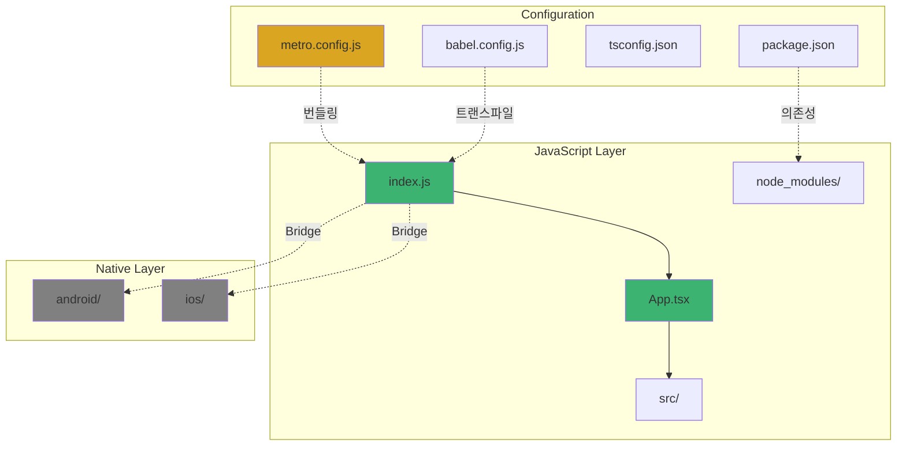
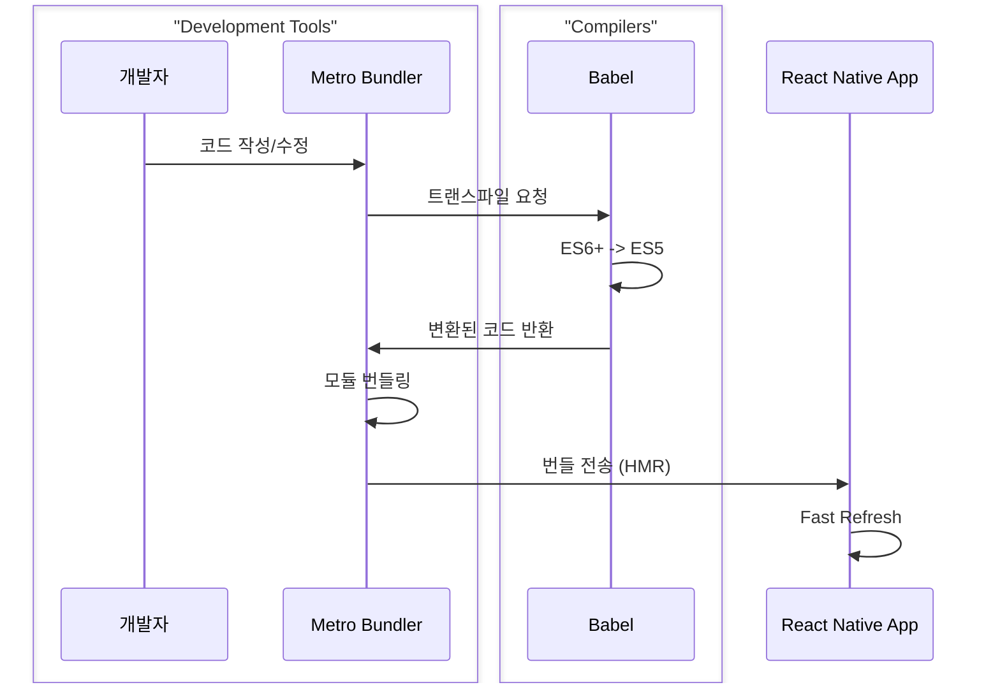
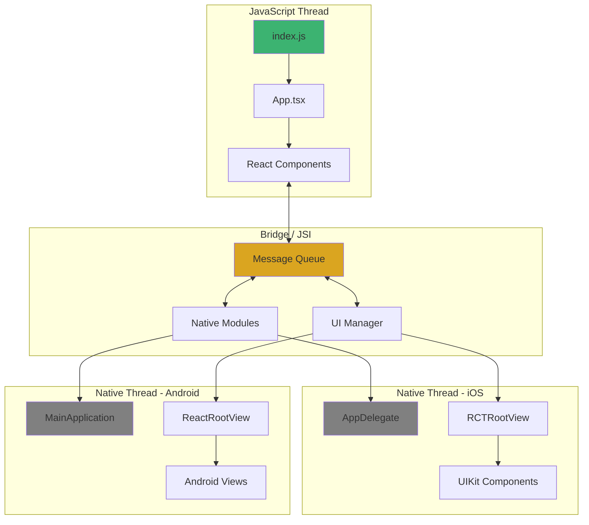
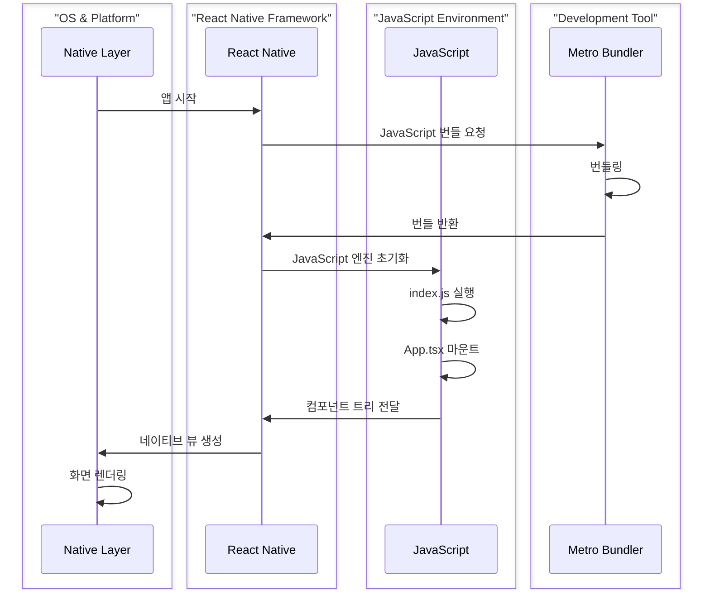
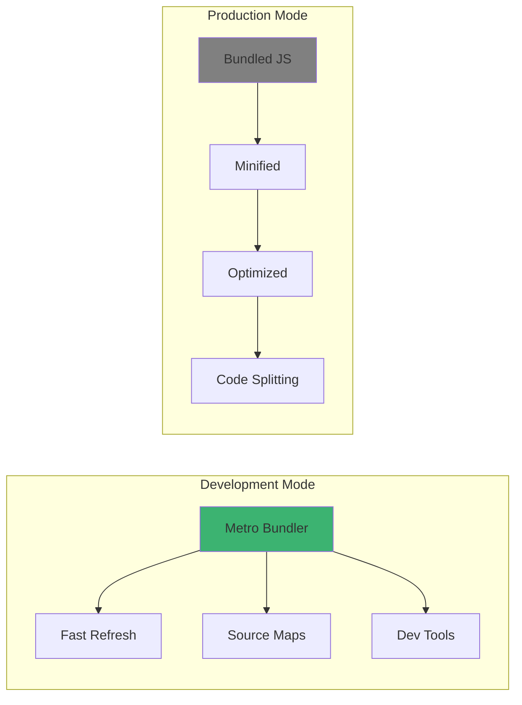

# 2장. 프로젝트 구조와 아키텍처

## 2-1. React Native 프로젝트 구조 이해하기

### 개요

React Native 프로젝트의 구조를 이해하는 것은 효율적인 개발의 첫걸음입니다. 이 섹션에서는 React Native CLI로 생성한 프로젝트의 기본 구조와 각 디렉토리 및 파일의 역할을 살펴봅니다. 또한 iOS와 Android 네이티브 디렉토리의 구조와 JavaScript 계층과의 관계를 이해하고, Metro Bundler의 동작 원리를 다룹니다.

### 기본 프로젝트 구조

React Native CLI로 새 프로젝트를 생성하면 다음과 같은 구조가 만들어집니다:

```
MyApp/
├── __tests__/              # 테스트 파일
├── android/                # Android 네이티브 코드
├── ios/                    # iOS 네이티브 코드
├── node_modules/           # npm 패키지 의존성
├── .gitignore
├── .prettierrc.js
├── .watchmanconfig
├── app.json
├── App.tsx                 # 루트 컴포넌트
├── babel.config.js
├── index.js               # 앱 진입점
├── metro.config.js        # Metro 번들러 설정
├── package.json
├── tsconfig.json
└── yarn.lock / package-lock.json
```

#### 프로젝트 구조 다이어그램



### 주요 파일 및 디렉토리

#### 1. 진입점 파일

##### index.js

앱의 시작점으로, React Native 앱을 등록합니다.

```typescript
import { AppRegistry } from 'react-native';
import App from './App';
import { name as appName } from './app.json';

AppRegistry.registerComponent(appName, () => App);
```

**역할**:
- `AppRegistry`: 네이티브 측에서 JavaScript 측으로의 진입점
- 앱 이름과 루트 컴포넌트를 연결
- iOS와 Android 모두 이 파일을 진입점으로 사용

##### App.tsx

실제 앱의 루트 컴포넌트입니다.

```typescript
import React from 'react';
import { SafeAreaView, StatusBar, StyleSheet } from 'react-native';

const App: React.FC = () => {
  return (
    <SafeAreaView style={styles.container}>
      <StatusBar barStyle="dark-content" />
      {/* 앱의 메인 컨텐츠 */}
    </SafeAreaView>
  );
};

const styles = StyleSheet.create({
  container: {
    flex: 1,
  },
});

export default App;
```

#### 2. 설정 파일

##### metro.config.js

**Metro Bundler**는 React Native 전용 JavaScript 번들러입니다.

```javascript
const { getDefaultConfig, mergeConfig } = require('@react-native/metro-config');

const config = {
  transformer: {
    getTransformOptions: async () => ({
      transform: {
        experimentalImportSupport: false,
        inlineRequires: true, // 성능 최적화
      },
    }),
  },
  resolver: {
    sourceExts: ['jsx', 'js', 'ts', 'tsx', 'json'],
  },
};

module.exports = mergeConfig(getDefaultConfig(__dirname), config);
```

**Metro의 주요 기능**:
- **Fast Refresh**: 코드 변경 즉시 반영
- **트랜스파일링**: Babel을 통한 최신 JavaScript 문법 지원
- **번들링**: 모듈을 하나의 파일로 결합
- **소스 맵 생성**: 디버깅을 위한 소스 맵



##### babel.config.js

JavaScript 코드 트랜스파일 설정입니다.

```javascript
module.exports = {
  presets: ['module:@react-native/babel-preset'],
  plugins: [
    [
      'module-resolver',
      {
        root: ['./src'],
        extensions: ['.ios.js', '.android.js', '.js', '.ts', '.tsx', '.json'],
        alias: {
          '@components': './src/components',
          '@screens': './src/screens',
          '@utils': './src/utils',
          '@assets': './src/assets',
        },
      },
    ],
  ],
};
```

**주요 플러그인**:
- `@react-native/babel-preset`: React Native 기본 프리셋
- `module-resolver`: 경로 별칭 설정
- `@babel/plugin-proposal-decorators`: 데코레이터 문법 지원

##### tsconfig.json

TypeScript 컴파일러 설정입니다.

```json
{
  "extends": "@react-native/typescript-config/tsconfig.json",
  "compilerOptions": {
    "target": "esnext",
    "module": "commonjs",
    "lib": ["es2019"],
    "jsx": "react-native",
    "strict": true,
    "esModuleInterop": true,
    "skipLibCheck": true,
    "resolveJsonModule": true,
    "baseUrl": "./src",
    "paths": {
      "@components/*": ["components/*"],
      "@screens/*": ["screens/*"],
      "@utils/*": ["utils/*"]
    }
  },
  "include": ["src/**/*"],
  "exclude": ["node_modules", "babel.config.js", "metro.config.js"]
}
```

##### package.json

프로젝트 메타데이터와 의존성을 정의합니다.

```json
{
  "name": "MyApp",
  "version": "0.0.1",
  "private": true,
  "scripts": {
    "android": "react-native run-android",
    "ios": "react-native run-ios",
    "start": "react-native start",
    "test": "jest",
    "lint": "eslint ."
  },
  "dependencies": {
    "react": "18.2.0",
    "react-native": "0.74.0"
  },
  "devDependencies": {
    "@babel/core": "^7.20.0",
    "@react-native/babel-preset": "0.74.0",
    "@react-native/metro-config": "0.74.0",
    "typescript": "5.0.4"
  }
}
```

### Android 네이티브 구조

```
android/
├── app/
│   ├── build.gradle              # 앱 레벨 빌드 설정
│   ├── proguard-rules.pro        # 코드 난독화 규칙
│   └── src/
│       ├── main/
│       │   ├── java/             # Java/Kotlin 소스
│       │   │   └── com/myapp/
│       │   │       ├── MainActivity.java
│       │   │       └── MainApplication.java
│       │   ├── res/              # 리소스 (아이콘, 이미지 등)
│       │   └── AndroidManifest.xml
│       └── debug/
│           └── AndroidManifest.xml
├── gradle/
├── build.gradle                  # 프로젝트 레벨 빌드 설정
├── gradle.properties             # Gradle 속성
├── gradlew                       # Gradle Wrapper (Unix)
├── gradlew.bat                   # Gradle Wrapper (Windows)
└── settings.gradle
```

#### Android 주요 파일

##### MainActivity.java

React Native 앱의 메인 액티비티입니다.

```java
package com.myapp;

import com.facebook.react.ReactActivity;
import com.facebook.react.ReactActivityDelegate;
import com.facebook.react.defaults.DefaultNewArchitectureEntryPoint;
import com.facebook.react.defaults.DefaultReactActivityDelegate;

public class MainActivity extends ReactActivity {

  @Override
  protected String getMainComponentName() {
    return "MyApp"; // app.json의 name과 일치
  }

  @Override
  protected ReactActivityDelegate createReactActivityDelegate() {
    return new DefaultReactActivityDelegate(
      this,
      getMainComponentName(),
      DefaultNewArchitectureEntryPoint.getFabricEnabled()
    );
  }
}
```

##### MainApplication.java

React Native 앱의 애플리케이션 클래스입니다.

```java
package com.myapp;

import android.app.Application;
import com.facebook.react.PackageList;
import com.facebook.react.ReactApplication;
import com.facebook.react.ReactNativeHost;
import com.facebook.react.ReactPackage;
import com.facebook.react.defaults.DefaultNewArchitectureEntryPoint;
import com.facebook.react.defaults.DefaultReactNativeHost;
import java.util.List;

public class MainApplication extends Application implements ReactApplication {

  private final ReactNativeHost mReactNativeHost =
      new DefaultReactNativeHost(this) {
        @Override
        public boolean getUseDeveloperSupport() {
          return BuildConfig.DEBUG;
        }

        @Override
        protected List<ReactPackage> getPackages() {
          return new PackageList(this).getPackages();
          // 커스텀 네이티브 모듈 추가 가능
        }

        @Override
        protected String getJSMainModuleName() {
          return "index";
        }

        @Override
        protected boolean isNewArchEnabled() {
          return DefaultNewArchitectureEntryPoint.getFabricEnabled();
        }
      };

  @Override
  public ReactNativeHost getReactNativeHost() {
    return mReactNativeHost;
  }
}
```

##### AndroidManifest.xml

앱의 권한과 설정을 정의합니다.

```xml
<manifest xmlns:android="http://schemas.android.com/apk/res/android">

    <uses-permission android:name="android.permission.INTERNET" />
    <uses-permission android:name="android.permission.CAMERA" />
    <uses-permission android:name="android.permission.ACCESS_FINE_LOCATION" />

    <application
      android:name=".MainApplication"
      android:label="@string/app_name"
      android:icon="@mipmap/ic_launcher"
      android:roundIcon="@mipmap/ic_launcher_round"
      android:allowBackup="false"
      android:theme="@style/AppTheme">

      <activity
        android:name=".MainActivity"
        android:label="@string/app_name"
        android:configChanges="keyboard|keyboardHidden|orientation|screenSize"
        android:windowSoftInputMode="adjustResize"
        android:exported="true">
        <intent-filter>
            <action android:name="android.intent.action.MAIN" />
            <category android:name="android.intent.category.LAUNCHER" />
        </intent-filter>
      </activity>
    </application>
</manifest>
```

##### app/build.gradle

앱 레벨의 빌드 설정입니다.

```gradle
apply plugin: "com.android.application"
apply plugin: "com.facebook.react"

android {
    namespace "com.myapp"
    compileSdkVersion 34

    defaultConfig {
        applicationId "com.myapp"
        minSdkVersion 23
        targetSdkVersion 34
        versionCode 1
        versionName "1.0"
    }

    buildTypes {
        debug {
            signingConfig signingConfigs.debug
        }
        release {
            minifyEnabled true
            proguardFiles getDefaultProguardFile('proguard-android.txt'), 'proguard-rules.pro'
        }
    }
}

dependencies {
    implementation("com.facebook.react:react-android")

    if (hermesEnabled.toBoolean()) {
        implementation("com.facebook.react:hermes-android")
    } else {
        implementation jscFlavor
    }
}
```

### iOS 네이티브 구조

```
ios/
├── MyApp/
│   ├── AppDelegate.h             # 앱 델리게이트 헤더
│   ├── AppDelegate.mm            # 앱 델리게이트 구현
│   ├── Images.xcassets/          # 이미지 에셋
│   │   └── AppIcon.appiconset/
│   ├── Info.plist                # 앱 설정 및 권한
│   ├── LaunchScreen.storyboard   # 런치 스크린
│   └── main.m                    # 앱 진입점
├── MyApp.xcodeproj/              # Xcode 프로젝트 파일
│   ├── project.pbxproj
│   └── xcshareddata/
├── MyApp.xcworkspace/            # CocoaPods 워크스페이스
├── Podfile                       # CocoaPods 의존성
└── Pods/                         # 설치된 Pods
```

#### iOS 주요 파일

##### AppDelegate.mm

React Native 앱의 진입점입니다.

```objective-c
#import "AppDelegate.h"
#import <React/RCTBundleURLProvider.h>

@implementation AppDelegate

- (BOOL)application:(UIApplication *)application
    didFinishLaunchingWithOptions:(NSDictionary *)launchOptions
{
  self.moduleName = @"MyApp";
  self.initialProps = @{};

  return [super application:application
         didFinishLaunchingWithOptions:launchOptions];
}

- (NSURL *)sourceURLForBridge:(RCTBridge *)bridge
{
  return [self bundleURL];
}

- (NSURL *)bundleURL
{
#if DEBUG
  return [[RCTBundleURLProvider sharedSettings] jsBundleURLForBundleRoot:@"index"];
#else
  return [[NSBundle mainBundle] URLForResource:@"main" withExtension:@"jsbundle"];
#endif
}

@end
```

##### Info.plist

앱의 메타데이터와 권한을 정의합니다.

```xml
<?xml version="1.0" encoding="UTF-8"?>
<!DOCTYPE plist PUBLIC "-//Apple//DTD PLIST 1.0//EN" "http://www.apple.com/DTDs/PropertyList-1.0.dtd">
<plist version="1.0">
<dict>
    <key>CFBundleDisplayName</key>
    <string>MyApp</string>
    <key>CFBundleIdentifier</key>
    <string>com.myapp</string>
    <key>CFBundleVersion</key>
    <string>1</string>

    <!-- 권한 -->
    <key>NSCameraUsageDescription</key>
    <string>카메라 접근 권한이 필요합니다</string>
    <key>NSLocationWhenInUseUsageDescription</key>
    <string>위치 정보 접근 권한이 필요합니다</string>

    <!-- App Transport Security -->
    <key>NSAppTransportSecurity</key>
    <dict>
        <key>NSAllowsArbitraryLoads</key>
        <false/>
    </dict>
</dict>
</plist>
```

##### Podfile

CocoaPods 의존성을 정의합니다.

```ruby
require_relative '../node_modules/react-native/scripts/react_native_pods'
require_relative '../node_modules/@react-native-community/cli-platform-ios/native_modules'

platform :ios, '13.4'

target 'MyApp' do
  use_react_native!(
    :path => config[:reactNativePath],
    :hermes_enabled => true,
    :fabric_enabled => true,
    :app_path => "#{Pod::Config.instance.installation_root}/.."
  )

  post_install do |installer|
    react_native_post_install(installer)
  end
end
```

### JavaScript와 네이티브의 연결



### 실행 흐름

#### 앱 시작 프로세스



**단계별 설명**:

1. **네이티브 시작**
   - iOS: `main.m` → `AppDelegate.mm`
   - Android: `MainActivity.java` → `MainApplication.java`

2. **JavaScript 번들 로드**
   - 개발 모드: Metro에서 실시간 번들 제공
   - 프로덕션: 미리 번들링된 파일 사용

3. **JavaScript 실행**
   - `index.js`에서 `AppRegistry.registerComponent()` 호출
   - 루트 컴포넌트 등록

4. **UI 렌더링**
   - React 컴포넌트 트리 생성
   - Bridge/JSI를 통해 네이티브로 전달
   - 네이티브 뷰 생성 및 렌더링

### 개발 vs 프로덕션 구조



**개발 모드**:
- Metro 서버가 실시간으로 번들 제공
- Fast Refresh 활성화
- 소스 맵으로 디버깅 가능
- 개발 도구(Flipper, React DevTools) 연결

**프로덕션 모드**:
- 사전 번들링된 JavaScript 파일 포함
- 코드 최소화 및 난독화
- 성능 최적화 적용
- 디버깅 도구 비활성화

### 모범 사례

#### 1. 프로젝트 폴더 구조 제안

```
src/
├── components/           # 재사용 가능한 컴포넌트
│   ├── common/
│   └── features/
├── screens/             # 화면 컴포넌트
├── navigation/          # 네비게이션 설정
├── services/            # API 통신
│   └── api/
├── store/               # Redux 상태 관리
│   ├── slices/
│   └── middleware/
├── hooks/               # 커스텀 훅
├── utils/               # 유틸리티 함수
├── types/               # TypeScript 타입 정의
├── assets/              # 정적 리소스
│   ├── images/
│   └── fonts/
└── constants/           # 상수 정의
```

#### 2. 경로 별칭 활용

```typescript
// babel.config.js와 tsconfig.json에서 설정
import Button from '@components/common/Button';
import { useAuth } from '@hooks/useAuth';
import { api } from '@services/api';
```

#### 3. 플랫폼별 코드 분리

```typescript
// 파일명 확장자로 분리
Button.ios.tsx
Button.android.tsx
Button.tsx  // 공통 코드

// Platform.select로 분기
import { Platform } from 'react-native';

const styles = StyleSheet.create({
  container: {
    ...Platform.select({
      ios: { paddingTop: 20 },
      android: { paddingTop: 0 },
    }),
  },
});
```

### 요약

React Native 프로젝트 구조는 크게 세 가지 계층으로 구성됩니다:

1. **JavaScript 계층**: React 컴포넌트와 비즈니스 로직
2. **네이티브 계층**: iOS(Objective-C/Swift)와 Android(Java/Kotlin) 코드
3. **Bridge/JSI 계층**: JavaScript와 네이티브 간의 통신

**핵심 포인트**:
- `index.js`는 앱의 진입점이며 JavaScript 실행 시작점
- Metro Bundler는 개발 중 Fast Refresh와 번들링 담당
- Android는 Gradle, iOS는 CocoaPods로 의존성 관리
- 설정 파일을 통해 번들링, 트랜스파일, 타입 체크 제어
- 체계적인 폴더 구조와 경로 별칭으로 유지보수성 향상

다음 섹션에서는 실무에 적합한 폴더 구조 설계 전략을 다룹니다.
