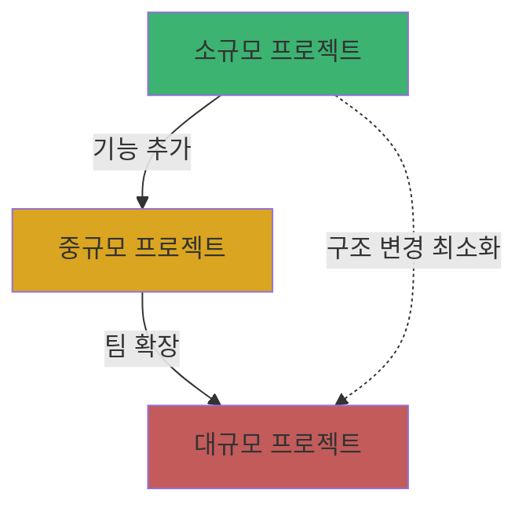
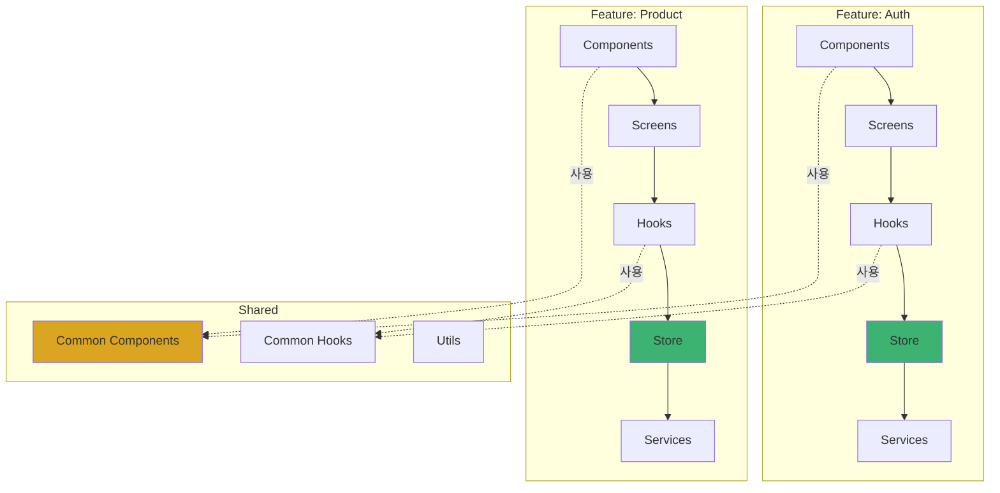
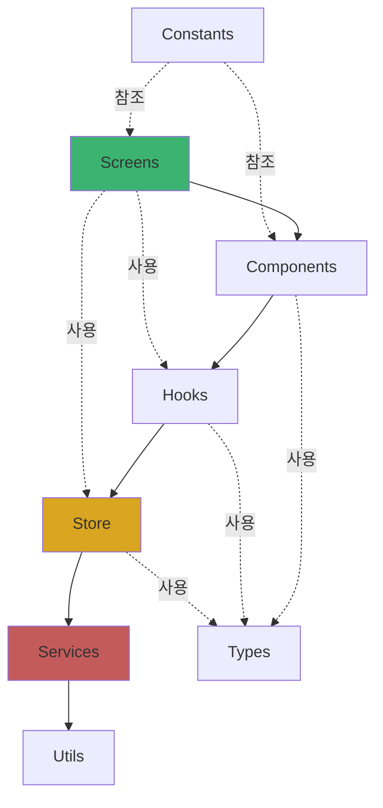
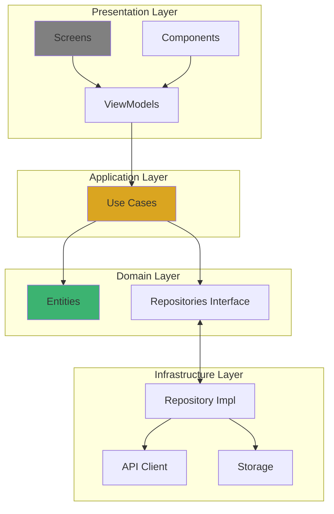
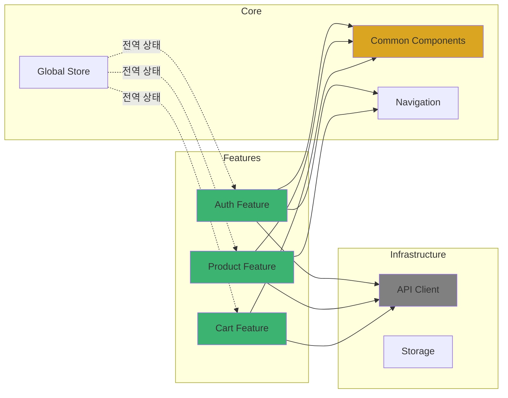
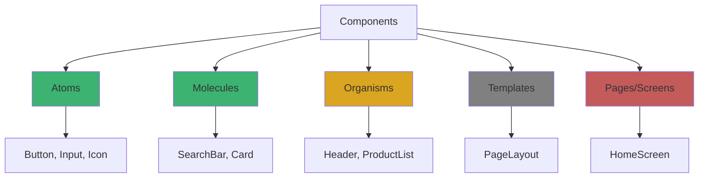
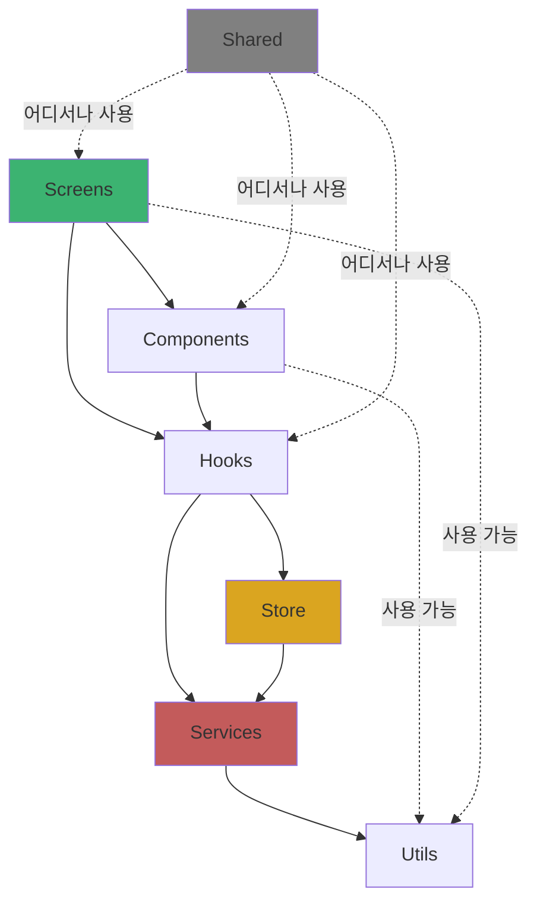

# 2장. 프로젝트 구조와 아키텍처

## 2-2. 폴더 구조 설계 전략

### 개요

효과적인 폴더 구조는 프로젝트의 확장성과 유지보수성을 결정하는 핵심 요소입니다. 이 섹션에서는 React Native 프로젝트의 다양한 폴더 구조 패턴을 살펴보고, 프로젝트 규모와 팀 구성에 따른 최적의 구조 설계 전략을 다룹니다. Feature-based, Layer-based, Domain-driven 등 여러 접근 방식을 비교하고 실무에 적용할 수 있는 가이드를 제공합니다.

### 폴더 구조 설계의 원칙

#### 1. 확장 가능성 (Scalability)

프로젝트가 성장해도 구조가 복잡해지지 않아야 합니다.



#### 2. 응집도 (Cohesion)

관련된 코드는 가까이, 관련 없는 코드는 분리합니다.

```typescript
// ❌ 낮은 응집도
components/Button.tsx
utils/buttonHelpers.ts
styles/buttonStyles.ts
types/buttonTypes.ts

// ✅ 높은 응집도
components/Button/
  ├── index.tsx
  ├── Button.styles.ts
  ├── Button.types.ts
  └── Button.utils.ts
```

#### 3. 명확성 (Clarity)

폴더와 파일 이름만으로 역할을 파악할 수 있어야 합니다.

#### 4. 일관성 (Consistency)

프로젝트 전체에서 동일한 규칙을 따라야 합니다.

### 주요 폴더 구조 패턴

#### 1. Feature-Based 구조

기능 중심으로 구성하는 방식으로, 각 기능이 독립적인 모듈처럼 동작합니다.

```
src/
├── features/
│   ├── auth/
│   │   ├── components/
│   │   │   ├── LoginForm.tsx
│   │   │   └── SignupForm.tsx
│   │   ├── screens/
│   │   │   ├── LoginScreen.tsx
│   │   │   └── SignupScreen.tsx
│   │   ├── hooks/
│   │   │   └── useAuth.ts
│   │   ├── store/
│   │   │   └── authSlice.ts
│   │   ├── services/
│   │   │   └── authApi.ts
│   │   ├── types/
│   │   │   └── auth.types.ts
│   │   └── index.ts
│   ├── product/
│   │   ├── components/
│   │   │   ├── ProductCard.tsx
│   │   │   └── ProductList.tsx
│   │   ├── screens/
│   │   │   ├── ProductListScreen.tsx
│   │   │   └── ProductDetailScreen.tsx
│   │   ├── hooks/
│   │   │   └── useProducts.ts
│   │   ├── store/
│   │   │   └── productSlice.ts
│   │   └── services/
│   │       └── productApi.ts
│   └── cart/
│       ├── components/
│       ├── screens/
│       ├── hooks/
│       └── store/
├── shared/
│   ├── components/
│   │   ├── Button/
│   │   ├── Input/
│   │   └── Modal/
│   ├── hooks/
│   │   └── useDebounce.ts
│   └── utils/
│       └── formatters.ts
├── navigation/
│   └── AppNavigator.tsx
├── store/
│   └── index.ts
└── App.tsx
```

**Feature-Based 구조 다이어그램**:



**장점**:
- ✅ 기능별로 완전히 독립적인 모듈
- ✅ 코드 재사용성 향상
- ✅ 팀 단위 개발에 유리
- ✅ 기능 추가/제거가 용이

**단점**:
- ❌ 초기 구조 설계가 복잡
- ❌ 기능 간 의존성 관리 필요
- ❌ 소규모 프로젝트에는 과도할 수 있음

**적합한 경우**:
- 중대규모 프로젝트
- 여러 팀이 협업하는 경우
- 기능이 명확히 구분되는 앱
- 마이크로프론트엔드 아키텍처

#### 2. Layer-Based 구조

계층 중심으로 구성하는 전통적인 방식입니다.

```
src/
├── components/
│   ├── common/
│   │   ├── Button/
│   │   ├── Input/
│   │   └── Card/
│   └── features/
│       ├── LoginForm/
│       ├── ProductCard/
│       └── CartItem/
├── screens/
│   ├── auth/
│   │   ├── LoginScreen.tsx
│   │   └── SignupScreen.tsx
│   ├── product/
│   │   ├── ProductListScreen.tsx
│   │   └── ProductDetailScreen.tsx
│   └── cart/
│       └── CartScreen.tsx
├── navigation/
│   ├── AuthNavigator.tsx
│   ├── MainNavigator.tsx
│   └── AppNavigator.tsx
├── store/
│   ├── slices/
│   │   ├── authSlice.ts
│   │   ├── productSlice.ts
│   │   └── cartSlice.ts
│   ├── middleware/
│   └── index.ts
├── services/
│   ├── api/
│   │   ├── authApi.ts
│   │   ├── productApi.ts
│   │   └── baseApi.ts
│   └── storage/
│       └── AsyncStorageService.ts
├── hooks/
│   ├── useAuth.ts
│   ├── useProducts.ts
│   └── useDebounce.ts
├── utils/
│   ├── formatters.ts
│   ├── validators.ts
│   └── helpers.ts
├── types/
│   ├── auth.types.ts
│   ├── product.types.ts
│   └── common.types.ts
├── constants/
│   ├── config.ts
│   └── theme.ts
└── assets/
    ├── images/
    └── fonts/
```

**Layer-Based 구조 다이어그램**:



**장점**:
- ✅ 이해하기 쉬운 구조
- ✅ 빠른 초기 설정
- ✅ 소규모 프로젝트에 적합
- ✅ 파일 찾기 쉬움

**단점**:
- ❌ 대규모 프로젝트에서 폴더가 비대해짐
- ❌ 기능별 응집도 낮음
- ❌ 기능 제거 시 여러 폴더 수정 필요

**적합한 경우**:
- 소규모 프로젝트
- 단순한 앱 구조
- 개인 프로젝트
- 빠른 프로토타입

#### 3. Domain-Driven 구조

비즈니스 도메인 중심으로 구성하는 방식입니다.

```
src/
├── domains/
│   ├── user/
│   │   ├── entities/
│   │   │   └── User.ts
│   │   ├── repositories/
│   │   │   └── UserRepository.ts
│   │   ├── usecases/
│   │   │   ├── LoginUseCase.ts
│   │   │   └── GetUserProfileUseCase.ts
│   │   └── presentation/
│   │       ├── components/
│   │       ├── screens/
│   │       └── viewmodels/
│   ├── product/
│   │   ├── entities/
│   │   │   └── Product.ts
│   │   ├── repositories/
│   │   │   └── ProductRepository.ts
│   │   ├── usecases/
│   │   │   ├── GetProductsUseCase.ts
│   │   │   └── SearchProductsUseCase.ts
│   │   └── presentation/
│   │       ├── components/
│   │       └── screens/
│   └── order/
│       ├── entities/
│       ├── repositories/
│       ├── usecases/
│       └── presentation/
├── infrastructure/
│   ├── api/
│   │   └── RestApiClient.ts
│   ├── storage/
│   │   └── LocalStorage.ts
│   └── navigation/
│       └── Navigator.ts
└── shared/
    ├── components/
    ├── hooks/
    └── utils/
```

**Domain-Driven 구조 다이어그램**:



**장점**:
- ✅ 비즈니스 로직과 UI 완전 분리
- ✅ 테스트 용이성
- ✅ 확장성 우수
- ✅ 명확한 책임 분리

**단점**:
- ❌ 높은 학습 곡선
- ❌ 초기 설정 복잡
- ❌ 간단한 앱에는 과도한 구조
- ❌ 보일러플레이트 코드 증가

**적합한 경우**:
- 복잡한 비즈니스 로직
- 엔터프라이즈 애플리케이션
- 장기 유지보수 프로젝트
- Clean Architecture 적용

### 하이브리드 접근법

실무에서는 여러 패턴을 혼합한 하이브리드 구조를 많이 사용합니다.

```
src/
├── features/                    # Feature-based
│   ├── auth/
│   │   ├── components/
│   │   ├── screens/
│   │   ├── hooks/
│   │   ├── store/
│   │   └── services/
│   ├── product/
│   └── cart/
├── core/                        # Layer-based
│   ├── components/
│   │   ├── Button/
│   │   ├── Input/
│   │   └── Card/
│   ├── hooks/
│   │   ├── useDebounce.ts
│   │   └── useTheme.ts
│   ├── navigation/
│   │   └── RootNavigator.tsx
│   └── store/
│       └── index.ts
├── shared/
│   ├── utils/
│   │   ├── formatters.ts
│   │   └── validators.ts
│   ├── types/
│   │   └── common.types.ts
│   └── constants/
│       ├── config.ts
│       └── theme.ts
├── infrastructure/              # Domain-driven
│   ├── api/
│   │   ├── client.ts
│   │   └── interceptors.ts
│   └── storage/
│       └── AsyncStorageService.ts
└── assets/
    ├── images/
    └── fonts/
```

**하이브리드 구조의 흐름**:



### 컴포넌트 구조 전략

#### 1. 컴포넌트 분류



**Atomic Design 패턴 적용**:

```
src/components/
├── atoms/               # 최소 단위 컴포넌트
│   ├── Button/
│   │   ├── index.tsx
│   │   ├── Button.styles.ts
│   │   ├── Button.types.ts
│   │   └── Button.test.tsx
│   ├── Input/
│   └── Icon/
├── molecules/           # Atoms 조합
│   ├── SearchBar/
│   ├── FormField/
│   └── ListItem/
├── organisms/           # 독립적인 기능 블록
│   ├── Header/
│   ├── ProductCard/
│   └── NavigationBar/
└── templates/           # 페이지 레이아웃
    ├── MainLayout/
    └── AuthLayout/
```

#### 2. 컴포넌트 파일 구조

**방법 1: 단일 파일**
```typescript
// components/Button/index.tsx
import React from 'react';
import { TouchableOpacity, Text, StyleSheet } from 'react-native';

interface ButtonProps {
  title: string;
  onPress: () => void;
  variant?: 'primary' | 'secondary';
}

export const Button: React.FC<ButtonProps> = ({
  title,
  onPress,
  variant = 'primary'
}) => {
  return (
    <TouchableOpacity
      style={[styles.button, styles[variant]]}
      onPress={onPress}
    >
      <Text style={styles.text}>{title}</Text>
    </TouchableOpacity>
  );
};

const styles = StyleSheet.create({
  button: { padding: 12, borderRadius: 8 },
  primary: { backgroundColor: '#007AFF' },
  secondary: { backgroundColor: '#8E8E93' },
  text: { color: 'white', fontSize: 16 },
});
```

**방법 2: 파일 분리** (추천)
```
Button/
├── index.tsx              # Export만 담당
├── Button.tsx             # 메인 컴포넌트
├── Button.styles.ts       # 스타일
├── Button.types.ts        # 타입 정의
├── Button.utils.ts        # 헬퍼 함수
├── Button.test.tsx        # 테스트
└── Button.stories.tsx     # Storybook (선택)
```

```typescript
// Button/index.tsx
export { Button } from './Button';
export type { ButtonProps } from './Button.types';

// Button/Button.types.ts
export interface ButtonProps {
  title: string;
  onPress: () => void;
  variant?: 'primary' | 'secondary';
  disabled?: boolean;
  loading?: boolean;
}

// Button/Button.styles.ts
import { StyleSheet } from 'react-native';

export const styles = StyleSheet.create({
  button: {
    padding: 12,
    borderRadius: 8,
    alignItems: 'center',
    justifyContent: 'center',
  },
  primary: {
    backgroundColor: '#007AFF',
  },
  secondary: {
    backgroundColor: '#8E8E93',
  },
  disabled: {
    opacity: 0.5,
  },
  text: {
    color: 'white',
    fontSize: 16,
    fontWeight: '600',
  },
});

// Button/Button.tsx
import React from 'react';
import { TouchableOpacity, Text, ActivityIndicator } from 'react-native';
import { ButtonProps } from './Button.types';
import { styles } from './Button.styles';

export const Button: React.FC<ButtonProps> = ({
  title,
  onPress,
  variant = 'primary',
  disabled = false,
  loading = false,
}) => {
  return (
    <TouchableOpacity
      style={[
        styles.button,
        styles[variant],
        disabled && styles.disabled,
      ]}
      onPress={onPress}
      disabled={disabled || loading}
    >
      {loading ? (
        <ActivityIndicator color="white" />
      ) : (
        <Text style={styles.text}>{title}</Text>
      )}
    </TouchableOpacity>
  );
};
```

### 네이밍 컨벤션

#### 1. 폴더 및 파일 명명 규칙

```typescript
// ✅ 올바른 네이밍
components/Button/index.tsx
screens/ProductListScreen.tsx
hooks/useAuth.ts
utils/formatDate.ts
types/product.types.ts
constants/API_ENDPOINTS.ts

// ❌ 잘못된 네이밍
components/button/index.tsx        // 컴포넌트는 PascalCase
screens/productList.tsx            // Screen 접미사 누락
hooks/AuthHook.ts                  // use 접두사 필요
utils/format-date.ts               // camelCase 사용
types/ProductTypes.ts              // .types.ts 컨벤션
constants/apiEndpoints.ts          // 상수는 UPPER_CASE
```

#### 2. 컴포넌트 네이밍

```typescript
// 컴포넌트: PascalCase
export const UserProfile: React.FC = () => {};
export const ProductCard: React.FC = () => {};

// 커스텀 훅: use + PascalCase
export const useAuth = () => {};
export const useProducts = () => {};

// 유틸 함수: camelCase
export const formatDate = () => {};
export const validateEmail = () => {};

// 타입/인터페이스: PascalCase
export interface User {}
export type Product = {};

// 상수: UPPER_SNAKE_CASE
export const API_BASE_URL = '';
export const MAX_RETRY_COUNT = 3;
```

#### 3. 파일 확장자 규칙

```typescript
// TypeScript 컴포넌트
*.tsx

// TypeScript 유틸/훅/서비스
*.ts

// 타입 정의
*.types.ts
*.d.ts

// 스타일
*.styles.ts

// 테스트
*.test.tsx / *.spec.tsx

// 플랫폼별
*.ios.tsx
*.android.tsx
```

### 경로 별칭 설정

#### 1. TypeScript 설정

```json
// tsconfig.json
{
  "compilerOptions": {
    "baseUrl": "./src",
    "paths": {
      "@features/*": ["features/*"],
      "@components/*": ["core/components/*"],
      "@screens/*": ["*/screens/*"],
      "@hooks/*": ["*/hooks/*"],
      "@store/*": ["core/store/*"],
      "@services/*": ["*/services/*"],
      "@utils/*": ["shared/utils/*"],
      "@types/*": ["shared/types/*"],
      "@constants/*": ["shared/constants/*"],
      "@assets/*": ["assets/*"],
      "@navigation/*": ["core/navigation/*"]
    }
  }
}
```

#### 2. Babel 설정

```javascript
// babel.config.js
module.exports = {
  presets: ['module:@react-native/babel-preset'],
  plugins: [
    [
      'module-resolver',
      {
        root: ['./src'],
        extensions: [
          '.ios.js',
          '.android.js',
          '.js',
          '.jsx',
          '.ts',
          '.tsx',
          '.json',
        ],
        alias: {
          '@features': './src/features',
          '@components': './src/core/components',
          '@screens': './src/*/screens',
          '@hooks': './src/*/hooks',
          '@store': './src/core/store',
          '@services': './src/*/services',
          '@utils': './src/shared/utils',
          '@types': './src/shared/types',
          '@constants': './src/shared/constants',
          '@assets': './src/assets',
          '@navigation': './src/core/navigation',
        },
      },
    ],
  ],
};
```

#### 3. 사용 예시

```typescript
// ❌ 상대 경로
import Button from '../../../core/components/Button';
import { useAuth } from '../../features/auth/hooks/useAuth';
import { API_BASE_URL } from '../../../shared/constants/config';

// ✅ 절대 경로 (경로 별칭)
import Button from '@components/Button';
import { useAuth } from '@features/auth/hooks/useAuth';
import { API_BASE_URL } from '@constants/config';
```

### 의존성 규칙

#### 단방향 의존성 흐름



**규칙**:
1. **상위 계층은 하위 계층에 의존 가능**
2. **하위 계층은 상위 계층에 의존 불가**
3. **Shared는 어디서나 사용 가능**
4. **Feature 간 직접 참조 금지** (Shared를 통해서만)

```typescript
// ✅ 올바른 의존성
// Screen → Component
import Button from '@components/Button';

// Hook → Service
import { authApi } from '@services/authApi';

// Component → Shared Util
import { formatDate } from '@utils/formatters';

// ❌ 잘못된 의존성
// Component → Screen (상위 계층 참조)
import HomeScreen from '@screens/HomeScreen';

// Utils → Hook (상위 계층 참조)
import { useAuth } from '@hooks/useAuth';

// Feature → Feature 직접 참조
import { ProductCard } from '@features/product/components/ProductCard';
// 대신 Shared로 이동하거나 Props로 전달
```

### 실무 예제

#### 완성된 프로젝트 구조

```
src/
├── features/
│   ├── auth/
│   │   ├── components/
│   │   │   ├── LoginForm/
│   │   │   │   ├── index.tsx
│   │   │   │   ├── LoginForm.tsx
│   │   │   │   ├── LoginForm.styles.ts
│   │   │   │   ├── LoginForm.types.ts
│   │   │   │   └── LoginForm.test.tsx
│   │   │   └── SocialLoginButtons/
│   │   ├── screens/
│   │   │   ├── LoginScreen.tsx
│   │   │   └── SignupScreen.tsx
│   │   ├── hooks/
│   │   │   ├── useAuth.ts
│   │   │   └── useAuthValidation.ts
│   │   ├── store/
│   │   │   └── authSlice.ts
│   │   ├── services/
│   │   │   └── authApi.ts
│   │   └── index.ts
│   ├── product/
│   │   ├── components/
│   │   │   ├── ProductCard/
│   │   │   ├── ProductList/
│   │   │   └── ProductFilter/
│   │   ├── screens/
│   │   │   ├── ProductListScreen.tsx
│   │   │   ├── ProductDetailScreen.tsx
│   │   │   └── ProductSearchScreen.tsx
│   │   ├── hooks/
│   │   │   ├── useProducts.ts
│   │   │   └── useProductFilter.ts
│   │   ├── store/
│   │   │   └── productSlice.ts
│   │   └── services/
│   │       └── productApi.ts
│   └── cart/
│       └── ...
├── core/
│   ├── components/
│   │   ├── atoms/
│   │   │   ├── Button/
│   │   │   ├── Input/
│   │   │   ├── Icon/
│   │   │   └── Text/
│   │   ├── molecules/
│   │   │   ├── SearchBar/
│   │   │   ├── FormField/
│   │   │   └── Card/
│   │   └── organisms/
│   │       ├── Header/
│   │       └── NavigationBar/
│   ├── navigation/
│   │   ├── AppNavigator.tsx
│   │   ├── AuthNavigator.tsx
│   │   ├── MainNavigator.tsx
│   │   └── navigationRef.ts
│   ├── store/
│   │   ├── index.ts
│   │   ├── middleware/
│   │   │   └── logger.ts
│   │   └── hooks.ts
│   └── hooks/
│       ├── useTheme.ts
│       └── useResponsive.ts
├── shared/
│   ├── utils/
│   │   ├── formatters.ts
│   │   ├── validators.ts
│   │   └── helpers.ts
│   ├── types/
│   │   ├── common.types.ts
│   │   ├── navigation.types.ts
│   │   └── api.types.ts
│   ├── constants/
│   │   ├── config.ts
│   │   ├── theme.ts
│   │   └── api.ts
│   └── hooks/
│       ├── useDebounce.ts
│       └── useAsync.ts
├── infrastructure/
│   ├── api/
│   │   ├── client.ts
│   │   ├── interceptors.ts
│   │   └── errorHandler.ts
│   └── storage/
│       ├── AsyncStorageService.ts
│       └── SecureStorageService.ts
├── assets/
│   ├── images/
│   │   ├── logo.png
│   │   └── icons/
│   └── fonts/
│       └── Roboto-Regular.ttf
└── App.tsx
```

### 프로젝트 규모별 권장 구조

```mermaid
graph TB
    subgraph "소규모 &#40;&#60;10 화면&#41;"
        S1[Layer-Based]
        S2[간단한 폴더 구조]
        S3[빠른 시작]
    end

    subgraph "중규모 &#40;10-50 화면&#41;"
        M1[Hybrid]
        M2[Feature &#43; Layer]
        M3[확장 가능]
    end

    subgraph "대규모 &#40;50&#43; 화면&#41;"
        L1[Feature-Based]
        L2[Domain-Driven]
        L3[모듈화]
    end

    style S1 fill:#3cb371
    style M1 fill:#daa520
    style L1 fill:#c35b5b
```



#### 소규모 프로젝트 (Layer-Based)

```
src/
├── components/
├── screens/
├── hooks/
├── utils/
└── constants/
```

#### 중규모 프로젝트 (Hybrid)

```
src/
├── features/
│   ├── auth/
│   └── product/
├── core/
│   ├── components/
│   └── navigation/
└── shared/
    ├── utils/
    └── types/
```

#### 대규모 프로젝트 (Feature-Based + DDD)

```
src/
├── features/ 또는 domains/
│   ├── auth/
│   ├── product/
│   ├── cart/
│   └── order/
├── core/
├── shared/
└── infrastructure/
```

### 요약

효과적인 폴더 구조 설계는 프로젝트의 성공을 좌우합니다.

**핵심 포인트**:
- **프로젝트 규모에 맞는 구조 선택**: 소규모는 Layer-Based, 대규모는 Feature-Based
- **일관된 네이밍 컨벤션**: PascalCase(컴포넌트), camelCase(함수), UPPER_CASE(상수)
- **경로 별칭 활용**: 상대 경로 대신 `@components`, `@utils` 등 사용
- **단방향 의존성**: 상위 → 하위 계층 의존, 하위 → 상위 금지
- **컴포넌트 분류**: Atomic Design 패턴으로 체계적 관리
- **Feature 독립성**: 각 Feature는 독립적으로 동작 가능하도록 구성

다음 섹션에서는 Redux Toolkit 기반 프로젝트 구성을 다룹니다.
