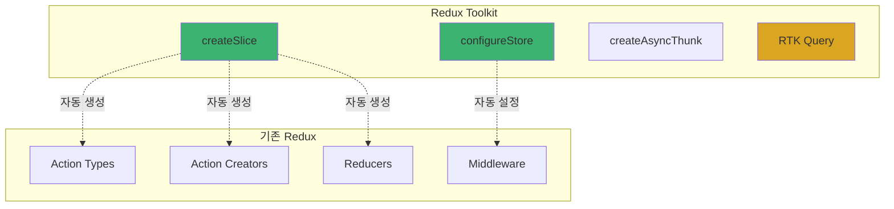
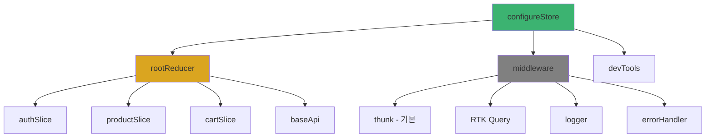
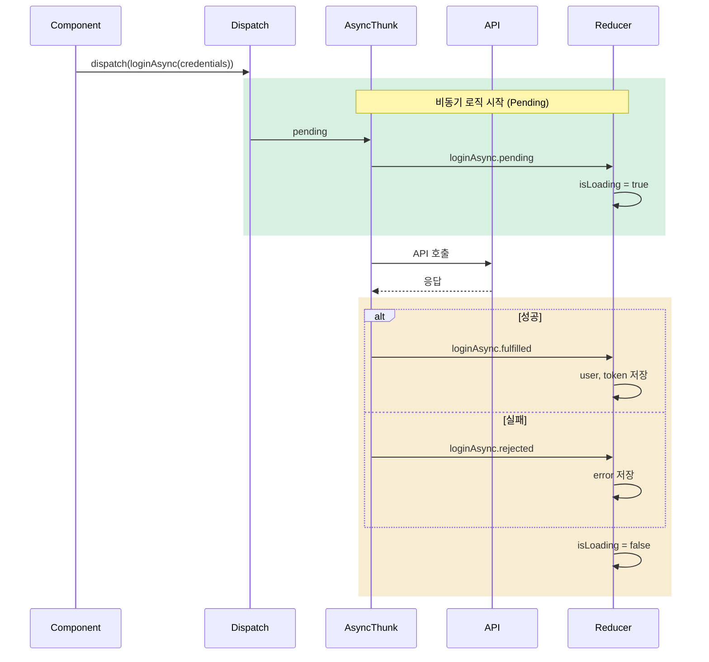
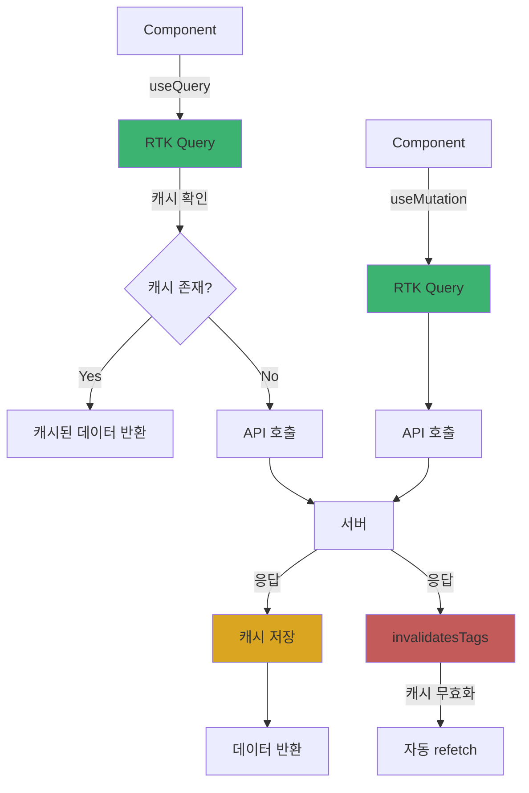
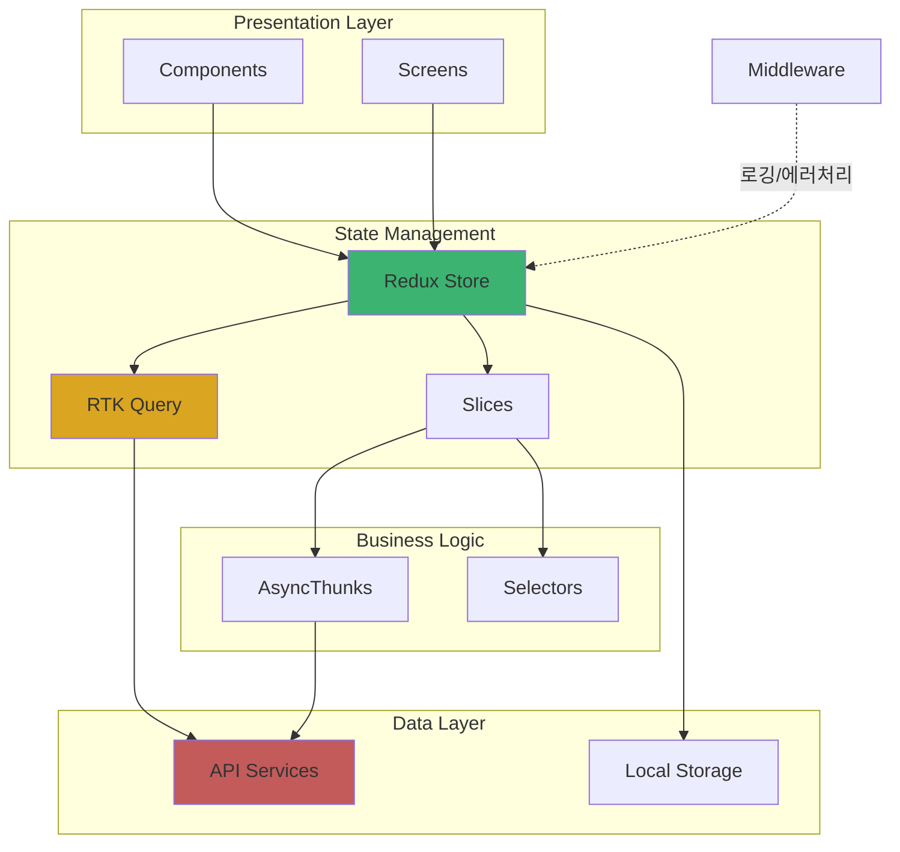

# 2장. 프로젝트 구조와 아키텍처

## 2-3. Redux Toolkit 기반 프로젝트 구성

### 개요

Redux Toolkit(RTK)은 Redux의 공식 권장 도구로, 보일러플레이트를 줄이고 모범 사례를 기본으로 제공합니다. 이 섹션에서는 React Native 프로젝트에서 Redux Toolkit을 효과적으로 구성하는 방법을 다룹니다. Store 설정부터 Slice 패턴, RTK Query를 활용한 API 통신, 그리고 TypeScript와의 통합까지 실무에서 바로 적용할 수 있는 구조를 제시합니다.

### Redux Toolkit이란?

Redux Toolkit은 Redux 개발을 더 쉽고 효율적으로 만들어주는 공식 도구 세트입니다.

**주요 특징**:
- **간결한 코드**: Action Creator, Reducer를 자동 생성
- **Immer 내장**: 불변성 관리를 간단하게
- **RTK Query**: 강력한 데이터 페칭 및 캐싱 솔루션
- **DevTools 통합**: Redux DevTools 자동 설정
- **TypeScript 지원**: 완벽한 타입 추론



### 프로젝트 구조

Redux Toolkit을 사용하는 권장 폴더 구조입니다.

```
src/
├── store/
│   ├── index.ts                    # Store 설정
│   ├── hooks.ts                    # Typed hooks
│   ├── rootReducer.ts              # Root reducer
│   ├── middleware/
│   │   ├── logger.ts
│   │   └── errorHandler.ts
│   └── slices/
│       ├── authSlice.ts
│       ├── productSlice.ts
│       ├── cartSlice.ts
│       └── uiSlice.ts
├── features/
│   ├── auth/
│   │   ├── store/
│   │   │   └── authSlice.ts        # Feature별 slice
│   │   └── services/
│   │       └── authApi.ts          # RTK Query API
│   └── product/
│       ├── store/
│       │   └── productSlice.ts
│       └── services/
│           └── productApi.ts
└── services/
    └── api/
        ├── baseApi.ts              # RTK Query base API
        └── types.ts
```

### Store 설정

#### 1. Store 생성

```typescript
// store/index.ts
import { configureStore } from '@reduxjs/toolkit';
import { setupListeners } from '@reduxjs/toolkit/query';
import rootReducer from './rootReducer';
import { baseApi } from '@services/api/baseApi';
import { logger } from './middleware/logger';
import { errorHandler } from './middleware/errorHandler';

export const store = configureStore({
  reducer: rootReducer,
  middleware: (getDefaultMiddleware) =>
    getDefaultMiddleware({
      serializableCheck: {
        // RTK Query를 위한 설정
        ignoredActions: ['persist/PERSIST', 'persist/REHYDRATE'],
      },
    })
      .concat(baseApi.middleware)
      .concat(logger)
      .concat(errorHandler),
  devTools: __DEV__, // 개발 환경에서만 DevTools 활성화
});

// RTK Query 리스너 설정 (refetchOnFocus, refetchOnReconnect 등)
setupListeners(store.dispatch);

export type RootState = ReturnType<typeof store.getState>;
export type AppDispatch = typeof store.dispatch;
```

**Store 설정 구조**:



#### 2. Root Reducer 구성

```typescript
// store/rootReducer.ts
import { combineReducers } from '@reduxjs/toolkit';
import { baseApi } from '@services/api/baseApi';
import authReducer from '@features/auth/store/authSlice';
import productReducer from '@features/product/store/productSlice';
import cartReducer from './slices/cartSlice';
import uiReducer from './slices/uiSlice';

const rootReducer = combineReducers({
  // RTK Query API
  [baseApi.reducerPath]: baseApi.reducer,

  // Feature slices
  auth: authReducer,
  product: productReducer,
  cart: cartReducer,
  ui: uiReducer,
});

export default rootReducer;
```

#### 3. Typed Hooks

TypeScript를 위한 타입이 지정된 훅을 생성합니다.

```typescript
// store/hooks.ts
import { TypedUseSelectorHook, useDispatch, useSelector } from 'react-redux';
import type { RootState, AppDispatch } from './index';

// 타입이 지정된 useDispatch
export const useAppDispatch = () => useDispatch<AppDispatch>();

// 타입이 지정된 useSelector
export const useAppSelector: TypedUseSelectorHook<RootState> = useSelector;
```

**사용 예시**:

```typescript
import { useAppDispatch, useAppSelector } from '@store/hooks';

const MyComponent = () => {
  // ✅ 타입 안전성 보장
  const dispatch = useAppDispatch();
  const user = useAppSelector((state) => state.auth.user);

  // ❌ 일반 훅 사용 (타입 추론 안됨)
  // const dispatch = useDispatch();
  // const user = useSelector((state) => state.auth.user);
};
```

### Slice 패턴

#### 1. 기본 Slice 구조

```typescript
// store/slices/authSlice.ts
import { createSlice, PayloadAction } from '@reduxjs/toolkit';

interface User {
  id: string;
  email: string;
  name: string;
}

interface AuthState {
  user: User | null;
  token: string | null;
  isAuthenticated: boolean;
  isLoading: boolean;
  error: string | null;
}

const initialState: AuthState = {
  user: null,
  token: null,
  isAuthenticated: false,
  isLoading: false,
  error: null,
};

const authSlice = createSlice({
  name: 'auth',
  initialState,
  reducers: {
    // 동기 액션
    setCredentials: (
      state,
      action: PayloadAction<{ user: User; token: string }>
    ) => {
      state.user = action.payload.user;
      state.token = action.payload.token;
      state.isAuthenticated = true;
    },
    logout: (state) => {
      state.user = null;
      state.token = null;
      state.isAuthenticated = false;
    },
    setLoading: (state, action: PayloadAction<boolean>) => {
      state.isLoading = action.payload;
    },
    setError: (state, action: PayloadAction<string | null>) => {
      state.error = action.payload;
    },
  },
});

export const { setCredentials, logout, setLoading, setError } = authSlice.actions;
export default authSlice.reducer;
```

#### 2. createAsyncThunk 활용

비동기 로직을 처리하는 Thunk를 생성합니다.

```typescript
// features/auth/store/authSlice.ts
import { createSlice, createAsyncThunk, PayloadAction } from '@reduxjs/toolkit';
import { authApi } from '../services/authApi';

interface LoginRequest {
  email: string;
  password: string;
}

interface User {
  id: string;
  email: string;
  name: string;
}

interface AuthState {
  user: User | null;
  token: string | null;
  isAuthenticated: boolean;
  isLoading: boolean;
  error: string | null;
}

const initialState: AuthState = {
  user: null,
  token: null,
  isAuthenticated: false,
  isLoading: false,
  error: null,
};

// 비동기 Thunk 생성
export const loginAsync = createAsyncThunk(
  'auth/login',
  async (credentials: LoginRequest, { rejectWithValue }) => {
    try {
      const response = await authApi.login(credentials);
      return response.data;
    } catch (error: any) {
      return rejectWithValue(error.response?.data?.message || '로그인 실패');
    }
  }
);

export const logoutAsync = createAsyncThunk(
  'auth/logout',
  async (_, { rejectWithValue }) => {
    try {
      await authApi.logout();
    } catch (error: any) {
      return rejectWithValue(error.response?.data?.message);
    }
  }
);

const authSlice = createSlice({
  name: 'auth',
  initialState,
  reducers: {
    setCredentials: (
      state,
      action: PayloadAction<{ user: User; token: string }>
    ) => {
      state.user = action.payload.user;
      state.token = action.payload.token;
      state.isAuthenticated = true;
    },
    clearError: (state) => {
      state.error = null;
    },
  },
  extraReducers: (builder) => {
    // loginAsync 처리
    builder
      .addCase(loginAsync.pending, (state) => {
        state.isLoading = true;
        state.error = null;
      })
      .addCase(loginAsync.fulfilled, (state, action) => {
        state.isLoading = false;
        state.user = action.payload.user;
        state.token = action.payload.token;
        state.isAuthenticated = true;
      })
      .addCase(loginAsync.rejected, (state, action) => {
        state.isLoading = false;
        state.error = action.payload as string;
      });

    // logoutAsync 처리
    builder
      .addCase(logoutAsync.pending, (state) => {
        state.isLoading = true;
      })
      .addCase(logoutAsync.fulfilled, (state) => {
        state.isLoading = false;
        state.user = null;
        state.token = null;
        state.isAuthenticated = false;
      })
      .addCase(logoutAsync.rejected, (state, action) => {
        state.isLoading = false;
        state.error = action.payload as string;
      });
  },
});

export const { setCredentials, clearError } = authSlice.actions;
export default authSlice.reducer;
```

**Async Thunk 실행 흐름**:



#### 3. Selector 패턴

```typescript
// features/auth/store/authSlice.ts (계속)

// Selector 함수 정의
export const selectUser = (state: RootState) => state.auth.user;
export const selectIsAuthenticated = (state: RootState) =>
  state.auth.isAuthenticated;
export const selectAuthLoading = (state: RootState) => state.auth.isLoading;
export const selectAuthError = (state: RootState) => state.auth.error;

// Memoized Selector (reselect 사용)
import { createSelector } from '@reduxjs/toolkit';

export const selectUserName = createSelector(
  [selectUser],
  (user) => user?.name || 'Guest'
);

export const selectHasError = createSelector(
  [selectAuthError],
  (error) => error !== null
);
```

**사용 예시**:

```typescript
import { useAppSelector } from '@store/hooks';
import { selectUser, selectIsAuthenticated } from '@features/auth/store/authSlice';

const ProfileScreen = () => {
  const user = useAppSelector(selectUser);
  const isAuthenticated = useAppSelector(selectIsAuthenticated);

  if (!isAuthenticated) {
    return <LoginPrompt />;
  }

  return <UserProfile user={user} />;
};
```

### RTK Query 설정

RTK Query는 데이터 페칭과 캐싱을 자동으로 처리합니다.

#### 1. Base API 설정

```typescript
// services/api/baseApi.ts
import { createApi, fetchBaseQuery } from '@reduxjs/toolkit/query/react';
import { RootState } from '@store/index';
import { API_BASE_URL } from '@constants/config';

export const baseApi = createApi({
  reducerPath: 'api',
  baseQuery: fetchBaseQuery({
    baseUrl: API_BASE_URL,
    prepareHeaders: (headers, { getState }) => {
      // 토큰 자동 추가
      const token = (getState() as RootState).auth.token;
      if (token) {
        headers.set('Authorization', `Bearer ${token}`);
      }
      headers.set('Content-Type', 'application/json');
      return headers;
    },
  }),
  // 태그 타입 정의 (캐시 무효화용)
  tagTypes: ['User', 'Product', 'Cart', 'Order'],
  endpoints: () => ({}),
});
```

#### 2. Feature별 API 정의

```typescript
// features/product/services/productApi.ts
import { baseApi } from '@services/api/baseApi';

interface Product {
  id: string;
  name: string;
  price: number;
  description: string;
  imageUrl: string;
}

interface ProductListParams {
  page?: number;
  limit?: number;
  category?: string;
}

interface ProductListResponse {
  products: Product[];
  total: number;
  page: number;
  totalPages: number;
}

export const productApi = baseApi.injectEndpoints({
  endpoints: (builder) => ({
    // Query: 데이터 조회
    getProducts: builder.query<ProductListResponse, ProductListParams>({
      query: (params) => ({
        url: '/products',
        params,
      }),
      // 캐시 태그 설정
      providesTags: (result) =>
        result
          ? [
              ...result.products.map(({ id }) => ({
                type: 'Product' as const,
                id
              })),
              { type: 'Product', id: 'LIST' },
            ]
          : [{ type: 'Product', id: 'LIST' }],
    }),

    getProductById: builder.query<Product, string>({
      query: (id) => `/products/${id}`,
      providesTags: (result, error, id) => [{ type: 'Product', id }],
    }),

    // Mutation: 데이터 변경
    createProduct: builder.mutation<Product, Partial<Product>>({
      query: (body) => ({
        url: '/products',
        method: 'POST',
        body,
      }),
      // 캐시 무효화
      invalidatesTags: [{ type: 'Product', id: 'LIST' }],
    }),

    updateProduct: builder.mutation<Product, { id: string; data: Partial<Product> }>({
      query: ({ id, data }) => ({
        url: `/products/${id}`,
        method: 'PUT',
        body: data,
      }),
      invalidatesTags: (result, error, { id }) => [
        { type: 'Product', id },
        { type: 'Product', id: 'LIST' },
      ],
    }),

    deleteProduct: builder.mutation<void, string>({
      query: (id) => ({
        url: `/products/${id}`,
        method: 'DELETE',
      }),
      invalidatesTags: (result, error, id) => [
        { type: 'Product', id },
        { type: 'Product', id: 'LIST' },
      ],
    }),

    // 검색
    searchProducts: builder.query<Product[], string>({
      query: (searchTerm) => ({
        url: '/products/search',
        params: { q: searchTerm },
      }),
    }),
  }),
});

// 자동 생성된 훅 export
export const {
  useGetProductsQuery,
  useGetProductByIdQuery,
  useCreateProductMutation,
  useUpdateProductMutation,
  useDeleteProductMutation,
  useSearchProductsQuery,
  useLazySearchProductsQuery, // lazy 버전
} = productApi;
```

**RTK Query 데이터 흐름**:



#### 3. RTK Query 사용 예시

```typescript
// features/product/screens/ProductListScreen.tsx
import React, { useState } from 'react';
import { View, FlatList, ActivityIndicator, Text } from 'react-native';
import { useGetProductsQuery } from '../services/productApi';
import ProductCard from '../components/ProductCard';

const ProductListScreen = () => {
  const [page, setPage] = useState(1);

  // RTK Query 훅 사용
  const {
    data,
    isLoading,
    isFetching,
    isError,
    error,
    refetch,
  } = useGetProductsQuery({ page, limit: 20 });

  if (isLoading) {
    return <ActivityIndicator size="large" />;
  }

  if (isError) {
    return (
      <View>
        <Text>Error: {error.toString()}</Text>
        <Button title="재시도" onPress={refetch} />
      </View>
    );
  }

  return (
    <FlatList
      data={data?.products}
      renderItem={({ item }) => <ProductCard product={item} />}
      keyExtractor={(item) => item.id}
      refreshing={isFetching}
      onRefresh={refetch}
      onEndReached={() => setPage((prev) => prev + 1)}
      onEndReachedThreshold={0.5}
    />
  );
};

// Mutation 사용 예시
import { useCreateProductMutation } from '../services/productApi';

const CreateProductScreen = () => {
  const [createProduct, { isLoading, isSuccess, isError }] =
    useCreateProductMutation();

  const handleSubmit = async (productData: Partial<Product>) => {
    try {
      await createProduct(productData).unwrap();
      // 성공 처리
      navigation.goBack();
    } catch (error) {
      // 에러 처리
      console.error('Failed to create product:', error);
    }
  };

  return (
    <ProductForm onSubmit={handleSubmit} isLoading={isLoading} />
  );
};
```

#### 4. RTK Query 고급 기능

##### 조건부 쿼리

```typescript
const ProfileScreen = ({ userId }: { userId?: string }) => {
  // userId가 있을 때만 쿼리 실행
  const { data: user } = useGetUserByIdQuery(userId!, {
    skip: !userId,
  });

  return user ? <UserProfile user={user} /> : null;
};
```

##### 폴링 (Polling)

```typescript
const DashboardScreen = () => {
  // 5초마다 자동으로 refetch
  const { data } = useGetDashboardDataQuery(undefined, {
    pollingInterval: 5000,
  });

  return <Dashboard data={data} />;
};
```

##### Optimistic Update

```typescript
const TodoList = () => {
  const [updateTodo] = useUpdateTodoMutation();

  const handleToggle = async (id: string, completed: boolean) => {
    try {
      await updateTodo({
        id,
        data: { completed: !completed },
      }).unwrap();
    } catch (error) {
      // 실패 시 롤백은 RTK Query가 자동 처리
    }
  };

  return <TodoListView onToggle={handleToggle} />;
};
```

##### 캐시 수동 업데이트

```typescript
// productApi.ts
updateProduct: builder.mutation({
  query: ({ id, data }) => ({
    url: `/products/${id}`,
    method: 'PUT',
    body: data,
  }),
  // 캐시 수동 업데이트
  async onQueryStarted({ id, data }, { dispatch, queryFulfilled }) {
    // Optimistic update
    const patchResult = dispatch(
      productApi.util.updateQueryData('getProductById', id, (draft) => {
        Object.assign(draft, data);
      })
    );

    try {
      await queryFulfilled;
    } catch {
      // 실패 시 롤백
      patchResult.undo();
    }
  },
}),
```

### Middleware 구성

#### 1. Logger Middleware

```typescript
// store/middleware/logger.ts
import { Middleware } from '@reduxjs/toolkit';

export const logger: Middleware = (store) => (next) => (action) => {
  if (__DEV__) {
    console.group(action.type);
    console.info('dispatching', action);
    const result = next(action);
    console.log('next state', store.getState());
    console.groupEnd();
    return result;
  }
  return next(action);
};
```

#### 2. Error Handler Middleware

```typescript
// store/middleware/errorHandler.ts
import { Middleware, isRejectedWithValue } from '@reduxjs/toolkit';
import { Alert } from 'react-native';

export const errorHandler: Middleware = () => (next) => (action) => {
  // RTK Query 에러 처리
  if (isRejectedWithValue(action)) {
    const errorMessage =
      action.payload?.data?.message ||
      action.error?.message ||
      '알 수 없는 오류가 발생했습니다.';

    if (__DEV__) {
      console.error('API Error:', errorMessage);
    }

    // 프로덕션에서는 에러 리포팅 서비스로 전송
    // Sentry.captureException(action.error);

    // 사용자에게 알림
    Alert.alert('오류', errorMessage);
  }

  return next(action);
};
```

#### 3. Persistence Middleware

Redux Persist를 사용한 상태 영속화:

```typescript
// store/index.ts (수정)
import { configureStore } from '@reduxjs/toolkit';
import {
  persistStore,
  persistReducer,
  FLUSH,
  REHYDRATE,
  PAUSE,
  PERSIST,
  PURGE,
  REGISTER,
} from 'redux-persist';
import AsyncStorage from '@react-native-async-storage/async-storage';
import rootReducer from './rootReducer';

const persistConfig = {
  key: 'root',
  storage: AsyncStorage,
  whitelist: ['auth', 'cart'], // 저장할 reducer
  blacklist: ['ui'], // 제외할 reducer
};

const persistedReducer = persistReducer(persistConfig, rootReducer);

export const store = configureStore({
  reducer: persistedReducer,
  middleware: (getDefaultMiddleware) =>
    getDefaultMiddleware({
      serializableCheck: {
        ignoredActions: [FLUSH, REHYDRATE, PAUSE, PERSIST, PURGE, REGISTER],
      },
    }),
});

export const persistor = persistStore(store);
```

```typescript
// App.tsx
import { Provider } from 'react-redux';
import { PersistGate } from 'redux-persist/integration/react';
import { store, persistor } from '@store/index';

const App = () => {
  return (
    <Provider store={store}>
      <PersistGate loading={null} persistor={persistor}>
        <AppNavigator />
      </PersistGate>
    </Provider>
  );
};
```

### 전체 아키텍처



### 실전 예제: 장바구니 기능

#### 1. Cart Slice

```typescript
// store/slices/cartSlice.ts
import { createSlice, PayloadAction } from '@reduxjs/toolkit';

interface CartItem {
  productId: string;
  name: string;
  price: number;
  quantity: number;
  imageUrl: string;
}

interface CartState {
  items: CartItem[];
  totalAmount: number;
  totalItems: number;
}

const initialState: CartState = {
  items: [],
  totalAmount: 0,
  totalItems: 0,
};

const calculateTotals = (items: CartItem[]) => {
  const totalItems = items.reduce((sum, item) => sum + item.quantity, 0);
  const totalAmount = items.reduce(
    (sum, item) => sum + item.price * item.quantity,
    0
  );
  return { totalItems, totalAmount };
};

const cartSlice = createSlice({
  name: 'cart',
  initialState,
  reducers: {
    addToCart: (state, action: PayloadAction<Omit<CartItem, 'quantity'>>) => {
      const existingItem = state.items.find(
        (item) => item.productId === action.payload.productId
      );

      if (existingItem) {
        existingItem.quantity += 1;
      } else {
        state.items.push({ ...action.payload, quantity: 1 });
      }

      const totals = calculateTotals(state.items);
      state.totalItems = totals.totalItems;
      state.totalAmount = totals.totalAmount;
    },

    removeFromCart: (state, action: PayloadAction<string>) => {
      state.items = state.items.filter(
        (item) => item.productId !== action.payload
      );

      const totals = calculateTotals(state.items);
      state.totalItems = totals.totalItems;
      state.totalAmount = totals.totalAmount;
    },

    updateQuantity: (
      state,
      action: PayloadAction<{ productId: string; quantity: number }>
    ) => {
      const item = state.items.find(
        (item) => item.productId === action.payload.productId
      );

      if (item) {
        if (action.payload.quantity <= 0) {
          state.items = state.items.filter(
            (item) => item.productId !== action.payload.productId
          );
        } else {
          item.quantity = action.payload.quantity;
        }
      }

      const totals = calculateTotals(state.items);
      state.totalItems = totals.totalItems;
      state.totalAmount = totals.totalAmount;
    },

    clearCart: (state) => {
      state.items = [];
      state.totalAmount = 0;
      state.totalItems = 0;
    },
  },
});

export const { addToCart, removeFromCart, updateQuantity, clearCart } =
  cartSlice.actions;

// Selectors
export const selectCartItems = (state: RootState) => state.cart.items;
export const selectCartTotal = (state: RootState) => state.cart.totalAmount;
export const selectCartItemCount = (state: RootState) => state.cart.totalItems;

export const selectCartItemById = (productId: string) => (state: RootState) =>
  state.cart.items.find((item) => item.productId === productId);

export default cartSlice.reducer;
```

#### 2. 컴포넌트에서 사용

```typescript
// features/product/components/ProductCard.tsx
import React from 'react';
import { View, Text, Image, TouchableOpacity } from 'react-native';
import { useAppDispatch, useAppSelector } from '@store/hooks';
import { addToCart, selectCartItemById } from '@store/slices/cartSlice';

interface ProductCardProps {
  product: {
    id: string;
    name: string;
    price: number;
    imageUrl: string;
  };
}

const ProductCard: React.FC<ProductCardProps> = ({ product }) => {
  const dispatch = useAppDispatch();
  const cartItem = useAppSelector(selectCartItemById(product.id));

  const handleAddToCart = () => {
    dispatch(
      addToCart({
        productId: product.id,
        name: product.name,
        price: product.price,
        imageUrl: product.imageUrl,
      })
    );
  };

  return (
    <View>
      <Image source={{ uri: product.imageUrl }} />
      <Text>{product.name}</Text>
      <Text>${product.price}</Text>

      {cartItem ? (
        <Text>장바구니에 {cartItem.quantity}개 담김</Text>
      ) : null}

      <TouchableOpacity onPress={handleAddToCart}>
        <Text>장바구니에 담기</Text>
      </TouchableOpacity>
    </View>
  );
};

export default ProductCard;
```

### 성능 최적화

#### 1. Memoized Selector

```typescript
// store/slices/cartSlice.ts
import { createSelector } from '@reduxjs/toolkit';

export const selectCartItemsCount = createSelector(
  [selectCartItems],
  (items) => items.reduce((sum, item) => sum + item.quantity, 0)
);

export const selectCartTotalPrice = createSelector(
  [selectCartItems],
  (items) =>
    items.reduce((sum, item) => sum + item.price * item.quantity, 0)
);

export const selectExpensiveItems = createSelector(
  [selectCartItems],
  (items) => items.filter((item) => item.price > 100)
);
```

#### 2. RTK Query 캐싱 전략

```typescript
// services/api/baseApi.ts
export const baseApi = createApi({
  reducerPath: 'api',
  baseQuery: fetchBaseQuery({ baseUrl: API_BASE_URL }),
  tagTypes: ['User', 'Product', 'Cart', 'Order'],
  // 캐시 설정
  keepUnusedDataFor: 60, // 60초 동안 캐시 유지
  refetchOnMountOrArgChange: 30, // 30초 후 자동 refetch
  refetchOnFocus: true, // 포커스 시 refetch
  refetchOnReconnect: true, // 재연결 시 refetch
  endpoints: () => ({}),
});
```

### 테스트 전략

```typescript
// store/slices/__tests__/cartSlice.test.ts
import cartReducer, {
  addToCart,
  removeFromCart,
  updateQuantity,
  clearCart,
} from '../cartSlice';

describe('cartSlice', () => {
  const initialState = {
    items: [],
    totalAmount: 0,
    totalItems: 0,
  };

  it('should add item to cart', () => {
    const product = {
      productId: '1',
      name: 'Test Product',
      price: 100,
      imageUrl: 'test.jpg',
    };

    const state = cartReducer(initialState, addToCart(product));

    expect(state.items).toHaveLength(1);
    expect(state.items[0].quantity).toBe(1);
    expect(state.totalItems).toBe(1);
    expect(state.totalAmount).toBe(100);
  });

  it('should increase quantity when adding existing item', () => {
    const product = {
      productId: '1',
      name: 'Test Product',
      price: 100,
      imageUrl: 'test.jpg',
    };

    let state = cartReducer(initialState, addToCart(product));
    state = cartReducer(state, addToCart(product));

    expect(state.items).toHaveLength(1);
    expect(state.items[0].quantity).toBe(2);
    expect(state.totalItems).toBe(2);
    expect(state.totalAmount).toBe(200);
  });

  it('should remove item from cart', () => {
    const state = {
      items: [
        {
          productId: '1',
          name: 'Test Product',
          price: 100,
          imageUrl: 'test.jpg',
          quantity: 1,
        },
      ],
      totalAmount: 100,
      totalItems: 1,
    };

    const newState = cartReducer(state, removeFromCart('1'));

    expect(newState.items).toHaveLength(0);
    expect(newState.totalItems).toBe(0);
    expect(newState.totalAmount).toBe(0);
  });
});
```

### 요약

Redux Toolkit은 React Native 프로젝트의 상태 관리를 간결하고 효율적으로 만듭니다.

**핵심 포인트**:
- **configureStore**: DevTools, Middleware 자동 설정
- **createSlice**: Action, Reducer 자동 생성, Immer로 불변성 관리
- **createAsyncThunk**: 비동기 로직 처리, pending/fulfilled/rejected 상태 자동 관리
- **RTK Query**: 데이터 페칭, 캐싱, 동기화 자동 처리
- **Typed Hooks**: TypeScript 타입 안전성 보장
- **Selector 패턴**: 파생 상태 계산, 메모이제이션으로 성능 최적화
- **Middleware**: Logger, Error Handler, Persistence 구성

다음 장에서는 React Navigation을 사용한 네비게이션 구현을 다룹니다.
