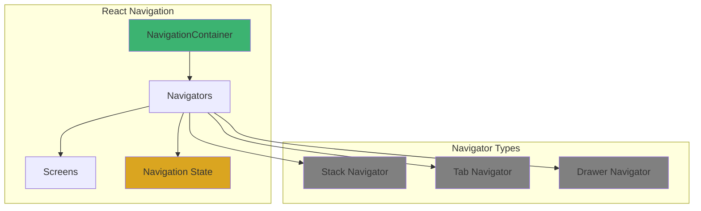
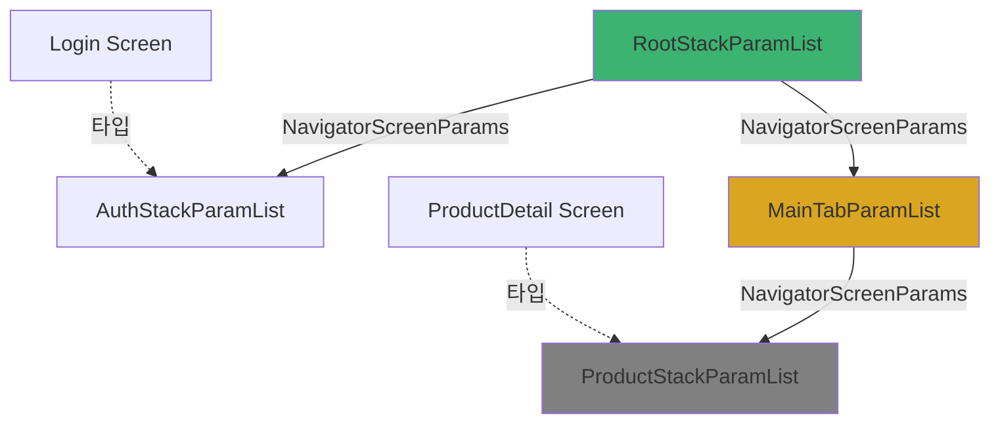
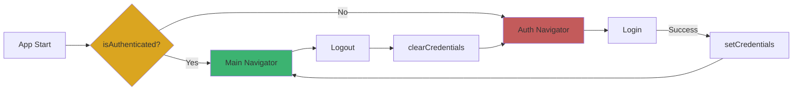
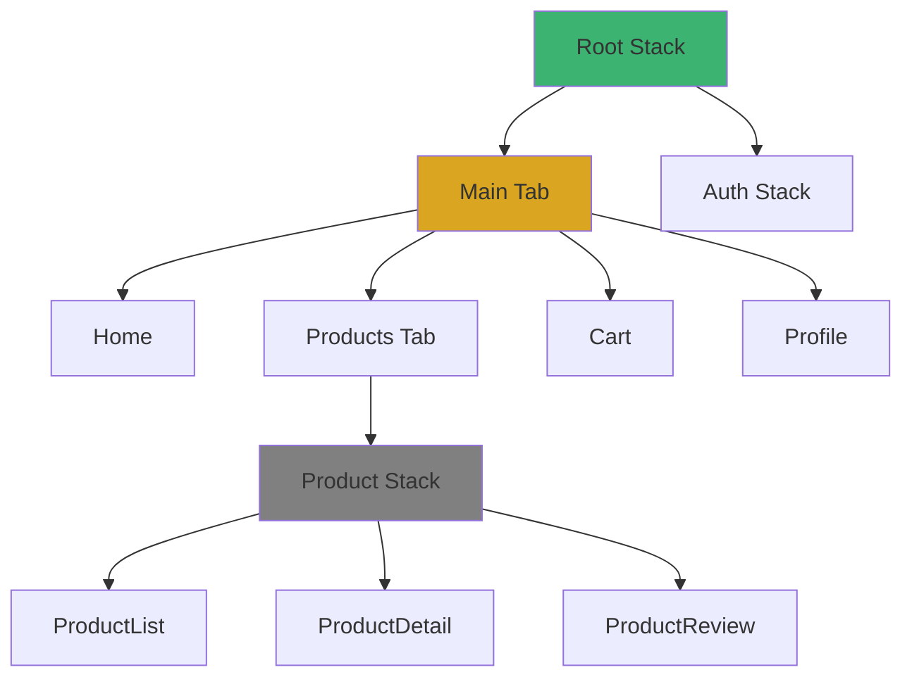
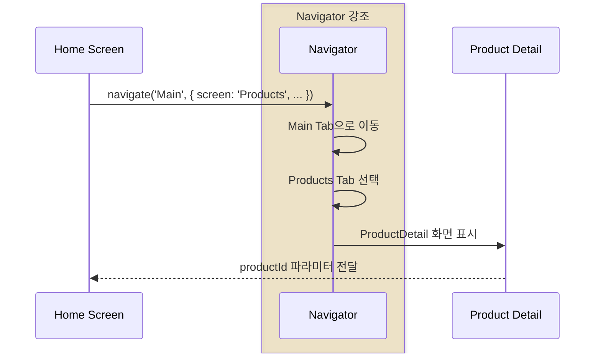
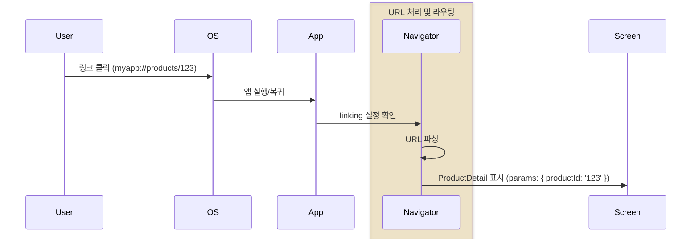

# 3장. React Navigation

## 3-1. React Navigation 설정

### 개요

React Navigation은 React Native에서 가장 널리 사용되는 네비게이션 라이브러리입니다. 이 섹션에서는 React Navigation v6의 설치부터 기본 설정, TypeScript 통합, 그리고 딥링킹 구성까지 다룹니다. 네비게이션은 앱의 사용자 경험을 결정하는 핵심 요소이므로, 체계적인 설정과 타입 안전성을 갖춘 구조를 구축하는 것이 중요합니다.

### React Navigation 아키텍처

React Navigation은 JavaScript 기반의 네비게이션 솔루션으로, 네이티브 플랫폼의 동작을 시뮬레이션합니다.



**주요 개념**:
- **NavigationContainer**: 네비게이션 트리의 루트 컨테이너
- **Navigator**: 화면 전환 방식을 정의 (Stack, Tab, Drawer 등)
- **Screen**: 개별 화면 컴포넌트
- **Navigation State**: 현재 네비게이션 상태 관리

### 설치 및 의존성

#### 1. 패키지 설치

```bash
# React Navigation 코어
npm install @react-navigation/native

# 필수 의존성
npm install react-native-screens react-native-safe-area-context

# Navigator 타입별 설치 (필요한 것만)
npm install @react-navigation/stack
npm install @react-navigation/bottom-tabs
npm install @react-navigation/drawer
npm install @react-navigation/native-stack

# 추가 의존성
npm install react-native-gesture-handler react-native-reanimated
```

#### 2. iOS 설정

```bash
cd ios && pod install && cd ..
```

```objective-c
// ios/MyApp/AppDelegate.mm
#import <React/RCTLinkingManager.h>

// 파일 상단에 추가
#import "RNGestureHandler.h"

- (BOOL)application:(UIApplication *)application
   openURL:(NSURL *)url
   options:(NSDictionary<UIApplicationOpenURLOptionsKey,id> *)options
{
  return [RCTLinkingManager application:application openURL:url options:options];
}
```

#### 3. Android 설정

```java
// android/app/src/main/java/com/myapp/MainActivity.java
package com.myapp;

import android.os.Bundle;
import com.facebook.react.ReactActivity;
import com.facebook.react.ReactActivityDelegate;
import com.facebook.react.defaults.DefaultNewArchitectureEntryPoint;
import com.facebook.react.defaults.DefaultReactActivityDelegate;

public class MainActivity extends ReactActivity {

  @Override
  protected String getMainComponentName() {
    return "MyApp";
  }

  // react-native-screens 설정
  @Override
  protected void onCreate(Bundle savedInstanceState) {
    super.onCreate(null);
  }

  @Override
  protected ReactActivityDelegate createReactActivityDelegate() {
    return new DefaultReactActivityDelegate(
      this,
      getMainComponentName(),
      DefaultNewArchitectureEntryPoint.getFabricEnabled()
    );
  }
}
```

```xml
<!-- android/app/src/main/AndroidManifest.xml -->
<manifest xmlns:android="http://schemas.android.com/apk/res/android">

  <application>
    <!-- 딥링킹 설정 -->
    <activity
      android:name=".MainActivity"
      android:launchMode="singleTask">
      <intent-filter>
        <action android:name="android.intent.action.MAIN" />
        <category android:name="android.intent.category.LAUNCHER" />
      </intent-filter>

      <!-- Deep Link -->
      <intent-filter>
        <action android:name="android.intent.action.VIEW" />
        <category android:name="android.intent.category.DEFAULT" />
        <category android:name="android.intent.category.BROWSABLE" />
        <data android:scheme="myapp" />
      </intent-filter>
    </activity>
  </application>
</manifest>
```

#### 4. react-native-reanimated 설정

```javascript
// babel.config.js
module.exports = {
  presets: ['module:@react-native/babel-preset'],
  plugins: [
    'react-native-reanimated/plugin', // 반드시 마지막에 위치
  ],
};
```

```typescript
// index.js (최상단)
import 'react-native-gesture-handler';
import { AppRegistry } from 'react-native';
import App from './App';
import { name as appName } from './app.json';

AppRegistry.registerComponent(appName, () => App);
```

### 기본 설정

#### 1. NavigationContainer 설정

```typescript
// App.tsx
import React from 'react';
import { NavigationContainer } from '@react-navigation/native';
import { SafeAreaProvider } from 'react-native-safe-area-context';
import RootNavigator from '@navigation/RootNavigator';

const App: React.FC = () => {
  return (
    <SafeAreaProvider>
      <NavigationContainer>
        <RootNavigator />
      </NavigationContainer>
    </SafeAreaProvider>
  );
};

export default App;
```

#### 2. 네비게이션 구조

```
src/navigation/
├── RootNavigator.tsx         # 최상위 네비게이터
├── AuthNavigator.tsx         # 인증 관련 네비게이션
├── MainNavigator.tsx         # 메인 앱 네비게이션
├── navigationRef.ts          # Navigation Ref 관리
├── types.ts                  # 네비게이션 타입 정의
└── linking.ts                # 딥링킹 설정
```

### TypeScript 통합

#### 1. 네비게이션 타입 정의

```typescript
// navigation/types.ts
import { NavigatorScreenParams } from '@react-navigation/native';
import { StackScreenProps } from '@react-navigation/stack';
import { BottomTabScreenProps } from '@react-navigation/bottom-tabs';

// Root Navigator
export type RootStackParamList = {
  Auth: NavigatorScreenParams<AuthStackParamList>;
  Main: NavigatorScreenParams<MainTabParamList>;
  Modal: { title: string };
};

// Auth Navigator
export type AuthStackParamList = {
  Login: undefined;
  Signup: undefined;
  ForgotPassword: undefined;
};

// Main Tab Navigator
export type MainTabParamList = {
  Home: undefined;
  Products: NavigatorScreenParams<ProductStackParamList>;
  Cart: undefined;
  Profile: undefined;
};

// Product Stack Navigator
export type ProductStackParamList = {
  ProductList: { category?: string };
  ProductDetail: { productId: string };
  ProductReview: { productId: string; reviewId?: string };
};

// Screen Props 타입
export type RootStackScreenProps<T extends keyof RootStackParamList> =
  StackScreenProps<RootStackParamList, T>;

export type AuthStackScreenProps<T extends keyof AuthStackParamList> =
  StackScreenProps<AuthStackParamList, T>;

export type MainTabScreenProps<T extends keyof MainTabParamList> =
  BottomTabScreenProps<MainTabParamList, T>;

export type ProductStackScreenProps<T extends keyof ProductStackParamList> =
  StackScreenProps<ProductStackParamList, T>;

// Navigation 타입 선언 (전역)
declare global {
  namespace ReactNavigation {
    interface RootParamList extends RootStackParamList {}
  }
}
```

**타입 구조 다이어그램**:



#### 2. Root Navigator 구현

```typescript
// navigation/RootNavigator.tsx
import React from 'react';
import { createStackNavigator } from '@react-navigation/stack';
import { useAppSelector } from '@store/hooks';
import { selectIsAuthenticated } from '@features/auth/store/authSlice';
import AuthNavigator from './AuthNavigator';
import MainNavigator from './MainNavigator';
import ModalScreen from '@screens/ModalScreen';
import { RootStackParamList } from './types';

const Stack = createStackNavigator<RootStackParamList>();

const RootNavigator: React.FC = () => {
  const isAuthenticated = useAppSelector(selectIsAuthenticated);

  return (
    <Stack.Navigator screenOptions={{ headerShown: false }}>
      {isAuthenticated ? (
        <Stack.Screen name="Main" component={MainNavigator} />
      ) : (
        <Stack.Screen name="Auth" component={AuthNavigator} />
      )}

      {/* Modal Screen */}
      <Stack.Screen
        name="Modal"
        component={ModalScreen}
        options={{
          presentation: 'modal',
          headerShown: true,
        }}
      />
    </Stack.Navigator>
  );
};

export default RootNavigator;
```

**조건부 네비게이션 흐름**:



#### 3. Auth Navigator 구현

```typescript
// navigation/AuthNavigator.tsx
import React from 'react';
import { createStackNavigator } from '@react-navigation/stack';
import LoginScreen from '@features/auth/screens/LoginScreen';
import SignupScreen from '@features/auth/screens/SignupScreen';
import ForgotPasswordScreen from '@features/auth/screens/ForgotPasswordScreen';
import { AuthStackParamList } from './types';

const Stack = createStackNavigator<AuthStackParamList>();

const AuthNavigator: React.FC = () => {
  return (
    <Stack.Navigator
      screenOptions={{
        headerStyle: {
          backgroundColor: '#007AFF',
        },
        headerTintColor: '#fff',
        headerTitleStyle: {
          fontWeight: 'bold',
        },
      }}
    >
      <Stack.Screen
        name="Login"
        component={LoginScreen}
        options={{ title: '로그인' }}
      />
      <Stack.Screen
        name="Signup"
        component={SignupScreen}
        options={{ title: '회원가입' }}
      />
      <Stack.Screen
        name="ForgotPassword"
        component={ForgotPasswordScreen}
        options={{ title: '비밀번호 찾기' }}
      />
    </Stack.Navigator>
  );
};

export default AuthNavigator;
```

#### 4. Main Navigator (Tab) 구현

```typescript
// navigation/MainNavigator.tsx
import React from 'react';
import { createBottomTabNavigator } from '@react-navigation/bottom-tabs';
import Icon from 'react-native-vector-icons/Ionicons';
import HomeScreen from '@screens/HomeScreen';
import ProductNavigator from './ProductNavigator';
import CartScreen from '@screens/CartScreen';
import ProfileScreen from '@screens/ProfileScreen';
import { MainTabParamList } from './types';
import { useAppSelector } from '@store/hooks';
import { selectCartItemCount } from '@store/slices/cartSlice';

const Tab = createBottomTabNavigator<MainTabParamList>();

const MainNavigator: React.FC = () => {
  const cartItemCount = useAppSelector(selectCartItemCount);

  return (
    <Tab.Navigator
      screenOptions={({ route }) => ({
        tabBarIcon: ({ focused, color, size }) => {
          let iconName: string;

          switch (route.name) {
            case 'Home':
              iconName = focused ? 'home' : 'home-outline';
              break;
            case 'Products':
              iconName = focused ? 'list' : 'list-outline';
              break;
            case 'Cart':
              iconName = focused ? 'cart' : 'cart-outline';
              break;
            case 'Profile':
              iconName = focused ? 'person' : 'person-outline';
              break;
            default:
              iconName = 'help-outline';
          }

          return <Icon name={iconName} size={size} color={color} />;
        },
        tabBarActiveTintColor: '#007AFF',
        tabBarInactiveTintColor: 'gray',
        headerShown: false,
      })}
    >
      <Tab.Screen
        name="Home"
        component={HomeScreen}
        options={{ title: '홈' }}
      />
      <Tab.Screen
        name="Products"
        component={ProductNavigator}
        options={{ title: '상품' }}
      />
      <Tab.Screen
        name="Cart"
        component={CartScreen}
        options={{
          title: '장바구니',
          tabBarBadge: cartItemCount > 0 ? cartItemCount : undefined,
        }}
      />
      <Tab.Screen
        name="Profile"
        component={ProfileScreen}
        options={{ title: '프로필' }}
      />
    </Tab.Navigator>
  );
};

export default MainNavigator;
```

#### 5. Nested Navigator (Product Stack)

```typescript
// navigation/ProductNavigator.tsx
import React from 'react';
import { createStackNavigator } from '@react-navigation/stack';
import ProductListScreen from '@features/product/screens/ProductListScreen';
import ProductDetailScreen from '@features/product/screens/ProductDetailScreen';
import ProductReviewScreen from '@features/product/screens/ProductReviewScreen';
import { ProductStackParamList } from './types';

const Stack = createStackNavigator<ProductStackParamList>();

const ProductNavigator: React.FC = () => {
  return (
    <Stack.Navigator>
      <Stack.Screen
        name="ProductList"
        component={ProductListScreen}
        options={{ title: '상품 목록' }}
      />
      <Stack.Screen
        name="ProductDetail"
        component={ProductDetailScreen}
        options={{ title: '상품 상세' }}
      />
      <Stack.Screen
        name="ProductReview"
        component={ProductReviewScreen}
        options={{ title: '리뷰 작성' }}
      />
    </Stack.Navigator>
  );
};

export default ProductNavigator;
```

**Nested Navigator 구조**:



### 네비게이션 사용법

#### 1. 화면 이동

```typescript
// features/auth/screens/LoginScreen.tsx
import React from 'react';
import { View, Button } from 'react-native';
import { AuthStackScreenProps } from '@navigation/types';

type Props = AuthStackScreenProps<'Login'>;

const LoginScreen: React.FC<Props> = ({ navigation }) => {
  const handleLogin = () => {
    // 로그인 로직...

    // 네비게이션은 자동으로 Main으로 전환됨 (RootNavigator에서 조건 처리)
  };

  const goToSignup = () => {
    // 타입 안전한 네비게이션
    navigation.navigate('Signup');
  };

  const goToForgotPassword = () => {
    navigation.navigate('ForgotPassword');
  };

  return (
    <View>
      <Button title="로그인" onPress={handleLogin} />
      <Button title="회원가입" onPress={goToSignup} />
      <Button title="비밀번호 찾기" onPress={goToForgotPassword} />
    </View>
  );
};

export default LoginScreen;
```

#### 2. 파라미터 전달

```typescript
// features/product/screens/ProductListScreen.tsx
import React from 'react';
import { FlatList, TouchableOpacity, Text } from 'react-native';
import { ProductStackScreenProps } from '@navigation/types';

type Props = ProductStackScreenProps<'ProductList'>;

const ProductListScreen: React.FC<Props> = ({ navigation, route }) => {
  // 파라미터 받기 (타입 안전)
  const { category } = route.params || {};

  const handleProductPress = (productId: string) => {
    // 파라미터 전달 (타입 체크)
    navigation.navigate('ProductDetail', { productId });
  };

  return (
    <FlatList
      data={products}
      renderItem={({ item }) => (
        <TouchableOpacity onPress={() => handleProductPress(item.id)}>
          <Text>{item.name}</Text>
        </TouchableOpacity>
      )}
    />
  );
};

// features/product/screens/ProductDetailScreen.tsx
type DetailProps = ProductStackScreenProps<'ProductDetail'>;

const ProductDetailScreen: React.FC<DetailProps> = ({ route, navigation }) => {
  // 파라미터 받기
  const { productId } = route.params;

  const goToReview = () => {
    navigation.navigate('ProductReview', { productId });
  };

  return (
    <View>
      <Text>Product ID: {productId}</Text>
      <Button title="리뷰 작성" onPress={goToReview} />
    </View>
  );
};
```

#### 3. 중첩 네비게이션

```typescript
// HomeScreen에서 Product Detail로 이동
import { useNavigation } from '@react-navigation/native';
import { RootStackScreenProps } from '@navigation/types';

const HomeScreen = () => {
  const navigation = useNavigation();

  const goToProductDetail = (productId: string) => {
    // 중첩된 네비게이터로 이동
    navigation.navigate('Main', {
      screen: 'Products',
      params: {
        screen: 'ProductDetail',
        params: { productId },
      },
    });
  };

  return (
    <Button title="상품 보기" onPress={() => goToProductDetail('123')} />
  );
};
```

**네비게이션 흐름**:



### Navigation Ref 관리

컴포넌트 외부에서 네비게이션을 제어할 수 있습니다.

```typescript
// navigation/navigationRef.ts
import { createNavigationContainerRef } from '@react-navigation/native';
import { RootStackParamList } from './types';

export const navigationRef = createNavigationContainerRef<RootStackParamList>();

export function navigate(name: keyof RootStackParamList, params?: any) {
  if (navigationRef.isReady()) {
    navigationRef.navigate(name as never, params as never);
  }
}

export function goBack() {
  if (navigationRef.isReady() && navigationRef.canGoBack()) {
    navigationRef.goBack();
  }
}

export function resetRoot(name: keyof RootStackParamList) {
  if (navigationRef.isReady()) {
    navigationRef.reset({
      index: 0,
      routes: [{ name: name as never }],
    });
  }
}
```

```typescript
// App.tsx (수정)
import { NavigationContainer } from '@react-navigation/native';
import { navigationRef } from '@navigation/navigationRef';

const App = () => {
  return (
    <NavigationContainer ref={navigationRef}>
      <RootNavigator />
    </NavigationContainer>
  );
};
```

```typescript
// 사용 예시: Redux Middleware에서
// store/middleware/authMiddleware.ts
import { navigate, resetRoot } from '@navigation/navigationRef';

export const authMiddleware = (store) => (next) => (action) => {
  const result = next(action);

  if (action.type === 'auth/logout') {
    // 컴포넌트 외부에서 네비게이션
    resetRoot('Auth');
  }

  return result;
};
```

### 딥링킹 설정

```typescript
// navigation/linking.ts
import { LinkingOptions } from '@react-navigation/native';
import { RootStackParamList } from './types';

const linking: LinkingOptions<RootStackParamList> = {
  prefixes: ['myapp://', 'https://myapp.com'],
  config: {
    screens: {
      Auth: {
        screens: {
          Login: 'login',
          Signup: 'signup',
        },
      },
      Main: {
        screens: {
          Home: 'home',
          Products: {
            screens: {
              ProductList: 'products',
              ProductDetail: 'products/:productId',
              ProductReview: 'products/:productId/review',
            },
          },
          Cart: 'cart',
          Profile: 'profile',
        },
      },
      Modal: 'modal/:title',
    },
  },
};

export default linking;
```

```typescript
// App.tsx (수정)
import linking from '@navigation/linking';

const App = () => {
  return (
    <NavigationContainer ref={navigationRef} linking={linking}>
      <RootNavigator />
    </NavigationContainer>
  );
};
```

**딥링킹 예시**:
- `myapp://login` → LoginScreen
- `myapp://products/123` → ProductDetailScreen (productId: '123')
- `https://myapp.com/products/123/review` → ProductReviewScreen

**딥링킹 흐름**:



### 네비게이션 이벤트

```typescript
// ProductDetailScreen.tsx
import React, { useEffect } from 'react';

const ProductDetailScreen: React.FC<Props> = ({ navigation }) => {
  useEffect(() => {
    // 화면 포커스 이벤트
    const unsubscribeFocus = navigation.addListener('focus', () => {
      console.log('Screen focused');
      // 데이터 새로고침 등
    });

    // 화면 블러 이벤트
    const unsubscribeBlur = navigation.addListener('blur', () => {
      console.log('Screen blurred');
      // 타이머 정리 등
    });

    // 뒤로가기 이벤트
    const unsubscribeBeforeRemove = navigation.addListener(
      'beforeRemove',
      (e) => {
        // 저장되지 않은 변경사항이 있으면 확인
        if (!hasUnsavedChanges) {
          return;
        }

        e.preventDefault();

        Alert.alert(
          '변경사항 저장',
          '저장하지 않은 변경사항이 있습니다. 나가시겠습니까?',
          [
            { text: '취소', style: 'cancel' },
            {
              text: '나가기',
              style: 'destructive',
              onPress: () => navigation.dispatch(e.data.action),
            },
          ]
        );
      }
    );

    return () => {
      unsubscribeFocus();
      unsubscribeBlur();
      unsubscribeBeforeRemove();
    };
  }, [navigation, hasUnsavedChanges]);

  return <View>{/* ... */}</View>;
};
```

### 헤더 커스터마이징

```typescript
// ProductDetailScreen.tsx
import React, { useLayoutEffect } from 'react';

const ProductDetailScreen: React.FC<Props> = ({ navigation, route }) => {
  const { productId } = route.params;

  useLayoutEffect(() => {
    navigation.setOptions({
      headerTitle: 'Custom Title',
      headerRight: () => (
        <TouchableOpacity onPress={handleShare}>
          <Icon name="share" size={24} />
        </TouchableOpacity>
      ),
      headerLeft: () => (
        <TouchableOpacity onPress={() => navigation.goBack()}>
          <Icon name="arrow-back" size={24} />
        </TouchableOpacity>
      ),
    });
  }, [navigation]);

  return <View>{/* ... */}</View>;
};
```

### 네비게이션 상태 지속성

```typescript
// App.tsx
import React, { useEffect, useState } from 'react';
import { NavigationContainer } from '@react-navigation/native';
import AsyncStorage from '@react-native-async-storage/async-storage';

const PERSISTENCE_KEY = 'NAVIGATION_STATE';

const App = () => {
  const [isReady, setIsReady] = useState(false);
  const [initialState, setInitialState] = useState();

  useEffect(() => {
    const restoreState = async () => {
      try {
        const savedStateString = await AsyncStorage.getItem(PERSISTENCE_KEY);
        const state = savedStateString
          ? JSON.parse(savedStateString)
          : undefined;

        setInitialState(state);
      } finally {
        setIsReady(true);
      }
    };

    if (!isReady) {
      restoreState();
    }
  }, [isReady]);

  if (!isReady) {
    return null;
  }

  return (
    <NavigationContainer
      initialState={initialState}
      onStateChange={(state) =>
        AsyncStorage.setItem(PERSISTENCE_KEY, JSON.stringify(state))
      }
    >
      <RootNavigator />
    </NavigationContainer>
  );
};
```

### 요약

React Navigation은 React Native 앱의 화면 전환을 관리하는 강력한 라이브러리입니다.

**핵심 포인트**:
- **TypeScript 통합**: 타입 안전한 네비게이션 및 파라미터 전달
- **NavigationContainer**: 네비게이션 트리의 루트
- **중첩 네비게이터**: Stack, Tab, Drawer를 조합하여 복잡한 구조 구성
- **Navigation Ref**: 컴포넌트 외부에서 네비게이션 제어
- **딥링킹**: URL 기반 화면 이동 지원
- **이벤트 리스너**: focus, blur, beforeRemove 등 생명주기 관리
- **상태 지속성**: AsyncStorage로 네비게이션 상태 저장

다음 섹션에서는 Stack, Tab, Drawer 네비게이터의 상세 구현을 다룹니다.
