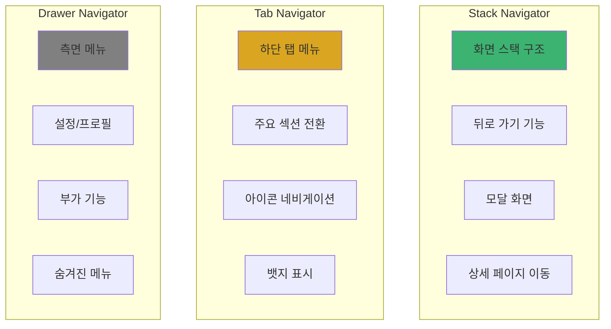
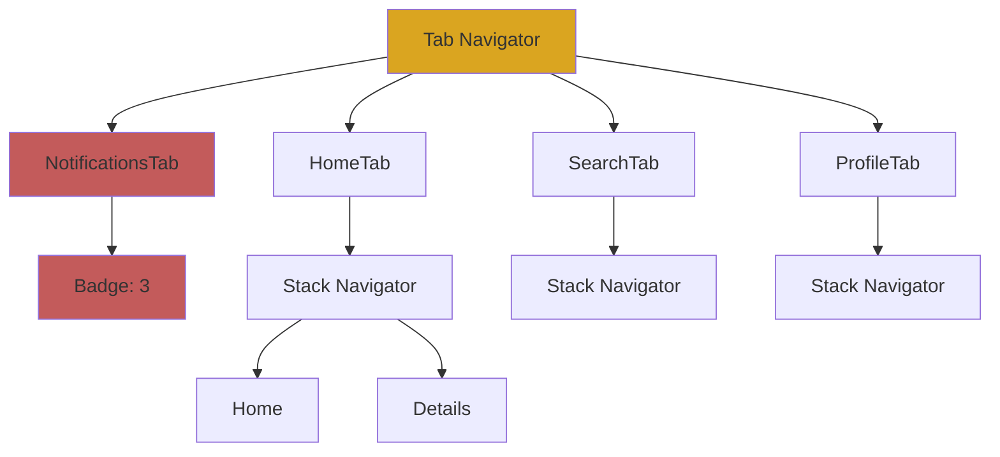
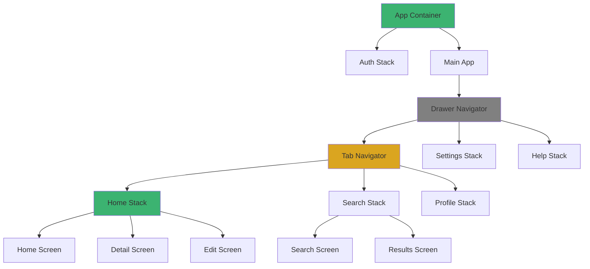
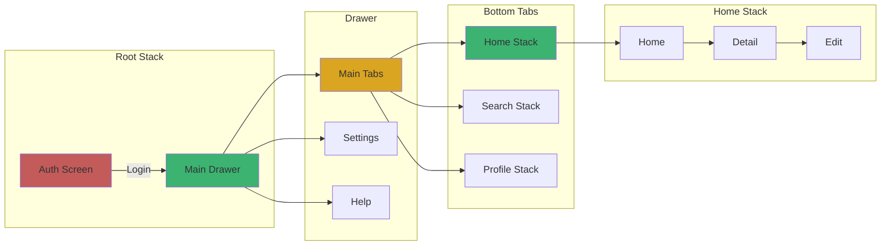

# 3장. React Navigation

## 3-2. Stack, Tab, Drawer 네비게이터 구현

### 개요

React Navigation은 세 가지 핵심 네비게이터를 제공합니다: **Stack Navigator**, **Tab Navigator**, **Drawer Navigator**. 이 섹션에서는 각 네비게이터의 구현 방법과 실무에서 자주 사용하는 **중첩 네비게이터(Nested Navigator)** 패턴을 다룹니다.

TypeScript와 함께 사용하여 타입 안정성을 확보하고, Redux Toolkit과 연동하여 네비게이션 상태를 관리하는 방법도 살펴봅니다.

### 네비게이터 타입별 용도



### Stack Navigator 구현

Stack Navigator는 화면을 **스택(Stack)** 형태로 관리하며, 새 화면이 위에 쌓이고 뒤로 가기로 제거됩니다.

#### 패키지 설치

```bash
npm install @react-navigation/stack
npm install react-native-gesture-handler react-native-reanimated
```

#### 기본 Stack Navigator 구현

```typescript
// src/navigation/types.ts
import type { StackScreenProps } from '@react-navigation/stack';

export type RootStackParamList = {
  Home: undefined;
  Profile: { userId: string };
  Settings: undefined;
  ProductDetail: { productId: number; title: string };
};

export type HomeScreenProps = StackScreenProps<RootStackParamList, 'Home'>;
export type ProfileScreenProps = StackScreenProps<RootStackParamList, 'Profile'>;
export type ProductDetailScreenProps = StackScreenProps<
  RootStackParamList,
  'ProductDetail'
>;
```

```typescript
// src/navigation/RootStackNavigator.tsx
import React from 'react';
import { createStackNavigator } from '@react-navigation/stack';
import type { RootStackParamList } from './types';

import HomeScreen from '../screens/HomeScreen';
import ProfileScreen from '../screens/ProfileScreen';
import SettingsScreen from '../screens/SettingsScreen';
import ProductDetailScreen from '../screens/ProductDetailScreen';

const Stack = createStackNavigator<RootStackParamList>();

const RootStackNavigator: React.FC = () => {
  return (
    <Stack.Navigator
      initialRouteName="Home"
      screenOptions={{
        headerStyle: {
          backgroundColor: '#6200ee',
        },
        headerTintColor: '#fff',
        headerTitleStyle: {
          fontWeight: 'bold',
        },
        cardStyleInterpolator: ({ current, layouts }) => ({
          cardStyle: {
            transform: [
              {
                translateX: current.progress.interpolate({
                  inputRange: [0, 1],
                  outputRange: [layouts.screen.width, 0],
                }),
              },
            ],
          },
        }),
      }}
    >
      <Stack.Screen 
        name="Home" 
        component={HomeScreen}
        options={{ title: '홈' }}
      />
      <Stack.Screen 
        name="Profile" 
        component={ProfileScreen}
        options={{ title: '프로필' }}
      />
      <Stack.Screen 
        name="Settings" 
        component={SettingsScreen}
        options={{ title: '설정' }}
      />
      <Stack.Screen 
        name="ProductDetail" 
        component={ProductDetailScreen}
        options={({ route }) => ({ 
          title: route.params.title 
        })}
      />
    </Stack.Navigator>
  );
};

export default RootStackNavigator;
```

#### 화면 전환 및 파라미터 전달

```typescript
// src/screens/HomeScreen.tsx
import React from 'react';
import { View, Text, Button, StyleSheet } from 'react-native';
import type { HomeScreenProps } from '../navigation/types';

const HomeScreen: React.FC<HomeScreenProps> = ({ navigation }) => {
  return (
    <View style={styles.container}>
      <Text style={styles.title}>홈 화면</Text>
      
      <Button
        title="프로필 보기"
        onPress={() => navigation.navigate('Profile', { userId: 'user123' })}
      />
      
      <Button
        title="제품 상세"
        onPress={() => 
          navigation.navigate('ProductDetail', { 
            productId: 42, 
            title: 'React Native 가이드' 
          })
        }
      />
      
      <Button
        title="설정"
        onPress={() => navigation.navigate('Settings')}
      />
    </View>
  );
};

const styles = StyleSheet.create({
  container: {
    flex: 1,
    justifyContent: 'center',
    alignItems: 'center',
    gap: 10,
  },
  title: {
    fontSize: 24,
    fontWeight: 'bold',
    marginBottom: 20,
  },
});

export default HomeScreen;
```

#### Stack Navigator 화면 전환 플로우

```mermaid
sequenceDiagram
    participant User as 사용자
    participant Home as HomeScreen
    participant Stack as Stack Navigator
    participant Profile as ProfileScreen
    
    User->>Home: 프로필 버튼 클릭
    Home->>Stack: navigate&#40;'Profile', &#123; userId: 'user123' &#125;&#41;
    Stack->>Stack: 스택에 Profile 추가
    Stack->>Profile: params 전달
    Profile->>Profile: userId로 데이터 로드
    
    User->>Profile: 뒤로 가기
    Profile->>Stack: goBack&#40;&#41;
    Stack->>Stack: 스택에서 Profile 제거
    Stack->>Home: 이전 화면 복원
    
    Note over Stack: 스택 상태 유지
```



### Tab Navigator 구현

Tab Navigator는 앱의 주요 섹션을 **하단 탭**으로 빠르게 전환할 수 있게 합니다.

#### 패키지 설치

```bash
npm install @react-navigation/bottom-tabs
npm install @react-native-vector-icons/ionicons
```

#### Bottom Tab Navigator 구현

```typescript
// src/navigation/types.ts
import type { BottomTabScreenProps } from '@react-navigation/bottom-tabs';

export type MainTabParamList = {
  HomeTab: undefined;
  SearchTab: undefined;
  NotificationsTab: undefined;
  ProfileTab: undefined;
};

export type HomeTabScreenProps = BottomTabScreenProps<MainTabParamList, 'HomeTab'>;
```

```typescript
// src/navigation/MainTabNavigator.tsx
import React from 'react';
import { createBottomTabNavigator } from '@react-navigation/bottom-tabs';
import Icon from 'react-native-vector-icons/Ionicons';
import type { MainTabParamList } from './types';

import HomeTabScreen from '../screens/HomeTabScreen';
import SearchTabScreen from '../screens/SearchTabScreen';
import NotificationsTabScreen from '../screens/NotificationsTabScreen';
import ProfileTabScreen from '../screens/ProfileTabScreen';

const Tab = createBottomTabNavigator<MainTabParamList>();

const MainTabNavigator: React.FC = () => {
  return (
    <Tab.Navigator
      screenOptions={({ route }) => ({
        tabBarIcon: ({ focused, color, size }) => {
          let iconName: string;

          switch (route.name) {
            case 'HomeTab':
              iconName = focused ? 'home' : 'home-outline';
              break;
            case 'SearchTab':
              iconName = focused ? 'search' : 'search-outline';
              break;
            case 'NotificationsTab':
              iconName = focused ? 'notifications' : 'notifications-outline';
              break;
            case 'ProfileTab':
              iconName = focused ? 'person' : 'person-outline';
              break;
            default:
              iconName = 'help-outline';
          }

          return <Icon name={iconName} size={size} color={color} />;
        },
        tabBarActiveTintColor: '#6200ee',
        tabBarInactiveTintColor: 'gray',
        tabBarStyle: {
          paddingBottom: 5,
          height: 60,
        },
        headerShown: false,
      })}
    >
      <Tab.Screen 
        name="HomeTab" 
        component={HomeTabScreen}
        options={{ tabBarLabel: '홈' }}
      />
      <Tab.Screen 
        name="SearchTab" 
        component={SearchTabScreen}
        options={{ tabBarLabel: '검색' }}
      />
      <Tab.Screen 
        name="NotificationsTab" 
        component={NotificationsTabScreen}
        options={{ 
          tabBarLabel: '알림',
          tabBarBadge: 3,  // 뱃지 표시
        }}
      />
      <Tab.Screen 
        name="ProfileTab" 
        component={ProfileTabScreen}
        options={{ tabBarLabel: '프로필' }}
      />
    </Tab.Navigator>
  );
};

export default MainTabNavigator;
```

#### Redux와 연동한 동적 뱃지 표시

```typescript
// src/navigation/MainTabNavigator.tsx (Redux 연동)
import { useSelector } from 'react-redux';
import type { RootState } from '../store/store';

const MainTabNavigator: React.FC = () => {
  const unreadCount = useSelector(
    (state: RootState) => state.notifications.unreadCount
  );

  return (
    <Tab.Navigator>
      {/* 다른 탭들... */}
      <Tab.Screen 
        name="NotificationsTab" 
        component={NotificationsTabScreen}
        options={{ 
          tabBarLabel: '알림',
          tabBarBadge: unreadCount > 0 ? unreadCount : undefined,
        }}
      />
    </Tab.Navigator>
  );
};
```

#### Tab Navigator 구조



### Drawer Navigator 구현

Drawer Navigator는 측면에서 슬라이드되는 **메뉴 패널**을 제공합니다.

#### 패키지 설치

```bash
npm install @react-navigation/drawer
npm install react-native-gesture-handler react-native-reanimated
```

#### Drawer Navigator 구현

```typescript
// src/navigation/types.ts
import type { DrawerScreenProps } from '@react-navigation/drawer';

export type DrawerParamList = {
  MainContent: undefined;
  Settings: undefined;
  Help: undefined;
  About: undefined;
};

export type MainContentScreenProps = DrawerScreenProps<DrawerParamList, 'MainContent'>;
```

```typescript
// src/navigation/DrawerNavigator.tsx
import React from 'react';
import { createDrawerNavigator } from '@react-navigation/drawer';
import Icon from 'react-native-vector-icons/Ionicons';
import type { DrawerParamList } from './types';

import MainContentScreen from '../screens/MainContentScreen';
import SettingsScreen from '../screens/SettingsScreen';
import HelpScreen from '../screens/HelpScreen';
import AboutScreen from '../screens/AboutScreen';
import CustomDrawerContent from '../components/CustomDrawerContent';

const Drawer = createDrawerNavigator<DrawerParamList>();

const DrawerNavigator: React.FC = () => {
  return (
    <Drawer.Navigator
      drawerContent={(props) => <CustomDrawerContent {...props} />}
      screenOptions={{
        drawerStyle: {
          backgroundColor: '#f8f9fa',
          width: 280,
        },
        drawerActiveTintColor: '#6200ee',
        drawerInactiveTintColor: '#333',
        drawerLabelStyle: {
          fontSize: 16,
        },
      }}
    >
      <Drawer.Screen 
        name="MainContent" 
        component={MainContentScreen}
        options={{
          drawerLabel: '메인',
          drawerIcon: ({ color, size }) => (
            <Icon name="home-outline" size={size} color={color} />
          ),
        }}
      />
      <Drawer.Screen 
        name="Settings" 
        component={SettingsScreen}
        options={{
          drawerLabel: '설정',
          drawerIcon: ({ color, size }) => (
            <Icon name="settings-outline" size={size} color={color} />
          ),
        }}
      />
      <Drawer.Screen 
        name="Help" 
        component={HelpScreen}
        options={{
          drawerLabel: '도움말',
          drawerIcon: ({ color, size }) => (
            <Icon name="help-circle-outline" size={size} color={color} />
          ),
        }}
      />
      <Drawer.Screen 
        name="About" 
        component={AboutScreen}
        options={{
          drawerLabel: '정보',
          drawerIcon: ({ color, size }) => (
            <Icon name="information-circle-outline" size={size} color={color} />
          ),
        }}
      />
    </Drawer.Navigator>
  );
};

export default DrawerNavigator;
```

#### 커스텀 Drawer Content

```typescript
// src/components/CustomDrawerContent.tsx
import React from 'react';
import { View, Text, StyleSheet, Image } from 'react-native';
import {
  DrawerContentScrollView,
  DrawerItemList,
  DrawerItem,
} from '@react-navigation/drawer';
import { useSelector, useDispatch } from 'react-redux';
import type { RootState } from '../store/store';
import { logout } from '../store/slices/authSlice';

const CustomDrawerContent: React.FC<any> = (props) => {
  const dispatch = useDispatch();
  const user = useSelector((state: RootState) => state.auth.user);

  return (
    <DrawerContentScrollView {...props}>
      {/* 사용자 프로필 영역 */}
      <View style={styles.userSection}>
        <Image
          source={{ uri: user?.avatar || 'https://via.placeholder.com/80' }}
          style={styles.avatar}
        />
        <Text style={styles.userName}>{user?.name || '게스트'}</Text>
        <Text style={styles.userEmail}>{user?.email || ''}</Text>
      </View>

      {/* 기본 Drawer 메뉴 */}
      <DrawerItemList {...props} />

      {/* 커스텀 메뉴 아이템 */}
      <DrawerItem
        label="로그아웃"
        onPress={() => {
          dispatch(logout());
          props.navigation.closeDrawer();
        }}
        icon={({ color, size }) => (
          <Icon name="log-out-outline" size={size} color={color} />
        )}
      />
    </DrawerContentScrollView>
  );
};

const styles = StyleSheet.create({
  userSection: {
    padding: 20,
    borderBottomWidth: 1,
    borderBottomColor: '#e0e0e0',
    marginBottom: 10,
  },
  avatar: {
    width: 80,
    height: 80,
    borderRadius: 40,
    marginBottom: 10,
  },
  userName: {
    fontSize: 18,
    fontWeight: 'bold',
  },
  userEmail: {
    fontSize: 14,
    color: '#666',
  },
});

export default CustomDrawerContent;
```

### 중첩 네비게이터 (Nested Navigator)

실무에서는 여러 네비게이터를 **중첩(Nesting)**하여 복잡한 네비게이션 구조를 만듭니다.

#### 일반적인 중첩 패턴



#### 중첩 네비게이터 구현

```typescript
// src/navigation/types.ts
import type { NavigatorScreenParams } from '@react-navigation/native';

// Tab Navigator 내부의 각 Stack
export type HomeStackParamList = {
  HomeScreen: undefined;
  DetailScreen: { id: number };
  EditScreen: { id: number };
};

export type SearchStackParamList = {
  SearchScreen: undefined;
  ResultsScreen: { query: string };
};

export type ProfileStackParamList = {
  ProfileScreen: undefined;
  EditProfileScreen: undefined;
};

// Main Tab Navigator
export type MainTabParamList = {
  HomeTab: NavigatorScreenParams<HomeStackParamList>;
  SearchTab: NavigatorScreenParams<SearchStackParamList>;
  ProfileTab: NavigatorScreenParams<ProfileStackParamList>;
};

// Drawer Navigator
export type DrawerParamList = {
  MainTabs: NavigatorScreenParams<MainTabParamList>;
  Settings: undefined;
  Help: undefined;
};

// Root Navigation
export type RootStackParamList = {
  Auth: undefined;
  Main: NavigatorScreenParams<DrawerParamList>;
};
```

```typescript
// src/navigation/HomeStackNavigator.tsx
import React from 'react';
import { createStackNavigator } from '@react-navigation/stack';
import type { HomeStackParamList } from './types';

import HomeScreen from '../screens/Home/HomeScreen';
import DetailScreen from '../screens/Home/DetailScreen';
import EditScreen from '../screens/Home/EditScreen';

const Stack = createStackNavigator<HomeStackParamList>();

const HomeStackNavigator: React.FC = () => {
  return (
    <Stack.Navigator>
      <Stack.Screen 
        name="HomeScreen" 
        component={HomeScreen}
        options={{ title: '홈' }}
      />
      <Stack.Screen 
        name="DetailScreen" 
        component={DetailScreen}
        options={{ title: '상세' }}
      />
      <Stack.Screen 
        name="EditScreen" 
        component={EditScreen}
        options={{ title: '편집' }}
      />
    </Stack.Navigator>
  );
};

export default HomeStackNavigator;
```

```typescript
// src/navigation/MainTabNavigator.tsx (중첩 버전)
import React from 'react';
import { createBottomTabNavigator } from '@react-navigation/bottom-tabs';
import Icon from 'react-native-vector-icons/Ionicons';
import type { MainTabParamList } from './types';

import HomeStackNavigator from './HomeStackNavigator';
import SearchStackNavigator from './SearchStackNavigator';
import ProfileStackNavigator from './ProfileStackNavigator';

const Tab = createBottomTabNavigator<MainTabParamList>();

const MainTabNavigator: React.FC = () => {
  return (
    <Tab.Navigator
      screenOptions={{
        headerShown: false,  // Stack의 헤더 사용
      }}
    >
      <Tab.Screen 
        name="HomeTab" 
        component={HomeStackNavigator}
        options={{
          tabBarLabel: '홈',
          tabBarIcon: ({ color, size }) => (
            <Icon name="home-outline" size={size} color={color} />
          ),
        }}
      />
      <Tab.Screen 
        name="SearchTab" 
        component={SearchStackNavigator}
        options={{
          tabBarLabel: '검색',
          tabBarIcon: ({ color, size }) => (
            <Icon name="search-outline" size={size} color={color} />
          ),
        }}
      />
      <Tab.Screen 
        name="ProfileTab" 
        component={ProfileStackNavigator}
        options={{
          tabBarLabel: '프로필',
          tabBarIcon: ({ color, size }) => (
            <Icon name="person-outline" size={size} color={color} />
          ),
        }}
      />
    </Tab.Navigator>
  );
};

export default MainTabNavigator;
```

```typescript
// src/navigation/AppNavigator.tsx (최상위 네비게이터)
import React from 'react';
import { NavigationContainer } from '@react-navigation/native';
import { createStackNavigator } from '@react-navigation/stack';
import { useSelector } from 'react-redux';
import type { RootState } from '../store/store';
import type { RootStackParamList } from './types';

import AuthScreen from '../screens/AuthScreen';
import DrawerNavigator from './DrawerNavigator';

const Stack = createStackNavigator<RootStackParamList>();

const AppNavigator: React.FC = () => {
  const isAuthenticated = useSelector(
    (state: RootState) => state.auth.isAuthenticated
  );

  return (
    <NavigationContainer>
      <Stack.Navigator screenOptions={{ headerShown: false }}>
        {!isAuthenticated ? (
          <Stack.Screen name="Auth" component={AuthScreen} />
        ) : (
          <Stack.Screen name="Main" component={DrawerNavigator} />
        )}
      </Stack.Navigator>
    </NavigationContainer>
  );
};

export default AppNavigator;
```

#### 중첩 네비게이터에서 화면 이동

```typescript
// src/screens/Home/HomeScreen.tsx
import React from 'react';
import { View, Button } from 'react-native';
import type { CompositeScreenProps } from '@react-navigation/native';
import type { StackScreenProps } from '@react-navigation/stack';
import type { BottomTabScreenProps } from '@react-navigation/bottom-tabs';
import type { 
  HomeStackParamList, 
  MainTabParamList 
} from '../../navigation/types';

type HomeScreenProps = CompositeScreenProps<
  StackScreenProps<HomeStackParamList, 'HomeScreen'>,
  BottomTabScreenProps<MainTabParamList>
>;

const HomeScreen: React.FC<HomeScreenProps> = ({ navigation }) => {
  return (
    <View style={{ flex: 1, justifyContent: 'center', alignItems: 'center' }}>
      {/* 같은 Stack 내 이동 */}
      <Button
        title="상세 화면으로"
        onPress={() => navigation.navigate('DetailScreen', { id: 123 })}
      />
      
      {/* 다른 Tab으로 이동 */}
      <Button
        title="검색 탭으로"
        onPress={() => navigation.navigate('SearchTab', {
          screen: 'SearchScreen'
        })}
      />
      
      {/* 중첩된 화면으로 직접 이동 */}
      <Button
        title="검색 결과로"
        onPress={() => navigation.navigate('SearchTab', {
          screen: 'ResultsScreen',
          params: { query: 'React Native' }
        })}
      />
    </View>
  );
};

export default HomeScreen;
```

### 네비게이션 플로우 다이어그램



### 네비게이션 옵션 커스터마이징

#### 동적 헤더 설정

```typescript
// src/navigation/HomeStackNavigator.tsx
const HomeStackNavigator: React.FC = () => {
  const dispatch = useDispatch();

  return (
    <Stack.Navigator>
      <Stack.Screen 
        name="HomeScreen" 
        component={HomeScreen}
        options={({ navigation }) => ({
          title: '홈',
          headerRight: () => (
            <Button
              onPress={() => navigation.navigate('DetailScreen', { id: 1 })}
              title="추가"
              color="#fff"
            />
          ),
        })}
      />
      <Stack.Screen 
        name="DetailScreen" 
        component={DetailScreen}
        options={({ route }) => ({
          title: `상세 #${route.params.id}`,
          headerBackTitle: '뒤로',
        })}
      />
    </Stack.Navigator>
  );
};
```

#### 플랫폼별 스타일 적용

```typescript
import { Platform } from 'react-native';

const Stack = createStackNavigator();

const options = {
  headerStyle: {
    backgroundColor: '#6200ee',
    ...Platform.select({
      ios: {
        shadowColor: '#000',
        shadowOffset: { width: 0, height: 2 },
        shadowOpacity: 0.25,
      },
      android: {
        elevation: 4,
      },
    }),
  },
  headerTintColor: '#fff',
  headerTitleAlign: Platform.OS === 'ios' ? 'center' : 'left',
};
```

### 화면 전환 애니메이션

```typescript
// src/navigation/RootStackNavigator.tsx
import { TransitionPresets } from '@react-navigation/stack';

const Stack = createStackNavigator();

const RootStackNavigator: React.FC = () => {
  return (
    <Stack.Navigator
      screenOptions={{
        ...TransitionPresets.SlideFromRightIOS,  // iOS 스타일
        // 또는
        ...TransitionPresets.ModalSlideFromBottomIOS,  // 모달 스타일
        // 또는 커스텀
        cardStyleInterpolator: ({ current, layouts }) => ({
          cardStyle: {
            opacity: current.progress,
          },
        }),
      }}
    >
      {/* Screens */}
    </Stack.Navigator>
  );
};
```

### 성능 최적화 팁

```typescript
// 화면 lazy loading
const HomeScreen = React.lazy(() => import('../screens/HomeScreen'));
const DetailScreen = React.lazy(() => import('../screens/DetailScreen'));

const HomeStackNavigator: React.FC = () => {
  return (
    <Stack.Navigator>
      <Stack.Screen name="HomeScreen">
        {(props) => (
          <React.Suspense fallback={<LoadingScreen />}>
            <HomeScreen {...props} />
          </React.Suspense>
        )}
      </Stack.Screen>
    </Stack.Navigator>
  );
};
```

### 요약

Stack, Tab, Drawer 네비게이터의 구현 방법을 다루었습니다.

**핵심 내용**:
- **Stack Navigator**: 화면 스택 관리, 파라미터 전달
- **Tab Navigator**: 하단 탭 UI, 뱃지 표시, Redux 연동
- **Drawer Navigator**: 측면 메뉴, 커스텀 Drawer Content
- **중첩 네비게이터**: 복잡한 네비게이션 구조 설계
- **TypeScript**: 타입 안정성 확보
- **화면 전환**: 애니메이션 커스터마이징

**다음 섹션**에서는 네비게이션과 Redux를 통합하여 네비게이션 상태를 전역으로 관리하는 방법을 다룹니다.
