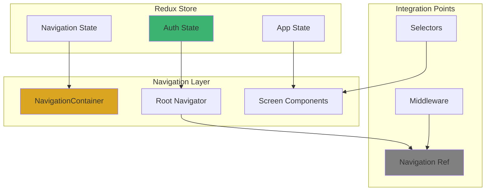
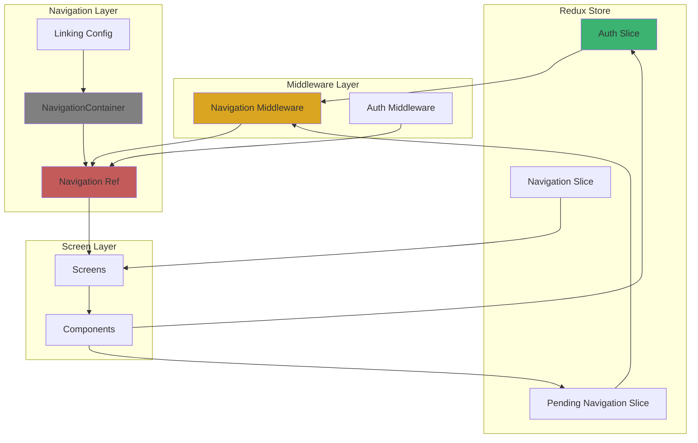

# 3장. React Navigation

## 3-3. 네비게이션과 Redux 통합

### 개요

네비게이션과 Redux를 통합하면 네비게이션 상태를 전역으로 관리하고, 컴포넌트 외부에서도 화면 전환을 제어할 수 있습니다. 이 섹션에서는 Redux를 활용한 인증 기반 네비게이션 제어, 네비게이션 상태 추적, 그리고 Redux Middleware를 통한 네비게이션 자동화를 다룹니다.

실무에서는 로그인 상태에 따라 화면을 전환하거나, 특정 액션 발생 시 자동으로 화면을 이동시키는 경우가 많습니다. Redux와 네비게이션을 효과적으로 통합하면 이러한 요구사항을 깔끔하게 구현할 수 있습니다.

### Redux와 네비게이션의 관계



**통합 방식**:
- **조건부 네비게이션**: Redux 상태 기반 화면 전환
- **Navigation Ref**: 컴포넌트 외부에서 네비게이션 제어
- **Middleware**: 액션 발생 시 자동 네비게이션
- **State Sync**: 네비게이션 상태와 Redux 상태 동기화

### 인증 기반 네비게이션

#### 1. Auth Slice 구성

```typescript
// store/slices/authSlice.ts
import { createSlice, createAsyncThunk, PayloadAction } from '@reduxjs/toolkit';
import { authApi } from '@services/api/authApi';

interface User {
  id: string;
  email: string;
  name: string;
  avatar?: string;
}

interface AuthState {
  user: User | null;
  token: string | null;
  isAuthenticated: boolean;
  isLoading: boolean;
  error: string | null;
}

const initialState: AuthState = {
  user: null,
  token: null,
  isAuthenticated: false,
  isLoading: false,
  error: null,
};

// 비동기 로그인
export const loginAsync = createAsyncThunk(
  'auth/login',
  async (
    credentials: { email: string; password: string },
    { rejectWithValue }
  ) => {
    try {
      const response = await authApi.login(credentials);
      return response.data;
    } catch (error: any) {
      return rejectWithValue(error.response?.data?.message || '로그인 실패');
    }
  }
);

// 비동기 로그아웃
export const logoutAsync = createAsyncThunk(
  'auth/logout',
  async (_, { rejectWithValue }) => {
    try {
      await authApi.logout();
    } catch (error: any) {
      return rejectWithValue(error.response?.data?.message);
    }
  }
);

const authSlice = createSlice({
  name: 'auth',
  initialState,
  reducers: {
    setCredentials: (
      state,
      action: PayloadAction<{ user: User; token: string }>
    ) => {
      state.user = action.payload.user;
      state.token = action.payload.token;
      state.isAuthenticated = true;
      state.error = null;
    },
    clearCredentials: (state) => {
      state.user = null;
      state.token = null;
      state.isAuthenticated = false;
    },
    clearError: (state) => {
      state.error = null;
    },
  },
  extraReducers: (builder) => {
    // loginAsync
    builder
      .addCase(loginAsync.pending, (state) => {
        state.isLoading = true;
        state.error = null;
      })
      .addCase(loginAsync.fulfilled, (state, action) => {
        state.isLoading = false;
        state.user = action.payload.user;
        state.token = action.payload.token;
        state.isAuthenticated = true;
      })
      .addCase(loginAsync.rejected, (state, action) => {
        state.isLoading = false;
        state.error = action.payload as string;
      });

    // logoutAsync
    builder
      .addCase(logoutAsync.pending, (state) => {
        state.isLoading = true;
      })
      .addCase(logoutAsync.fulfilled, (state) => {
        state.isLoading = false;
        state.user = null;
        state.token = null;
        state.isAuthenticated = false;
      })
      .addCase(logoutAsync.rejected, (state, action) => {
        state.isLoading = false;
        state.error = action.payload as string;
      });
  },
});

export const { setCredentials, clearCredentials, clearError } =
  authSlice.actions;

// Selectors
export const selectUser = (state: RootState) => state.auth.user;
export const selectIsAuthenticated = (state: RootState) =>
  state.auth.isAuthenticated;
export const selectAuthLoading = (state: RootState) => state.auth.isLoading;
export const selectAuthError = (state: RootState) => state.auth.error;

export default authSlice.reducer;
```

#### 2. 인증 상태 기반 Root Navigator

```typescript
// navigation/RootNavigator.tsx
import React from 'react';
import { createStackNavigator } from '@react-navigation/stack';
import { useAppSelector } from '@store/hooks';
import { selectIsAuthenticated } from '@store/slices/authSlice';
import AuthNavigator from './AuthNavigator';
import MainNavigator from './MainNavigator';
import { RootStackParamList } from './types';

const Stack = createStackNavigator<RootStackParamList>();

const RootNavigator: React.FC = () => {
  const isAuthenticated = useAppSelector(selectIsAuthenticated);

  return (
    <Stack.Navigator screenOptions={{ headerShown: false }}>
      {isAuthenticated ? (
        <Stack.Screen name="Main" component={MainNavigator} />
      ) : (
        <Stack.Screen name="Auth" component={AuthNavigator} />
      )}
    </Stack.Navigator>
  );
};

export default RootNavigator;
```

**인증 기반 네비게이션 플로우**:

```mermaid
sequenceDiagram
    participant U as User
    participant L as LoginScreen
    participant R as Redux Store
    participant N as Root Navigator
    participant M as Main Navigator

    U->>L: 로그인 정보 입력
    L->>R: dispatch&#40;loginAsync&#41;

    rect rgb(60, 179, 113, 0.2)
        Note over R: Auth State 변경
        R->>R: isAuthenticated = true
        R->>R: user, token 저장
    end

    R->>N: state 변경 감지
    N->>N: isAuthenticated 확인

    rect rgb(60, 179, 113, 0.2)
        Note over N,M: 조건부 렌더링
        N->>M: Main Navigator 렌더링
        M->>M: 홈 화면 표시
    end

    U->>M: 로그아웃 버튼 클릭
    M->>R: dispatch&#40;logoutAsync&#41;
    R->>R: isAuthenticated = false
    R->>N: state 변경 감지
    N->>L: Auth Navigator 렌더링
```



### Navigation Ref 활용

컴포넌트 외부에서 네비게이션을 제어하기 위해 Navigation Ref를 사용합니다.

#### 1. Navigation Ref 설정

```typescript
// navigation/navigationRef.ts
import {
  createNavigationContainerRef,
  StackActions,
} from '@react-navigation/native';
import type { RootStackParamList } from './types';

export const navigationRef =
  createNavigationContainerRef<RootStackParamList>();

/**
 * 화면 이동
 */
export function navigate<RouteName extends keyof RootStackParamList>(
  name: RouteName,
  params?: RootStackParamList[RouteName]
) {
  if (navigationRef.isReady()) {
    navigationRef.navigate(name as never, params as never);
  }
}

/**
 * 뒤로 가기
 */
export function goBack() {
  if (navigationRef.isReady() && navigationRef.canGoBack()) {
    navigationRef.goBack();
  }
}

/**
 * 네비게이션 스택 리셋
 */
export function resetRoot<RouteName extends keyof RootStackParamList>(
  name: RouteName,
  params?: RootStackParamList[RouteName]
) {
  if (navigationRef.isReady()) {
    navigationRef.reset({
      index: 0,
      routes: [{ name: name as never, params: params as never }],
    });
  }
}

/**
 * 특정 화면으로 이동 (스택에 추가)
 */
export function push<RouteName extends keyof RootStackParamList>(
  name: RouteName,
  params?: RootStackParamList[RouteName]
) {
  if (navigationRef.isReady()) {
    navigationRef.dispatch(StackActions.push(name as never, params as never));
  }
}

/**
 * 현재 라우트 이름 가져오기
 */
export function getCurrentRoute() {
  if (navigationRef.isReady()) {
    return navigationRef.getCurrentRoute();
  }
  return null;
}
```

#### 2. App.tsx에 적용

```typescript
// App.tsx
import React from 'react';
import { NavigationContainer } from '@react-navigation/native';
import { Provider } from 'react-redux';
import { SafeAreaProvider } from 'react-native-safe-area-context';
import { store } from '@store/index';
import { navigationRef } from '@navigation/navigationRef';
import RootNavigator from '@navigation/RootNavigator';

const App: React.FC = () => {
  return (
    <Provider store={store}>
      <SafeAreaProvider>
        <NavigationContainer ref={navigationRef}>
          <RootNavigator />
        </NavigationContainer>
      </SafeAreaProvider>
    </Provider>
  );
};

export default App;
```

### Redux Middleware를 통한 네비게이션 제어

Redux Middleware를 사용하면 특정 액션 발생 시 자동으로 네비게이션을 처리할 수 있습니다.

#### 1. Navigation Middleware 구현

```typescript
// store/middleware/navigationMiddleware.ts
import { Middleware, isAnyOf } from '@reduxjs/toolkit';
import { loginAsync, logoutAsync } from '@store/slices/authSlice';
import { navigate, resetRoot } from '@navigation/navigationRef';

export const navigationMiddleware: Middleware = () => (next) => (action) => {
  const result = next(action);

  // 로그인 성공 시 Main으로 이동
  if (loginAsync.fulfilled.match(action)) {
    resetRoot('Main');
  }

  // 로그아웃 시 Auth로 이동
  if (
    isAnyOf(logoutAsync.fulfilled, logoutAsync.rejected)(action)
  ) {
    resetRoot('Auth');
  }

  // 세션 만료 시 Auth로 이동
  if (action.type === 'auth/sessionExpired') {
    resetRoot('Auth');
  }

  return result;
};
```

#### 2. Middleware 등록

```typescript
// store/index.ts
import { configureStore } from '@reduxjs/toolkit';
import rootReducer from './rootReducer';
import { navigationMiddleware } from './middleware/navigationMiddleware';

export const store = configureStore({
  reducer: rootReducer,
  middleware: (getDefaultMiddleware) =>
    getDefaultMiddleware().concat(navigationMiddleware),
});

export type RootState = ReturnType<typeof store.getState>;
export type AppDispatch = typeof store.dispatch;
```

**Middleware 동작 플로우**:

```mermaid
graph LR
    A[Action Dispatch] --> B[Middleware]

    subgraph "Navigation Middleware"
        B --> C{Action Type?}
        C -->|loginAsync.fulfilled| D[resetRoot&#40;'Main'&#41;]
        C -->|logoutAsync| E[resetRoot&#40;'Auth'&#41;]
        C -->|sessionExpired| F[resetRoot&#40;'Auth'&#41;]
        C -->|Other| G[Pass Through]
    end

    D --> H[Reducer]
    E --> H
    F --> H
    G --> H

    H --> I[State Update]
    I --> J[Component Re-render]

    style B fill:#daa520
    style C fill:#808080
    style H fill:#3cb371
```



### 네비게이션 상태 추적

네비게이션 상태를 Redux에 저장하여 분석이나 디버깅에 활용할 수 있습니다.

#### 1. Navigation Tracking Slice

```typescript
// store/slices/navigationSlice.ts
import { createSlice, PayloadAction } from '@reduxjs/toolkit';

interface Route {
  name: string;
  params?: Record<string, any>;
}

interface NavigationState {
  currentRoute: Route | null;
  history: Route[];
}

const initialState: NavigationState = {
  currentRoute: null,
  history: [],
};

const navigationSlice = createSlice({
  name: 'navigation',
  initialState,
  reducers: {
    setCurrentRoute: (state, action: PayloadAction<Route>) => {
      state.currentRoute = action.payload;
      state.history.push(action.payload);

      // 최근 20개만 유지
      if (state.history.length > 20) {
        state.history.shift();
      }
    },
    clearHistory: (state) => {
      state.history = [];
    },
  },
});

export const { setCurrentRoute, clearHistory } = navigationSlice.actions;

// Selectors
export const selectCurrentRoute = (state: RootState) =>
  state.navigation.currentRoute;
export const selectNavigationHistory = (state: RootState) =>
  state.navigation.history;

export default navigationSlice.reducer;
```

#### 2. NavigationContainer 상태 추적

```typescript
// App.tsx
import React from 'react';
import { NavigationContainer } from '@react-navigation/native';
import { useAppDispatch } from '@store/hooks';
import { setCurrentRoute } from '@store/slices/navigationSlice';

const App: React.FC = () => {
  const dispatch = useAppDispatch();

  return (
    <NavigationContainer
      ref={navigationRef}
      onStateChange={(state) => {
        const currentRoute = state?.routes[state.index];
        if (currentRoute) {
          dispatch(
            setCurrentRoute({
              name: currentRoute.name,
              params: currentRoute.params,
            })
          );
        }
      }}
    >
      <RootNavigator />
    </NavigationContainer>
  );
};
```

### 실전 예제: 장바구니 → 로그인 플로우

#### 1. 시나리오

사용자가 비로그인 상태에서 장바구니에 상품을 담으려 할 때:
1. 로그인 화면으로 이동
2. 로그인 성공 후 장바구니로 복귀
3. 자동으로 상품 추가

#### 2. Pending Navigation Slice

```typescript
// store/slices/pendingNavigationSlice.ts
import { createSlice, PayloadAction } from '@reduxjs/toolkit';

interface PendingNavigation {
  screen: string;
  params?: Record<string, any>;
  action?: {
    type: string;
    payload?: any;
  };
}

interface PendingNavigationState {
  pending: PendingNavigation | null;
}

const initialState: PendingNavigationState = {
  pending: null,
};

const pendingNavigationSlice = createSlice({
  name: 'pendingNavigation',
  initialState,
  reducers: {
    setPendingNavigation: (state, action: PayloadAction<PendingNavigation>) => {
      state.pending = action.payload;
    },
    clearPendingNavigation: (state) => {
      state.pending = null;
    },
  },
});

export const { setPendingNavigation, clearPendingNavigation } =
  pendingNavigationSlice.actions;

export const selectPendingNavigation = (state: RootState) =>
  state.pendingNavigation.pending;

export default pendingNavigationSlice.reducer;
```

#### 3. 로그인 요구 처리

```typescript
// features/product/components/AddToCartButton.tsx
import React from 'react';
import { TouchableOpacity, Text } from 'react-native';
import { useAppDispatch, useAppSelector } from '@store/hooks';
import { selectIsAuthenticated } from '@store/slices/authSlice';
import { addToCart } from '@store/slices/cartSlice';
import { setPendingNavigation } from '@store/slices/pendingNavigationSlice';
import { navigate } from '@navigation/navigationRef';

interface AddToCartButtonProps {
  productId: string;
  productName: string;
  price: number;
}

const AddToCartButton: React.FC<AddToCartButtonProps> = ({
  productId,
  productName,
  price,
}) => {
  const dispatch = useAppDispatch();
  const isAuthenticated = useAppSelector(selectIsAuthenticated);

  const handleAddToCart = () => {
    if (!isAuthenticated) {
      // 로그인 필요: pending navigation 저장
      dispatch(
        setPendingNavigation({
          screen: 'Cart',
          action: {
            type: 'cart/addToCart',
            payload: {
              productId,
              name: productName,
              price,
            },
          },
        })
      );

      // 로그인 화면으로 이동
      navigate('Auth', { screen: 'Login' });
      return;
    }

    // 로그인 상태: 바로 장바구니 추가
    dispatch(addToCart({ productId, name: productName, price }));
  };

  return (
    <TouchableOpacity onPress={handleAddToCart}>
      <Text>장바구니에 담기</Text>
    </TouchableOpacity>
  );
};

export default AddToCartButton;
```

#### 4. 로그인 후 자동 처리

```typescript
// store/middleware/navigationMiddleware.ts (수정)
import { Middleware } from '@reduxjs/toolkit';
import { loginAsync } from '@store/slices/authSlice';
import {
  selectPendingNavigation,
  clearPendingNavigation,
} from '@store/slices/pendingNavigationSlice';
import { navigate, resetRoot } from '@navigation/navigationRef';

export const navigationMiddleware: Middleware =
  (store) => (next) => (action) => {
    const result = next(action);

    // 로그인 성공 시
    if (loginAsync.fulfilled.match(action)) {
      const state = store.getState();
      const pending = selectPendingNavigation(state);

      if (pending) {
        // Pending action 실행
        if (pending.action) {
          store.dispatch(pending.action);
        }

        // Pending navigation 실행
        setTimeout(() => {
          navigate(pending.screen as any, pending.params as any);
          store.dispatch(clearPendingNavigation());
        }, 100);
      } else {
        resetRoot('Main');
      }
    }

    return result;
  };
```

**Pending Navigation 플로우**:

```mermaid
sequenceDiagram
    participant U as User
    participant P as ProductScreen
    participant S as Redux Store
    participant L as LoginScreen
    participant C as CartScreen

    U->>P: 장바구니 담기 클릭
    P->>S: isAuthenticated 확인
    S-->>P: false

    rect rgb(60, 179, 113, 0.2)
        Note over P,S: Pending 저장
        P->>S: setPendingNavigation&#40;&#123; screen: 'Cart', action: ... &#125;&#41;
    end

    P->>L: navigate&#40;'Login'&#41;

    U->>L: 로그인 정보 입력
    L->>S: dispatch&#40;loginAsync&#41;
    S->>S: loginAsync.fulfilled

    rect rgb(60, 179, 113, 0.2)
        Note over S: Middleware 처리
        S->>S: Pending action 실행
        S->>S: addToCart
        S->>C: navigate&#40;'Cart'&#41;
        S->>S: clearPendingNavigation
    end

    C->>U: 상품이 담긴 장바구니 표시
```



### 딥링킹과 Redux 통합

딥링크를 통한 진입 시 인증 체크 및 상태 초기화를 처리합니다.

```typescript
// navigation/linking.ts
import { LinkingOptions } from '@react-navigation/native';
import { RootStackParamList } from './types';
import { store } from '@store/index';
import { selectIsAuthenticated } from '@store/slices/authSlice';
import { setPendingNavigation } from '@store/slices/pendingNavigationSlice';

const linking: LinkingOptions<RootStackParamList> = {
  prefixes: ['myapp://', 'https://myapp.com'],
  config: {
    screens: {
      Auth: {
        screens: {
          Login: 'login',
        },
      },
      Main: {
        screens: {
          Home: 'home',
          ProductDetail: 'products/:productId',
          Cart: 'cart',
        },
      },
    },
  },
  // 커스텀 링크 처리
  getStateFromPath: (path, config) => {
    // 기본 파싱
    const state = getStateFromPath(path, config);

    // 인증 필요한 경로 체크
    const protectedRoutes = ['cart', 'profile', 'orders'];
    const isProtectedRoute = protectedRoutes.some((route) =>
      path.includes(route)
    );

    if (isProtectedRoute) {
      const isAuthenticated = selectIsAuthenticated(store.getState());

      if (!isAuthenticated) {
        // Pending navigation 저장
        store.dispatch(
          setPendingNavigation({
            screen: state?.routes[0]?.name || 'Home',
            params: state?.routes[0]?.params,
          })
        );

        // 로그인 화면으로 리다이렉트
        return {
          routes: [{ name: 'Auth', state: { routes: [{ name: 'Login' }] } }],
        };
      }
    }

    return state;
  },
};

export default linking;
```

### 네비게이션 이벤트 Redux 연동

```typescript
// hooks/useNavigationTracking.ts
import { useEffect } from 'react';
import { useNavigation } from '@react-navigation/native';
import { useAppDispatch } from '@store/hooks';
import { setCurrentRoute } from '@store/slices/navigationSlice';
import analytics from '@services/analytics';

export const useNavigationTracking = () => {
  const navigation = useNavigation();
  const dispatch = useAppDispatch();

  useEffect(() => {
    const unsubscribe = navigation.addListener('state', () => {
      const route = navigation.getCurrentRoute();

      if (route) {
        // Redux 상태 업데이트
        dispatch(
          setCurrentRoute({
            name: route.name,
            params: route.params,
          })
        );

        // Analytics 전송
        analytics.logScreenView({
          screen_name: route.name,
          screen_class: route.name,
        });
      }
    });

    return unsubscribe;
  }, [navigation, dispatch]);
};
```

```typescript
// App.tsx
import { useNavigationTracking } from '@hooks/useNavigationTracking';

const AppContent: React.FC = () => {
  useNavigationTracking();

  return <RootNavigator />;
};
```

### 전체 통합 아키텍처



### 테스트 전략

```typescript
// __tests__/navigationMiddleware.test.ts
import { configureStore } from '@reduxjs/toolkit';
import { navigationMiddleware } from '@store/middleware/navigationMiddleware';
import authReducer, { loginAsync } from '@store/slices/authSlice';
import * as navigationRef from '@navigation/navigationRef';

jest.mock('@navigation/navigationRef');

describe('navigationMiddleware', () => {
  let store: any;

  beforeEach(() => {
    store = configureStore({
      reducer: { auth: authReducer },
      middleware: (getDefaultMiddleware) =>
        getDefaultMiddleware().concat(navigationMiddleware),
    });
  });

  it('should navigate to Main on login success', async () => {
    const resetRootMock = jest.spyOn(navigationRef, 'resetRoot');

    await store.dispatch(
      loginAsync({ email: 'test@test.com', password: 'password' })
    );

    expect(resetRootMock).toHaveBeenCalledWith('Main');
  });
});
```

### 성능 최적화

```typescript
// hooks/useAuthNavigation.ts
import { useEffect, useRef } from 'react';
import { useAppSelector } from '@store/hooks';
import { selectIsAuthenticated } from '@store/slices/authSlice';
import { resetRoot } from '@navigation/navigationRef';

/**
 * 인증 상태 변화에 따른 네비게이션 처리
 * (debounce 적용)
 */
export const useAuthNavigation = () => {
  const isAuthenticated = useAppSelector(selectIsAuthenticated);
  const prevAuthRef = useRef(isAuthenticated);

  useEffect(() => {
    // 초기 렌더링 스킵
    if (prevAuthRef.current === isAuthenticated) {
      return;
    }

    const timer = setTimeout(() => {
      if (isAuthenticated && !prevAuthRef.current) {
        // 로그인됨
        resetRoot('Main');
      } else if (!isAuthenticated && prevAuthRef.current) {
        // 로그아웃됨
        resetRoot('Auth');
      }

      prevAuthRef.current = isAuthenticated;
    }, 100);

    return () => clearTimeout(timer);
  }, [isAuthenticated]);
};
```

### 요약

네비게이션과 Redux의 통합을 통해 전역 상태 기반 네비게이션 제어와 자동화를 구현했습니다.

**핵심 포인트**:
- **인증 기반 네비게이션**: Redux 상태에 따른 조건부 화면 전환
- **Navigation Ref**: 컴포넌트 외부에서 네비게이션 제어
- **Middleware 통합**: 액션 발생 시 자동 네비게이션 처리
- **Pending Navigation**: 로그인 후 원래 화면으로 복귀
- **상태 추적**: 네비게이션 히스토리 관리 및 분석
- **딥링킹 통합**: URL 기반 인증 체크 및 리다이렉트
- **이벤트 추적**: Analytics 연동

다음 장에서는 UI 컴포넌트 설계와 스타일링 전략을 다룹니다.
