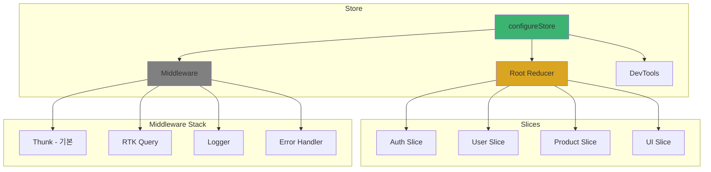
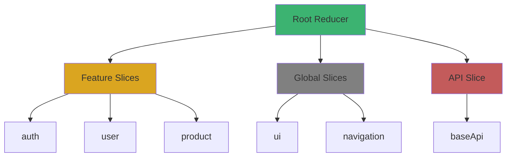
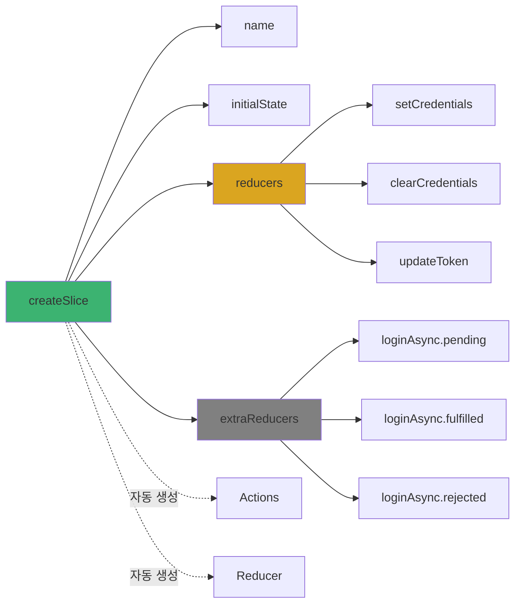
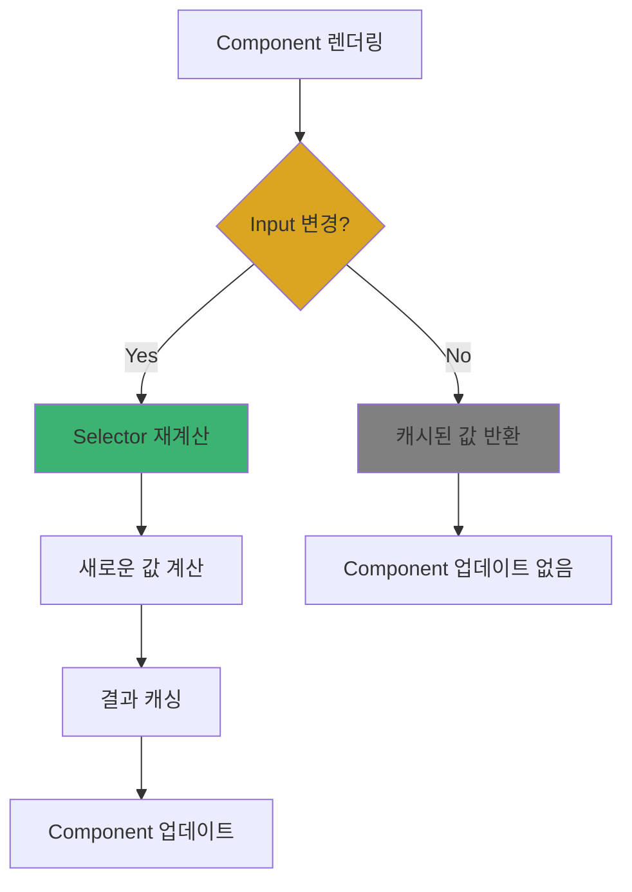

# 4장. Redux Toolkit 핵심

## 4-1. Store 설정과 Slice 패턴

### 개요

Redux Toolkit의 Store와 Slice는 전역 상태 관리의 핵심입니다. 이 섹션에서는 **configureStore**를 사용한 Store 설정, **createSlice**를 활용한 모듈식 상태 관리, 그리고 **Selector 패턴**을 통한 파생 상태 계산 방법을 다룹니다.

Redux Toolkit은 기존 Redux의 보일러플레이트를 대폭 줄이고, Immer를 내장하여 불변성 관리를 자동화하며, TypeScript와의 완벽한 통합을 제공합니다. 실무에서 바로 적용할 수 있는 패턴과 모범 사례를 중심으로 설명합니다.

### Redux Toolkit Store 구조



### Store 설정

#### 1. 기본 Store 구성

```typescript
// store/index.ts
import { configureStore } from '@reduxjs/toolkit';
import { setupListeners } from '@reduxjs/toolkit/query';
import rootReducer from './rootReducer';
import { baseApi } from '@services/api/baseApi';
import { logger } from './middleware/logger';
import { errorHandler } from './middleware/errorHandler';

export const store = configureStore({
  reducer: rootReducer,
  middleware: (getDefaultMiddleware) =>
    getDefaultMiddleware({
      // Serializable 체크 설정
      serializableCheck: {
        // Redux Persist 액션 무시
        ignoredActions: ['persist/PERSIST', 'persist/REHYDRATE'],
        // 특정 경로 무시
        ignoredPaths: ['api.queries'],
      },
      // Immutable 체크 활성화
      immutableCheck: true,
      // Thunk 설정
      thunk: true,
    })
      .concat(baseApi.middleware)
      .concat(logger)
      .concat(errorHandler),
  // DevTools 설정
  devTools: __DEV__
    ? {
        name: 'React Native App',
        trace: true,
        traceLimit: 25,
      }
    : false,
  // 향상된 리듀서 체크
  enhancers: (getDefaultEnhancers) => getDefaultEnhancers(),
});

// RTK Query 리스너 설정
setupListeners(store.dispatch);

// TypeScript 타입 export
export type RootState = ReturnType<typeof store.getState>;
export type AppDispatch = typeof store.dispatch;
```

#### 2. Root Reducer 구성

```typescript
// store/rootReducer.ts
import { combineReducers } from '@reduxjs/toolkit';
import { baseApi } from '@services/api/baseApi';

// Feature Slices
import authReducer from '@features/auth/store/authSlice';
import userReducer from '@features/user/store/userSlice';
import productReducer from '@features/product/store/productSlice';

// Global Slices
import uiReducer from './slices/uiSlice';
import navigationReducer from './slices/navigationSlice';
import pendingNavigationReducer from './slices/pendingNavigationSlice';

const rootReducer = combineReducers({
  // RTK Query API
  [baseApi.reducerPath]: baseApi.reducer,

  // Feature Slices
  auth: authReducer,
  user: userReducer,
  product: productReducer,

  // Global Slices
  ui: uiReducer,
  navigation: navigationReducer,
  pendingNavigation: pendingNavigationReducer,
});

export default rootReducer;
```

**Root Reducer 구조**:



#### 3. Typed Hooks

```typescript
// store/hooks.ts
import { useDispatch, useSelector } from 'react-redux';
import type { TypedUseSelectorHook } from 'react-redux';
import type { RootState, AppDispatch } from './index';

// 타입이 지정된 useDispatch
export const useAppDispatch: () => AppDispatch = useDispatch;

// 타입이 지정된 useSelector
export const useAppSelector: TypedUseSelectorHook<RootState> = useSelector;
```

**사용 예시**:

```typescript
import { useAppDispatch, useAppSelector } from '@store/hooks';

const MyComponent = () => {
  // ✅ 타입 안전성 보장
  const dispatch = useAppDispatch();
  const user = useAppSelector((state) => state.auth.user);

  const handleLogin = () => {
    dispatch(loginAsync({ email: 'test@test.com', password: 'password' }));
  };
};
```

### Slice 패턴

#### 1. 기본 Slice 구조

```typescript
// features/auth/store/authSlice.ts
import { createSlice, PayloadAction } from '@reduxjs/toolkit';
import type { RootState } from '@store/index';

interface User {
  id: string;
  email: string;
  name: string;
  avatar?: string;
}

interface AuthState {
  user: User | null;
  token: string | null;
  refreshToken: string | null;
  isAuthenticated: boolean;
  isLoading: boolean;
  error: string | null;
}

const initialState: AuthState = {
  user: null,
  token: null,
  refreshToken: null,
  isAuthenticated: false,
  isLoading: false,
  error: null,
};

const authSlice = createSlice({
  name: 'auth',
  initialState,
  reducers: {
    // 동기 액션: Credentials 설정
    setCredentials: (
      state,
      action: PayloadAction<{
        user: User;
        token: string;
        refreshToken: string;
      }>
    ) => {
      // Immer 덕분에 직접 수정 가능
      state.user = action.payload.user;
      state.token = action.payload.token;
      state.refreshToken = action.payload.refreshToken;
      state.isAuthenticated = true;
      state.error = null;
    },

    // 동기 액션: Credentials 제거
    clearCredentials: (state) => {
      state.user = null;
      state.token = null;
      state.refreshToken = null;
      state.isAuthenticated = false;
    },

    // 동기 액션: 토큰 갱신
    updateToken: (
      state,
      action: PayloadAction<{ token: string; refreshToken: string }>
    ) => {
      state.token = action.payload.token;
      state.refreshToken = action.payload.refreshToken;
    },

    // 동기 액션: 에러 제거
    clearError: (state) => {
      state.error = null;
    },

    // 동기 액션: 사용자 정보 업데이트
    updateUser: (state, action: PayloadAction<Partial<User>>) => {
      if (state.user) {
        state.user = { ...state.user, ...action.payload };
      }
    },
  },
});

// Actions export
export const {
  setCredentials,
  clearCredentials,
  updateToken,
  clearError,
  updateUser,
} = authSlice.actions;

// Selectors
export const selectUser = (state: RootState) => state.auth.user;
export const selectToken = (state: RootState) => state.auth.token;
export const selectRefreshToken = (state: RootState) => state.auth.refreshToken;
export const selectIsAuthenticated = (state: RootState) =>
  state.auth.isAuthenticated;
export const selectAuthLoading = (state: RootState) => state.auth.isLoading;
export const selectAuthError = (state: RootState) => state.auth.error;

// Reducer export
export default authSlice.reducer;
```

**Slice 구조 다이어그램**:



#### 2. createAsyncThunk 활용

```typescript
// features/auth/store/authSlice.ts (계속)
import { createAsyncThunk } from '@reduxjs/toolkit';
import { authApi } from '@services/api/authApi';

// 로그인 비동기 Thunk
export const loginAsync = createAsyncThunk(
  'auth/login',
  async (
    credentials: { email: string; password: string },
    { rejectWithValue }
  ) => {
    try {
      const response = await authApi.login(credentials);
      return response.data;
    } catch (error: any) {
      return rejectWithValue(
        error.response?.data?.message || '로그인에 실패했습니다.'
      );
    }
  }
);

// 로그아웃 비동기 Thunk
export const logoutAsync = createAsyncThunk(
  'auth/logout',
  async (_, { getState, rejectWithValue }) => {
    try {
      const state = getState() as RootState;
      await authApi.logout(state.auth.token!);
    } catch (error: any) {
      return rejectWithValue(error.response?.data?.message);
    }
  }
);

// 토큰 갱신 비동기 Thunk
export const refreshTokenAsync = createAsyncThunk(
  'auth/refreshToken',
  async (_, { getState, rejectWithValue }) => {
    try {
      const state = getState() as RootState;
      const response = await authApi.refreshToken(state.auth.refreshToken!);
      return response.data;
    } catch (error: any) {
      return rejectWithValue(error.response?.data?.message);
    }
  }
);

// Slice에 extraReducers 추가
const authSlice = createSlice({
  name: 'auth',
  initialState,
  reducers: {
    // ... (위와 동일)
  },
  extraReducers: (builder) => {
    // loginAsync 처리
    builder
      .addCase(loginAsync.pending, (state) => {
        state.isLoading = true;
        state.error = null;
      })
      .addCase(loginAsync.fulfilled, (state, action) => {
        state.isLoading = false;
        state.user = action.payload.user;
        state.token = action.payload.token;
        state.refreshToken = action.payload.refreshToken;
        state.isAuthenticated = true;
      })
      .addCase(loginAsync.rejected, (state, action) => {
        state.isLoading = false;
        state.error = action.payload as string;
      });

    // logoutAsync 처리
    builder
      .addCase(logoutAsync.pending, (state) => {
        state.isLoading = true;
      })
      .addCase(logoutAsync.fulfilled, (state) => {
        state.isLoading = false;
        state.user = null;
        state.token = null;
        state.refreshToken = null;
        state.isAuthenticated = false;
      })
      .addCase(logoutAsync.rejected, (state, action) => {
        state.isLoading = false;
        // 로그아웃은 실패해도 로컬 상태는 제거
        state.user = null;
        state.token = null;
        state.refreshToken = null;
        state.isAuthenticated = false;
      });

    // refreshTokenAsync 처리
    builder
      .addCase(refreshTokenAsync.fulfilled, (state, action) => {
        state.token = action.payload.token;
        state.refreshToken = action.payload.refreshToken;
      })
      .addCase(refreshTokenAsync.rejected, (state) => {
        // 토큰 갱신 실패 시 로그아웃
        state.user = null;
        state.token = null;
        state.refreshToken = null;
        state.isAuthenticated = false;
      });
  },
});
```

**createAsyncThunk 실행 플로우**:

```mermaid
sequenceDiagram
    participant C as Component
    participant D as Dispatch
    participant T as AsyncThunk
    participant A as API
    participant R as Reducer

    C->>D: dispatch&#40;loginAsync&#40;credentials&#41;&#41;

    rect rgb(60, 179, 113, 0.2)
        Note over T,R: Pending 상태
        D->>T: pending
        T->>R: loginAsync.pending
        R->>R: isLoading = true
    end

    T->>A: API 호출
    A-->>T: 응답 &#40;user, token&#41;

    rect rgb(60, 179, 113, 0.2)
        alt 성공
            T->>R: loginAsync.fulfilled
            R->>R: user, token 저장
            R->>R: isAuthenticated = true
        else 실패
            T->>R: loginAsync.rejected
            R->>R: error 저장
        end
        R->>R: isLoading = false
    end

    R->>C: State 업데이트
```



#### 3. Slice 모듈화 전략

**Feature별 Slice 분리**:

```typescript
// features/product/store/productSlice.ts
import { createSlice, createAsyncThunk, PayloadAction } from '@reduxjs/toolkit';

interface Product {
  id: string;
  name: string;
  price: number;
  description: string;
  imageUrl: string;
  stock: number;
}

interface ProductState {
  items: Product[];
  selectedProduct: Product | null;
  filters: {
    category: string | null;
    priceRange: [number, number];
    sortBy: 'name' | 'price' | 'date';
  };
  isLoading: boolean;
  error: string | null;
}

const initialState: ProductState = {
  items: [],
  selectedProduct: null,
  filters: {
    category: null,
    priceRange: [0, 1000000],
    sortBy: 'date',
  },
  isLoading: false,
  error: null,
};

export const fetchProductsAsync = createAsyncThunk(
  'product/fetchProducts',
  async (params: { category?: string; page?: number }, { rejectWithValue }) => {
    try {
      const response = await productApi.getProducts(params);
      return response.data;
    } catch (error: any) {
      return rejectWithValue(error.response?.data?.message);
    }
  }
);

const productSlice = createSlice({
  name: 'product',
  initialState,
  reducers: {
    setSelectedProduct: (state, action: PayloadAction<Product>) => {
      state.selectedProduct = action.payload;
    },
    clearSelectedProduct: (state) => {
      state.selectedProduct = null;
    },
    setFilters: (
      state,
      action: PayloadAction<Partial<ProductState['filters']>>
    ) => {
      state.filters = { ...state.filters, ...action.payload };
    },
    resetFilters: (state) => {
      state.filters = initialState.filters;
    },
  },
  extraReducers: (builder) => {
    builder
      .addCase(fetchProductsAsync.pending, (state) => {
        state.isLoading = true;
        state.error = null;
      })
      .addCase(fetchProductsAsync.fulfilled, (state, action) => {
        state.isLoading = false;
        state.items = action.payload.products;
      })
      .addCase(fetchProductsAsync.rejected, (state, action) => {
        state.isLoading = false;
        state.error = action.payload as string;
      });
  },
});

export const {
  setSelectedProduct,
  clearSelectedProduct,
  setFilters,
  resetFilters,
} = productSlice.actions;

export default productSlice.reducer;
```

### Selector 패턴

#### 1. 기본 Selector

```typescript
// features/product/store/productSlice.ts (계속)
import type { RootState } from '@store/index';

// 기본 Selector
export const selectProducts = (state: RootState) => state.product.items;
export const selectSelectedProduct = (state: RootState) =>
  state.product.selectedProduct;
export const selectProductFilters = (state: RootState) => state.product.filters;
export const selectProductLoading = (state: RootState) => state.product.isLoading;
export const selectProductError = (state: RootState) => state.product.error;
```

#### 2. Memoized Selector (Reselect)

```typescript
// features/product/store/productSelectors.ts
import { createSelector } from '@reduxjs/toolkit';
import { selectProducts, selectProductFilters } from './productSlice';

// 필터링된 상품 목록 (메모이제이션)
export const selectFilteredProducts = createSelector(
  [selectProducts, selectProductFilters],
  (products, filters) => {
    let filtered = products;

    // 카테고리 필터
    if (filters.category) {
      filtered = filtered.filter(
        (product) => product.category === filters.category
      );
    }

    // 가격 범위 필터
    filtered = filtered.filter(
      (product) =>
        product.price >= filters.priceRange[0] &&
        product.price <= filters.priceRange[1]
    );

    // 정렬
    filtered = [...filtered].sort((a, b) => {
      switch (filters.sortBy) {
        case 'name':
          return a.name.localeCompare(b.name);
        case 'price':
          return a.price - b.price;
        case 'date':
          return new Date(b.createdAt).getTime() - new Date(a.createdAt).getTime();
        default:
          return 0;
      }
    });

    return filtered;
  }
);

// 총 상품 개수
export const selectProductCount = createSelector(
  [selectProducts],
  (products) => products.length
);

// 평균 가격
export const selectAveragePrice = createSelector([selectProducts], (products) => {
  if (products.length === 0) return 0;
  const total = products.reduce((sum, product) => sum + product.price, 0);
  return Math.round(total / products.length);
});

// 가격대별 상품 개수
export const selectProductsByPriceRange = createSelector(
  [selectProducts],
  (products) => {
    return products.reduce(
      (acc, product) => {
        if (product.price < 10000) acc.low++;
        else if (product.price < 50000) acc.medium++;
        else acc.high++;
        return acc;
      },
      { low: 0, medium: 0, high: 0 }
    );
  }
);
```

**Selector 메모이제이션 플로우**:



#### 3. Parameterized Selector

```typescript
// features/product/store/productSelectors.ts (계속)
import { createSelector } from '@reduxjs/toolkit';

// ID로 상품 찾기
export const selectProductById = (productId: string) =>
  createSelector([selectProducts], (products) =>
    products.find((product) => product.id === productId)
  );

// 카테고리별 상품 목록
export const selectProductsByCategory = (category: string) =>
  createSelector([selectProducts], (products) =>
    products.filter((product) => product.category === category)
  );

// 가격 범위 내 상품 목록
export const selectProductsByPriceRange = (min: number, max: number) =>
  createSelector([selectProducts], (products) =>
    products.filter((product) => product.price >= min && product.price <= max)
  );
```

**사용 예시**:

```typescript
import { useAppSelector } from '@store/hooks';
import { selectProductById } from '@features/product/store/productSelectors';

const ProductDetailScreen: React.FC<{ productId: string }> = ({ productId }) => {
  // 메모이제이션된 Selector 사용
  const product = useAppSelector(selectProductById(productId));

  if (!product) {
    return <NotFound />;
  }

  return <ProductDetail product={product} />;
};
```

### UI Slice 패턴

전역 UI 상태를 관리하는 Slice입니다.

```typescript
// store/slices/uiSlice.ts
import { createSlice, PayloadAction } from '@reduxjs/toolkit';

interface Toast {
  id: string;
  message: string;
  type: 'success' | 'error' | 'info' | 'warning';
  duration?: number;
}

interface Modal {
  id: string;
  type: string;
  props?: Record<string, any>;
}

interface UIState {
  isLoading: boolean;
  loadingMessage: string | null;
  toasts: Toast[];
  modals: Modal[];
  theme: 'light' | 'dark';
}

const initialState: UIState = {
  isLoading: false,
  loadingMessage: null,
  toasts: [],
  modals: [],
  theme: 'light',
};

const uiSlice = createSlice({
  name: 'ui',
  initialState,
  reducers: {
    // 로딩 상태
    setLoading: (state, action: PayloadAction<boolean>) => {
      state.isLoading = action.payload;
    },
    setLoadingWithMessage: (
      state,
      action: PayloadAction<{ loading: boolean; message: string | null }>
    ) => {
      state.isLoading = action.payload.loading;
      state.loadingMessage = action.payload.message;
    },

    // Toast 관리
    addToast: (state, action: PayloadAction<Omit<Toast, 'id'>>) => {
      const id = Date.now().toString();
      state.toasts.push({ id, ...action.payload });
    },
    removeToast: (state, action: PayloadAction<string>) => {
      state.toasts = state.toasts.filter((toast) => toast.id !== action.payload);
    },
    clearToasts: (state) => {
      state.toasts = [];
    },

    // Modal 관리
    openModal: (state, action: PayloadAction<Omit<Modal, 'id'>>) => {
      const id = Date.now().toString();
      state.modals.push({ id, ...action.payload });
    },
    closeModal: (state, action: PayloadAction<string>) => {
      state.modals = state.modals.filter((modal) => modal.id !== action.payload);
    },
    closeAllModals: (state) => {
      state.modals = [];
    },

    // 테마 변경
    setTheme: (state, action: PayloadAction<'light' | 'dark'>) => {
      state.theme = action.payload;
    },
    toggleTheme: (state) => {
      state.theme = state.theme === 'light' ? 'dark' : 'light';
    },
  },
});

export const {
  setLoading,
  setLoadingWithMessage,
  addToast,
  removeToast,
  clearToasts,
  openModal,
  closeModal,
  closeAllModals,
  setTheme,
  toggleTheme,
} = uiSlice.actions;

// Selectors
export const selectIsLoading = (state: RootState) => state.ui.isLoading;
export const selectLoadingMessage = (state: RootState) => state.ui.loadingMessage;
export const selectToasts = (state: RootState) => state.ui.toasts;
export const selectModals = (state: RootState) => state.ui.modals;
export const selectTheme = (state: RootState) => state.ui.theme;

export default uiSlice.reducer;
```

### 실전 예제: 장바구니 Slice

```typescript
// store/slices/cartSlice.ts
import { createSlice, PayloadAction } from '@reduxjs/toolkit';
import { createSelector } from '@reduxjs/toolkit';

interface CartItem {
  productId: string;
  name: string;
  price: number;
  quantity: number;
  imageUrl: string;
}

interface CartState {
  items: CartItem[];
  totalAmount: number;
  totalItems: number;
  couponCode: string | null;
  discount: number;
}

const initialState: CartState = {
  items: [],
  totalAmount: 0,
  totalItems: 0,
  couponCode: null,
  discount: 0,
};

// Helper 함수
const calculateTotals = (items: CartItem[], discount: number) => {
  const totalItems = items.reduce((sum, item) => sum + item.quantity, 0);
  const subtotal = items.reduce(
    (sum, item) => sum + item.price * item.quantity,
    0
  );
  const totalAmount = subtotal - discount;
  return { totalItems, totalAmount };
};

const cartSlice = createSlice({
  name: 'cart',
  initialState,
  reducers: {
    addToCart: (state, action: PayloadAction<Omit<CartItem, 'quantity'>>) => {
      const existingItem = state.items.find(
        (item) => item.productId === action.payload.productId
      );

      if (existingItem) {
        existingItem.quantity += 1;
      } else {
        state.items.push({ ...action.payload, quantity: 1 });
      }

      const totals = calculateTotals(state.items, state.discount);
      state.totalItems = totals.totalItems;
      state.totalAmount = totals.totalAmount;
    },

    removeFromCart: (state, action: PayloadAction<string>) => {
      state.items = state.items.filter(
        (item) => item.productId !== action.payload
      );

      const totals = calculateTotals(state.items, state.discount);
      state.totalItems = totals.totalItems;
      state.totalAmount = totals.totalAmount;
    },

    updateQuantity: (
      state,
      action: PayloadAction<{ productId: string; quantity: number }>
    ) => {
      const item = state.items.find(
        (item) => item.productId === action.payload.productId
      );

      if (item) {
        if (action.payload.quantity <= 0) {
          state.items = state.items.filter(
            (item) => item.productId !== action.payload.productId
          );
        } else {
          item.quantity = action.payload.quantity;
        }
      }

      const totals = calculateTotals(state.items, state.discount);
      state.totalItems = totals.totalItems;
      state.totalAmount = totals.totalAmount;
    },

    applyCoupon: (
      state,
      action: PayloadAction<{ code: string; discount: number }>
    ) => {
      state.couponCode = action.payload.code;
      state.discount = action.payload.discount;

      const totals = calculateTotals(state.items, state.discount);
      state.totalAmount = totals.totalAmount;
    },

    removeCoupon: (state) => {
      state.couponCode = null;
      state.discount = 0;

      const totals = calculateTotals(state.items, state.discount);
      state.totalAmount = totals.totalAmount;
    },

    clearCart: (state) => {
      state.items = [];
      state.totalAmount = 0;
      state.totalItems = 0;
      state.couponCode = null;
      state.discount = 0;
    },
  },
});

export const {
  addToCart,
  removeFromCart,
  updateQuantity,
  applyCoupon,
  removeCoupon,
  clearCart,
} = cartSlice.actions;

// Selectors
export const selectCartItems = (state: RootState) => state.cart.items;
export const selectCartTotal = (state: RootState) => state.cart.totalAmount;
export const selectCartItemCount = (state: RootState) => state.cart.totalItems;
export const selectCouponCode = (state: RootState) => state.cart.couponCode;
export const selectDiscount = (state: RootState) => state.cart.discount;

// Parameterized Selector
export const selectCartItemById = (productId: string) => (state: RootState) =>
  state.cart.items.find((item) => item.productId === productId);

// Memoized Selectors
export const selectCartSubtotal = createSelector([selectCartItems], (items) =>
  items.reduce((sum, item) => sum + item.price * item.quantity, 0)
);

export const selectCartItemsWithTax = createSelector(
  [selectCartItems, selectCartSubtotal, selectDiscount],
  (items, subtotal, discount) => {
    const taxRate = 0.1; // 10% 세금
    const discountedAmount = subtotal - discount;
    const tax = discountedAmount * taxRate;
    const total = discountedAmount + tax;

    return {
      items,
      subtotal,
      discount,
      tax,
      total,
    };
  }
);

export default cartSlice.reducer;
```

### Slice 테스트

```typescript
// store/slices/__tests__/cartSlice.test.ts
import cartReducer, {
  addToCart,
  removeFromCart,
  updateQuantity,
  clearCart,
} from '../cartSlice';

describe('cartSlice', () => {
  const initialState = {
    items: [],
    totalAmount: 0,
    totalItems: 0,
    couponCode: null,
    discount: 0,
  };

  it('should handle initial state', () => {
    expect(cartReducer(undefined, { type: 'unknown' })).toEqual(initialState);
  });

  it('should handle addToCart', () => {
    const product = {
      productId: '1',
      name: 'Test Product',
      price: 10000,
      imageUrl: 'test.jpg',
    };

    const state = cartReducer(initialState, addToCart(product));

    expect(state.items).toHaveLength(1);
    expect(state.items[0].quantity).toBe(1);
    expect(state.totalItems).toBe(1);
    expect(state.totalAmount).toBe(10000);
  });

  it('should increase quantity when adding existing item', () => {
    const product = {
      productId: '1',
      name: 'Test Product',
      price: 10000,
      imageUrl: 'test.jpg',
    };

    let state = cartReducer(initialState, addToCart(product));
    state = cartReducer(state, addToCart(product));

    expect(state.items).toHaveLength(1);
    expect(state.items[0].quantity).toBe(2);
    expect(state.totalItems).toBe(2);
    expect(state.totalAmount).toBe(20000);
  });

  it('should handle removeFromCart', () => {
    const state = {
      items: [
        {
          productId: '1',
          name: 'Test Product',
          price: 10000,
          imageUrl: 'test.jpg',
          quantity: 1,
        },
      ],
      totalAmount: 10000,
      totalItems: 1,
      couponCode: null,
      discount: 0,
    };

    const newState = cartReducer(state, removeFromCart('1'));

    expect(newState.items).toHaveLength(0);
    expect(newState.totalItems).toBe(0);
    expect(newState.totalAmount).toBe(0);
  });

  it('should handle updateQuantity', () => {
    const state = {
      items: [
        {
          productId: '1',
          name: 'Test Product',
          price: 10000,
          imageUrl: 'test.jpg',
          quantity: 1,
        },
      ],
      totalAmount: 10000,
      totalItems: 1,
      couponCode: null,
      discount: 0,
    };

    const newState = cartReducer(
      state,
      updateQuantity({ productId: '1', quantity: 3 })
    );

    expect(newState.items[0].quantity).toBe(3);
    expect(newState.totalItems).toBe(3);
    expect(newState.totalAmount).toBe(30000);
  });

  it('should remove item when quantity is 0', () => {
    const state = {
      items: [
        {
          productId: '1',
          name: 'Test Product',
          price: 10000,
          imageUrl: 'test.jpg',
          quantity: 1,
        },
      ],
      totalAmount: 10000,
      totalItems: 1,
      couponCode: null,
      discount: 0,
    };

    const newState = cartReducer(
      state,
      updateQuantity({ productId: '1', quantity: 0 })
    );

    expect(newState.items).toHaveLength(0);
  });
});
```

### 요약

Redux Toolkit의 Store와 Slice 패턴을 통해 체계적인 전역 상태 관리를 구축했습니다.

**핵심 포인트**:
- **configureStore**: DevTools, Middleware 자동 설정
- **createSlice**: Action, Reducer 자동 생성, Immer로 불변성 관리
- **createAsyncThunk**: 비동기 로직 처리, pending/fulfilled/rejected 상태 관리
- **Typed Hooks**: TypeScript 타입 안전성 보장
- **Selector 패턴**: 기본 Selector, Memoized Selector, Parameterized Selector
- **UI Slice**: Toast, Modal, Loading 등 전역 UI 상태 관리
- **테스트**: Reducer 로직 단위 테스트

다음 섹션에서는 **RTK Query**를 활용한 API 통신과 캐싱 전략을 다룹니다.
